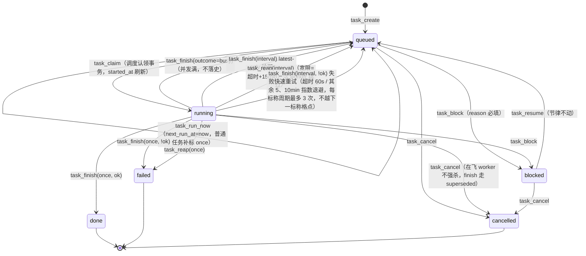

# 05 · task 域设计（任务 / 调度 / 执行史 / worker 注册表）

> 版本：v5.1 ｜ 状态：定稿（L6 调度器切换已实施，2026-09-17）｜ 契约版本：task domain manifest v1
> 依赖：订阅 `scope.granted`（审批入队种子任务）、`exec.worker.spawned` / `exec.worker.finished`（worker 注册表记账，强联动）、`know.release.revoked`（L6：撤回 → change-retest 重测需求任务入队，§2.3 变更触发节奏）、`vuln.signal.confirmed`（产出闭环：确认漏洞自动入队 `[提交] finding #id` 提交任务，同 finding 幂等去重）；`task_budget_extend` / `task_complete` 由 approval 域在 `approval_decide` 事务内**同步 dispatch**（actor=approval，幂等账本 `approval_effects`）执行——执行失败记 `approval_effects.failed`，**无独立 dispatcher 自动重试**，需人工 `approval_effects_retry` 补跑，不回滚 decide（09-approval §2.3；两域以此线为准）。
> 被订阅：`task.created`（看板/memcore）、`task.claimed`（看板）、`task.finished`（**fgs 域沉淀触发、fact 域 FGS 转正、ledger 域 handoff 追加、know 域学习 episode（L1）**）、`task.blocked` / `task.cancelled`（看板/memcore）
> 最高约定：[`00-conventions.md`](00-conventions.md)。本文与宪法冲突时以宪法为准。

---

## 一、对外暴露（External Surface）

### 1.1 服务标识与挂载

| 项 | 值 |
|---|---|
| 域名 | `task` |
| cordis 服务名 | `secDomain.task`（`ctx.provide('secDomain.task')`） |
| 插件包名 | `@silksec/sec-domain-task` |
| 后端插件包名 | `@silksec/sec-backend-task-sqlite` |
| owns（单写者声明） | 表：`tasks`、`task_runs`、`workers`；文件：`data/scheduler.lock`（调度器单例锁，本域独占读写）。**注意：`data/pipeline/{program}/` 下产物文件归 ledger 域 owns，本域只读（守卫校验经 ledger 域查询）** |
| 事件日志 | `data/events/task.jsonl` |

**profile 挂载矩阵**：

| profile | 挂载内容 | 说明 |
|---|---|---|
| `web`（宿主面） | 全部命令 + 全部查询 + RPC 投影 + **调度器循环（单例）** | 调度器只在 web profile 启动（文件锁兜底，headless 误载不认领） |
| `headless`（worker 面） | 模型可见命令 + 查询（不含 scheduler 专用动词） | worker 会话内 agent 需要建任务/记 note/查执行史 |

### 1.2 命令总表

| # | 动词 | 一句话语义 | actor | 幂等键 | 发布事件 | 模型可见 |
|---|---|---|---|---|---|---|
| C1 | `task_create` | 登记新任务（普通 / once / interval），含任务级模型覆盖、预算参数与 goal 目标类型（L6） | model, dashboard, script, approval, system, reactor | 自然键（interval）/ 自动指纹 | task.created | ✅ |
| C2 | `task_schedule` | 设置 / 修改 / 清除任务的调度（终态不可改） | model, dashboard | 显式 / 自动指纹 | — | ✅ |
| C3 | `task_run_now` | 立即触发一次（拨 next_run_at=now，不动节律） | model, dashboard | none（认领层防重复） | — | ✅ |
| C4 | `task_update_note` | 向 result 证据链追加一条带时间戳的记录（不改状态） | model, dashboard, scheduler, script, approval, system | 自动指纹 | — | ✅ |
| C5 | `task_block` | HITL 暂停：非终态 → blocked（blocked_reason 必填） | model, dashboard | 自动指纹 | task.blocked | ✅ |
| C6 | `task_resume` | 恢复：blocked → queued（节律不动） | model, dashboard | 自动指纹 | — | ✅ |
| C7 | `task_cancel` | 取消：任意非终态 → cancelled | model, dashboard | 自动指纹 | task.cancelled | ✅ |
| C8 | `task_finish` | **调度器专用收尾**：落执行史 + latest-only 续期 + 流程守卫前置不变量 | scheduler | 自然键（task_id+run_id） | task.finished | ❌ |
| C9 | `task_chain` | 能力图 BFS + 反向剪枝 → 落 parent 串联 once 链 | model, dashboard | auto（去重在 handler） | task.created ×N | ✅ |
| C10 | `task_budget_extend` | task-budget-extend 审批落列（budget_timeout_sec ≤7200） | approval | 自然键（task_id） | — | ❌ |
| C11 | `task_claim` | 调度认领：BEGIN IMMEDIATE 原子抢占 ≤4 条到期任务 | scheduler | none | task.claimed ×N | ❌ |
| C12 | `task_reap` | 僵尸回收：宽限=超时+15min，活 worker 跳过 | scheduler | none | —（manifest 声明 task.finished ×N，但 handler 返回 events:[]，实际**不发**） | ❌ |
| C13 | `task_worker_register` | worker 注册表登记（exec.worker.spawned 订阅执行） | reactor, scheduler | 自然键（run_id） | — | ❌ |
| C14 | `task_worker_finish` | worker 注册表收尾（exec.worker.finished 订阅执行） | reactor, scheduler | 自然键（run_id） | — | ❌ |
| C15 | `task_worker_reap` | worker 注册表启动/周期对账（meta 回读 → pid 判活 → 孤儿执法） | scheduler | none | — | ❌ |
| C16 | `task_submit_complete` | **自执行任务完成声明**（不改状态，提请 task-complete 审批） | model | auto（task_id+summary+evidence+follow_up） | — | ✅ |
| C17 | `task_complete` | **审批落成收尾**（approval 域 `approval_effects` effect outbox 执行（kind=task-complete），自执行任务唯一 done 入口） | approval | 自然键（task_id） | task.finished | ❌ |
| C18 | `task_submission_backlog` | 产出闭环补建：扫描 `vuln.submission_queue`（confirmed 未提交）幂等补建 `[提交] finding #id` 任务（历史存量一次性；2026-09-19 新增） | dashboard, system, human | none（handler 内按 objective 标记去重） | — | ❌ |

> \* actor 为 `reactor`（宪法 §三 域事件订阅反应器）：C13/C14 由总线从 `exec.worker.*` 订阅回调注入 actor=reactor，审计 cause 链指向源事件及其原始 actor；approval 事件的订阅执行保留专用 `approval` actor（语义更具体的先例身份）。

**与 exec 域的边界（dedupe_key 幂等语义为界）**：

| 职责 | 归属 | 内容 |
|---|---|---|
| 执行动作 | **exec 域** | `exec_spawn_worker` 命令：dedupe_key 构造（sha1(task 全文)）、`force` 跳过语义、幂等预检（调本域查询 `task_worker_recent`）、进程 spawn/超时杀组、run_dir 文件（worker.log/meta.json）、RoE 块注入、真实性校验（worker.log 拒执标记扫描——它读的是 exec owned 文件） |
| 任务执行史 | **task 域（本域）** | workers 表行：注册（spawn 后）、收尾（退出后）、对账（重启后）。exec 域**不直接写 workers 表**——spawn 成功后发布 `exec.worker.spawned {run_id, dedupe_key, pid, task, cwd, timeout_sec, session_id, run_dir}`（**强联动 sync**），本域订阅后执行 C13；进程退出后发布 `exec.worker.finished {run_id, status, exit_code, duration_ms}`（**不携带 truth**——truth 经 spawn_worker 返回值流向 task_finish，见 C8），本域执行 C14。强联动失败 → exec_spawn_worker 整体报错回滚（exec 域负责 kill 刚 spawn 的进程组再返回）——**注册行丢失 = dedupe 语义失效 = 重复 spawn**，故必须强联动 |

### 1.3 命令逐个详述

#### C1 `task_create`

**语义**：登记一个任务（可管理的工作单元，编排器的派单对象）。普通任务（无 schedule）只进队列；`once` 到期跑一次；`interval` 周期跑（latest-only 续期）。

**参数表**（additionalProperties: false）：

| 参数 | 类型 | 必填 | 默认 | 校验 |
|---|---|---|---|---|
| `program_id` | string | 条件 | 会话工作区反查 | 须存在于 programs（scope 域镜像）；显式传入优先；反查无果 → `E_TASK_PROGRAM_UNRESOLVED` |
| `objective` | string | ✅ | — | 非空；≤4000 字符；interval 任务额外过 objective lint（故障词/陈旧日期，memcore 既有口径） |
| `phase` | string | ❌ | `''` | 建议枚举 recon/vuln/biz-logic/code-audit/intranet/review（不硬校验，PHASE_PRESET 未命中则不注入人格） |
| `goal` | string | ❌ | `''`（=research） | L6（学习专项 §10）任务目标类型枚举：`research`（授权研究，默认）/ `learn-daily`（日常整理：补索引/复验到期来源/整偏，只产候选）/ `eval-batch`（周期评测批：候选对照/误报复盘/晋升审阅）/ `change-retest`（变更触发重测：撤回/失效驱动，`know.release.revoked` 订阅自动生成）。goal 进 `task.created`/`task.claimed` 载荷与 task_list 过滤；调度器对 learn-daily/eval-batch/change-retest 限流（每 tick ≤1）并按 goal 上限帽收紧无延长批准的预算（1800/3600/3600s） |
| `priority` | integer | ❌ | `5` | 0 最高；0–9 |
| `parent_id` | integer | ❌ | null | 须存在且非本任务自身；父任务终态后子任务才可被认领（链式放行） |
| `budget_tokens` | integer | ❌ | null | ≥0 |
| `assignee` | string | ❌ | `''` | 自由文本 |
| `schedule` | object | ❌ | null | `{kind:'once', at}`：at 接受整数 epoch（毫秒/秒）或字符串 ISO 8601 / `HH:mm`（带时区按声明时区、不带时区按北京时间），须未来时刻（≤60s 过期宽限内校准为立即执行），否则 `E_TASK_SCHEDULE_PAST`；`{kind:'interval', every_seconds, anchor?, tz?}`：every_seconds 整数且 ≥300，否则 `E_TASK_INTERVAL_MIN`；`anchor`（HH:mm/epoch/ISO）指定标称相位；`after_task_id`（前置任务，null 清除依赖）/ `after_delay_seconds`（0–86400，前置成功后延迟）为依赖参数；kind 非法 → `E_SCHEMA` |
| `provider` | string | ❌ | null | 任务级模型覆盖（P18）；须 provider+model 成对出现，单传 → `E_SCHEMA` |
| `model` | string | ❌ | null | 同上 |
| `reasoning_effort` | string | ❌ | null | 枚举 low/medium/high |

（`session_id` 由网关从调用面注入，调用方不传。）

**不变量（网关前置）**：

| ID | 不变量 | 失败码 |
|---|---|---|
| INV-T1 | interval 任务 objective 不得命中 intrusive 关键词表（manifest 可配，默认 `intrusive/主动利用/getshell/写入/破坏性`）——保守启发式，完整口径靠 objective lint 兜底 | `E_TASK_INTRUSIVE_INTERVAL` |
| INV-T2 | **interval 固定实体幂等**：同 `(program_id, objective)` 已有活跃（非 done/failed/cancelled）interval 任务 → 不新建，返回已有 `task_id` + `deduped:true`（v4.x P12 防任务表增殖语义原样保留） | （不失败，幂等命中） |
| INV-T3 | once.at 未来；every_seconds ≥300 整数 | `E_TASK_SCHEDULE_PAST` / `E_TASK_INTERVAL_MIN` |

**返回信封（成功）**：

```json
{
  "ok": true, "domain": "task", "cmd": "create",
  "data": { "task_id": 128, "status": "queued",
            "schedule": { "kind": "interval", "next_run_at": 1789003000000 },
            "deduped": false },
  "event_ids": ["evt_01J..."], "idempotency_key": "task:create:interval:prog-a:每日03点资产巡检", "replay": false
}
```

**错误码**：

| code | 触发 | hint | retryable |
|---|---|---|---|
| `E_SCHEMA` | objective 缺失 / schedule.kind 非法 / provider+model 不成对 | 「objective 必填；schedule.kind 仅 once/interval；模型覆盖须 provider+model 成对」 | false |
| `E_TASK_PROGRAM_UNRESOLVED` | program_id 缺失且会话不在已绑定工作区 | 「传 program_id（见 program_list），或在绑定工作区的会话里调用」 | false |
| `E_TASK_SCHEDULE_PAST` | once.at ≤ now | 「once 调度需要未来的毫秒时间戳」 | false |
| `E_TASK_INTERVAL_MIN` | every_seconds <300 或非整数 | 「interval 调度需要 every_seconds ≥300 的整数（对齐 dsh-schedule 下限）」 | false |
| `E_TASK_INTRUSIVE_INTERVAL` | INV-T1 命中 | 「intrusive 级目标禁止 interval——改用 once 单次执行，或拆出被动采集部分做周期任务」 | false |
| `E_TASK_DEPENDENCY` | 前置任务不存在 / 跨项目 / 自引用 / 成环，周期依赖周期不一致，或 after_delay_seconds 越界 | 「核对前置任务与周期，不能自引用或形成循环」 | false |

**幂等**：interval 分支走**自然键** `task:create:interval:{program_id}:{objective}`（活跃唯一约束）；once/普通分支走自动指纹（网关 sha1 核心字段）。重放同 key 同参 → 首次结果 + `replay:true`。

**actor**：model, dashboard, script, approval（审批种子任务订阅执行）, system, reactor（L6：`know.release.revoked` 订阅自动生成 change-retest 重测任务，cause 链带撤回事件）。`approval`/`reactor` actor 的调用 cause 链带源审批 id / 源事件 id。

**agent_note（模型面工具描述全文）**：

> 创建一个任务（可管理的工作单元，编排器的派单对象；看板任务视图立即可见）。program_id 见 program_list（不传则按当前会话所在工作区自动带出）；phase: recon/vuln/biz-logic/code-audit/intranet/review；priority 0 最高。依赖：传 parent_id 声明前置任务，前置未 done 时调度器/派单不放行（多级链用 task_chain 一次展开）。定时任务：用户说「定时/每隔/每天/每小时/定期跑」时必须传 schedule（{kind:"once",at:<未来毫秒时间戳>} 或 {kind:"interval",every_seconds:>=300}），不得只在会话里口头答应——带 schedule 的任务由调度循环自动执行，intrusive 级目标禁止 interval。provider/model/reasoning_effort 可选：任务级模型覆盖（不传走 agent-default-model）。

**side_effects**：`[rows_touched: tasks+1, events: task.created×1, caches: none]`

---

#### C2 `task_schedule`

**语义**：设置/修改/清除任务的调度。`schedule:null` 表示清除调度（变普通任务）。**终态任务不可改**。

**参数表**：

| 参数 | 类型 | 必填 | 默认 | 校验 |
|---|---|---|---|---|
| `task_id` | integer | ✅ | — | 存在，否则 `E_NOT_FOUND` |
| `schedule` | object\|null | ✅ | — | 同 task_create 的 schedule 校验；null=清除 |

**不变量**：INV-T4（终态不可改调度）→ `E_STATE`；interval 分支同样过 INV-T1/INV-T3。

**返回**：`data: {task_id, schedule: {kind, next_run_at}|null}`。

**错误码**：

| code | 触发 | hint | retryable |
|---|---|---|---|
| `E_NOT_FOUND` | 任务不存在 | 「核对 task_list 里的 id」 | false |
| `E_STATE` | 任务已 done/failed/cancelled | 「终态任务不能改调度；需要重跑请新建任务」 | false |
| `E_TASK_INTRUSIVE_INTERVAL` | 同 C1 | 同 C1 | false |

**幂等**：显式键（推荐）或自动指纹。**actor**：model, dashboard。**事件**：无（调度参数变更不是状态机流转，审计可见）。

**agent_note**：

> 设置/修改/清除任务的定时调度。schedule 结构同 task_create；schedule 传 null 清除调度变普通任务。终态任务不可改。修改 interval 的 every_seconds 后，续期锚点仍为原 run_at（节律相位不因改调度而重置，除非清除后重设）。

---

#### C3 `task_run_now`

**语义**：立即触发一次执行：把 `next_run_at` 拨到现在，调度循环下一 tick（≤60s）认领。**不动节律**——续期以 run_at 标称锚点计算，手动触发不会污染下次运行时间（2026-09-02 手动执行致每日任务从凌晨 3 点漂到 19 点的根因防护）。未设置 schedule_kind 的一次性任务自动标 `once`（否则调度循环永不认领）。

**参数表**：`task_id` integer ✅（存在性校验）。

**不变量**：仅 `queued` 可触发（`E_STATE`）。

**返回**：`data: {task_id, hint: "已排入调度队列，下一 tick（≤60s）认领执行"}`。

**错误码**：`E_NOT_FOUND`（hint「核对 task_list 里的 id」）；`E_STATE`（hint「仅 queued 可立即触发；running 用 task_worker_status 查进度，blocked 先 task_resume」）。

**幂等**：`none`——手动重跑是合法状态请求；重复触发在认领层由 `queued→running` 原子流转防重，失败回 queued 后允许再次触发。**actor**：model, dashboard。**事件**：无（状态未变，审计留痕）。

**agent_note**：

> 立即触发一次任务执行（不动调度节律）：排入调度队列，下一 tick（≤60s）由 worker 认领执行。手动提前跑 interval 任务不会跳过原定运行（未到期的标称格点仍保留）。

---

#### C4 `task_update_note`

**语义**：向任务 result 证据链追加一条 `[ISO 时间] note` 记录（v4.x taskUpdate 的 note 段独立成动词）。不改状态。

**参数表**：

| 参数 | 类型 | 必填 | 校验 |
|---|---|---|---|
| `task_id` | integer | ✅ | 存在 |
| `note` | string | ✅ | 非空；单条 ≤2000 字；result 总长截断保留尾部 8000 字 |

**返回**：`data: {task_id, result_tail: "…最近 200 字"}`。

**错误码**：`E_NOT_FOUND`；`E_SCHEMA`（note 空）。终态任务**允许**追加 note（证据链补录）。

**幂等**：自动指纹（防重放把同一条 note 叠两遍）。**actor**：model, dashboard, scheduler, script。**事件**：无。

**agent_note**：

> 向任务的 result 证据链追加一条带时间戳的记录（不改任务状态）。用于：执行中途记录关键结论、补录证据指针、说明阻塞背景。收尾摘要由调度器 task_finish 自动落，不要手动模拟。

---

#### C5 `task_block`

**语义**：HITL 暂停——非终态任务 → `blocked`（调度器只认领 queued，blocked 即冻结）。v4.x「看板手动改状态」的显式动词化。

**参数表**：

| 参数 | 类型 | 必填 | 校验 |
|---|---|---|---|
| `task_id` | integer | ✅ | 存在 |
| `blocked_reason` | string | ✅ | 非空；≤500 字 |
| `note` | string | ❌ | 追加进 result 证据链（**无长度上限**；result 总长仍截断保留尾部 8000 字） |

**不变量**：INV-T5（blocked_reason 必填；终态/已 blocked 不可再 block）→ `E_STATE`。

**返回**：`data: {task_id, status: "blocked"}`。

**错误码**：`E_NOT_FOUND`；`E_STATE`（hint「终态任务不可阻塞；已 blocked 用 task_resume 恢复」）；`E_SCHEMA`（blocked_reason 空，hint「阻塞必须写原因——这是解除阻塞时判断依据」）。

**幂等**：自动指纹。**actor**：model, dashboard。**事件**：`task.blocked`。

**agent_note**：

> 暂停一个任务（HITL 阻塞）：调度器不再认领，直到 task_resume。blocked_reason 必填（等授权/等审批/等人工确认…），恢复时人工据此判断。

---

#### C6 `task_resume`

**语义**：恢复——`blocked → queued`。next_run_at 不动（interval 节律保留；被阻塞错过的格点由 latest-only 续期自然跳过，不补跑）。

**参数表**：`task_id` integer ✅。

**不变量**：仅 blocked 可恢复（`E_STATE`）。

**返回**：`data: {task_id, status: "queued", next_run_at}`。

**错误码**：`E_NOT_FOUND`；`E_STATE`（hint「仅 blocked 状态可恢复；queued/running 无须恢复」）。

**幂等**：自动指纹。**actor**：model, dashboard。**事件**：无（恢复不是业务联动点；audit 可见，看板 30s 轮询自然刷新）。

**agent_note**：

> 恢复一个被阻塞（blocked）的任务回队列。节律不变：阻塞期间错过的周期不补跑。

---

#### C7 `task_cancel`

**语义**：取消——任意非终态 → `cancelled`。正在跑的 worker 不被杀（run 结果到达时 task_finish 走 superseded 路径，只补执行史不改状态）。

**参数表**：

| 参数 | 类型 | 必填 | 校验 |
|---|---|---|---|
| `task_id` | integer | ✅ | 存在 |
| `note` | string | ❌ | 取消原因（看板默认「看板手动取消」） |

**不变量**：INV-T9（终态不可再取消）→ `E_STATE`。

**返回**：`data: {task_id, status: "cancelled"}`。

**错误码**：`E_NOT_FOUND`；`E_STATE`（hint「任务已终态；重跑请新建」）。

**幂等**：自动指纹。**actor**：model, dashboard。**事件**：`task.cancelled`。

**agent_note**：

> 取消一个任务（任意非终态 → cancelled，不可逆）。在飞的 worker 不强杀——其结果仅补进执行史。误建的任务、目标失效的链、被更好方案取代的周期任务用它退出。

---

#### C8 `task_finish`（actor=scheduler 专用）

**语义**：调度器收尾一个 run：① 真实性判定（以调度器透传的 `truth` 参数为准——其来源是 exec_spawn_worker 返回值的拒执标记扫描结果，见 10-exec §1.3.2；拒执/API 错误即使 exit 0 也翻转为失败）；② **流程守卫前置不变量**（见下）；③ 落 task_runs 执行史；④ interval 任务 latest-only 续期回 queued / once 任务进终态；⑤ 写 last_run_at/last_run_id/session_id；⑥ 发布 `task.finished`。

**参数表**：

| 参数 | 类型 | 必填 | 默认 | 校验 |
|---|---|---|---|---|
| `task_id` | integer | ✅ | — | 存在 |
| `run_id` | string | 条件 | `''` | **证据即参数**（铁律 4）：outcome=done/failed 时必填（exception 路径允许空）；网关**仅做非空校验**，不校验是否存在于 exec 域 results，否则 `E_EVIDENCE_REQUIRED` |
| `outcome` | string | ✅ | — | 枚举 `done / failed / busy / crash`：busy=exec 并发满（回 queued 不落史）；crash=调度执行异常（视同 failed，run_id 可空） |
| `note` | string | ❌ | `''` | 摘要 ≤500 字（v4.x：worker 尾部去噪后 3 行） |
| `session_id` | string | ❌ | null | 会话反查回填值（findWorkerSessionId 结果） |
| `truth` | object | ❌ | `{checked:false,rejected:false,reason:''}` | 由调度器取 `exec_spawn_worker` 返回值（`data.truth`，拒执标记扫描结果）透传；`truth.rejected=true` ⇒ outcome 强制翻转为 failed（**不经 worker 事件**——`exec.worker.finished` 无 truth 字段） |
| `timed_out` | boolean | ❌ | false | 超时收尾标记；true 时 ok 强制为 false，并按超时策略参与续期快速重试（60s） |
| `spent_tokens` | integer | ❌ | null | **成本归因（INV-T14，2026-09-22 落地）**：worker 上报该 run 的 token 用量（≥0）；非空时回填 `tasks.spent_tokens` 并入 `task.finished` payload；`budget_tokens` 非空且超支时 note 前缀 `[预算超支]`、payload 带 `budget_overrun:true`（超支是观测事实不置 failed） |

**流程守卫（前置不变量，从 v4.x taskUpdate 拆出，成为 finish 的私有不变量）**：

| ID | 校验 | 作用域 | 失败语义 |
|---|---|---|---|
| INV-T6a | ① attempts 台账近 24h（北京日切：今天/昨天）有增量行（六态皆可）——**经 ledger 域查询 `ledger.task_proof`**（参数 `{program, since_ts}`，11-ledger §1.4.6） | `schedule_kind='interval'` 且 `data/pipeline/{program}/` 目录存在的任务 | 守卫结果不拒绝 finish（见下），进 payload |
| INV-T6b | ② card_usage-*.jsonl 近 24h 有记录（文件名日期或 mtime 24h 内）——同上经 ledger 查询 | 同上 | 同上 |
| INV-T6c | ③ handoff-<北京日期>.md 存在（今天或昨天）——同上经 ledger 查询 | 同上 | 同上 |

**守卫失败的处理（设计决策，防死锁）**：v4.x 守卫拦的是 agent 手动标 done；v5 收尾权唯一归 task_finish，而 interval 任务本就不落 done——**守卫失败不拒绝事务**，而是：本次 run 的 task_runs 落 `ok=0`、note 前缀 `[流程守卫缺失]` + missing 清单；task.finished payload 带 `guard:{checked, missing[]}`；ops 健康度红条（看板）呈现缺失清单。理由：拒绝 finish 会让任务卡 running 直至被 reap 误回收——纪律信号用可观测性承载，不用状态死锁承载。缺失清单的补救动作仍是 agent 职责（attempts_log / card_usage_log / handoff 五段结构）。

**守卫查询异常的处理（2026-09-16 L0 修正）**：`ledger.task_proof` 查询**抛错或返回 ok:false 不再静默降级为"无缺失"**——异常原因（截断 120 字）作为 missing 项入 `guard.missing`，本次 run 同样落 `ok=0` + `[流程守卫缺失]` 前缀（与内容缺失同等显式失败，见学习专项 L0-K6）。

**latest-only 续期锚点算法（interval 分支，逐行移植 v4.x，含全部防漂移注释）**：

```
step   = every_seconds × 1000
anchor = (run_at > 0) ? run_at : (started_at ?? next_run_at ?? finished)
         // ★ 锚点=标称相位 run_at（任务创建/改调度时的原始节律），绝不能用 next_run_at 当锚——
         //   task_run_now 会把它拨到"现在"，用它续期会把整个节律漂移到手动触发时刻。
         //   run_at 无效（epoch 0/NULL 老数据）时依次退回 started_at → next_run_at → finished。
if finished <= anchor:
    next = anchor                      // 手动提前跑（task_run_now）：未到期的原定运行仍保留，不跳格
else:
    next = anchor + max(1, ceil((finished - anchor) / step)) × step
    if next <= finished: next += step  // finish 恰落在格点上时防立即重复认领
    if not ok and previousAttempts + 1 < 3:  // MAX_SCHEDULED_ATTEMPTS=3：每标称周期最多 3 次
        delay = timed_out ? 60s : 5min × 2^min(previousAttempts, 1)  // 超时 60s 后续跑；其余失败 5/10min 指数退避
        next = min(next, finished + delay)   // 但不越过下一个标称格点——成功后自动回原节律
status = 'queued'
```

once 分支：`status = ok ? 'done' : 'failed'`，`finished_at=now`。

**superseded 路径**：任务已非 running（被 cancel/reap 抢先）→ 只补 task_runs 执行史，不改状态不续期，返回 `data:{task_id, superseded:true}`（不算错误）。

**返回信封（成功）**：

```json
{
  "ok": true, "domain": "task", "cmd": "finish",
  "data": { "task_id": 96, "status": "queued", "next_run_at": 1789086000000,
            "run_recorded": true, "guard": { "checked": true, "missing": [] } },
  "event_ids": ["evt_01J..."],
  "idempotency_key": "task:finish:96:run_wxyz12", "replay": false
}
```

**错误码**：

| code | 触发 | hint | retryable |
|---|---|---|---|
| `E_ACTOR_FORBIDDEN` | actor ≠ scheduler | 「task_finish 是调度器专用收尾动词；会话内记录结果用 task_update_note」 | false |
| `E_EVIDENCE_REQUIRED` | outcome=done/failed 且 run_id 缺失或不存在 | 「收尾必须携带真实 run_id（exec 域 results 引用）」 | false |
| `E_NOT_FOUND` | 任务不存在 | — | false |

**幂等**：自然键 `task:finish:{task_id}:{run_id}`——调度器重启重试同一 run 收尾时重放首次结果（`replay:true`），不重复落 task_runs。

**事件**：`task.finished`（payload 见 §1.5——**fgs 域沉淀与 ledger handoff 的触发器**）。busy 路径不发事件（无状态变更）。

**side_effects**：`[rows_touched: tasks+1, task_runs+1, events: task.finished×1, files: none]`

**agent_note**：无（不向模型注册）。

---

#### C9 `task_chain`

**归属论证（任务书要求）**：`task_chain` 归 **task 域**。理由：它的事务主体是写本域 owned 的 tasks 表 N 行（parent 串联的 once 链）——落点全在本域；它依赖的能力图（tools.d manifest 的 requires/produces）是 **exec 域 owned 数据**，经 exec 域查询 `exec_plan_chain`（纯读 BFS，归 exec 域）获取。跨域只读 + 本域写 = 合法形态；若归 exec 域则出现"exec 域事务写 tasks 表"，违反单写者律。

**语义**：一条 objective 自动展开为任务依赖链：① 调 exec_plan_chain BFS 验证可达（have→want 有序工具链）；② 反向剪枝——从 want 回溯，只保留 produces 命中所需能力的工具，其 requires 逐级并入所需集（去掉贪心旁支）；③ 幂等去重——同 program 已有未终结的同 `[链:want]` 标记链则不重复展开（`deduped:true`）；④ 建 parent 串联 once 任务（at 取小幅未来过校验，实际次序由认领的 parent gate 决定）。

**参数表**：

| 参数 | 类型 | 必填 | 默认 | 校验 |
|---|---|---|---|---|
| `program_id` | string | 条件 | 会话工作区反查 | 同 C1 |
| `objective` | string | ❌ | `''` | 整体目标描述，写入每级任务作上下文 |
| `want` | string | ❌ | `'findings'` | 目标能力（见 exec_plan_chain） |
| `have` | string[] | ❌ | `['domains']` | 起始已有能力 |
| `priority` | integer | ❌ | `3` | 链上任务统一优先级 |
| `parent_id` | integer | ❌ | null | 把链挂在某个已有任务之后 |

**返回**：`data: {program_id, want, have, chain: [工具名…], task_ids: […], deduped}`。

**错误码**：

| code | 触发 | hint | retryable |
|---|---|---|---|
| `E_TASK_CHAIN_UNREACHABLE` | BFS 凑不到 want | 「调整 have/want 或检查 manifest 的 requires/produces」 | false |
| `E_TASK_CHAIN_EMPTY` | 剪枝后链为空 | 「want 无产出工具，换一个能力目标」 | false |
| `E_TASK_PROGRAM_UNRESOLVED` | 同 C1 | 同 C1 | false |

**幂等**：自然键 `task:chain:{program_id}:链:{want}`（未终结链存在即命中，deduped 返回）。

**actor**：model, dashboard。**事件**：`task.created ×N`（批量命令事件数 ≤ 行数，合规）。

**agent_note**：

> 一条 objective 自动展开为任务依赖链：复用能力图（exec_plan_chain）按 manifest requires/produces 凑链，反向剪枝到达成 want 的最小链，落成 parent 串联的 once 调度任务——前置未完成不派单，parent 完成后调度器自动放行下一级（链式自动推进）。默认 have=["domains"]、want=findings（资产收集→存活→指纹→N-day）。链尾多为 active 扫描且会自动执行，仅对已授权 scope 使用。

---

#### C10 `task_budget_extend`

**语义**：`task-budget-extend` 审批批准后的落列动作（v4.5 异步审批协议的 task 侧终点）。写 `tasks.budget_timeout_sec`，下个调度周期 runWorker 取 `max(默认 3600, 该值)`。

**参数表**：

| 参数 | 类型 | 必填 | 校验 |
|---|---|---|---|
| `task_id` | integer | ✅ | 存在 |
| `budget_timeout_sec` | integer | ✅ | 1–7200（硬顶，防 2 小时外的失控 worker 占死调度槽），否则 `E_SCHEMA` |
| `approval_id` | integer | ✅ | 证据：源审批单 id（**证据即参数**），须为已批准的 task-budget-extend 单 |

**actor**：approval（approval 域 `approval_effects` 经 dispatcher 幂等执行——审批已裁决，落列失败进 approval_effects 退避重试/`approved_effect_failed`，不丢失）。**幂等**：自然键 `task:budget:{task_id}`。**事件**：无。**模型不可见**。

#### C11 `task_claim`（内部）

调度认领：`BEGIN IMMEDIATE` 事务内取 `schedule_kind IS NOT NULL AND status='queued' AND next_run_at<=now` 且 **parent gate**（parent_id 为空，或 parent 状态=done）的 ≤4 条（`ORDER BY priority ASC, next_run_at ASC`），逐条 `UPDATE … SET status='running', started_at=now WHERE id=? AND status='queued'` **原子抢占**（changes=1 才算认领成功；started_at 每次认领刷新——P15 修复语义，防跨日复用首次认领时间被 reap 误杀）。每条发布 `task.claimed`。actor=scheduler；幂等=状态条件（重复认领自然落空）；模型不可见。

#### C12 `task_reap`（内部）

僵尸回收：候选=`status='running' AND started_at < now-宽限`（2026-09-19 修复：**含一次性任务** `schedule_kind IS NULL`——旧实现只回收定时任务，一次性 running 崩溃后无租约成永久僵尸）。**活 worker 跳过**：last_run_id 对应 workers 行 status='running' 且 pid 活 → skip（P15 修复：旧逻辑按 started_at 判龄与 3600s 超时同量级，会误杀跑满预算的任务并双重派单）。回收动作：interval → queued、once → failed，`blocked_reason='宿主重启/超时回收'`，补落 task_runs（ok=0, note=回收原因），发布 `task.finished`（ok=false, cause=reap）。宽限默认 `(3600+900)s`；调度器启动时以 `max_age=0` 无条件跑一遍（新进程启动=旧进程已死，其 running 任务全是孤儿）。actor=scheduler；模型不可见。

#### C13–C15 `task_worker_register` / `task_worker_finish` / `task_worker_reap`（内部）

| 动词 | 触发面 | 语义 | 关键细节 |
|---|---|---|---|
| C13 `task_worker_register` | 订阅 `exec.worker.spawned`（强联动 sync） | workers 表 upsert（run_id 冲突时刷 pid/status） | 参数=事件 payload 原样：run_id（必填）、dedupe_key、**task_id**、task（含 RoE 的 fullTask，截 2000）、cwd、pid、timeout_sec、session_id、run_dir |
| C14 `task_worker_finish` | 订阅 `exec.worker.finished`（强联动 sync） | 写终态 status（done/failed/killed）+ exit_code + finished_at | 参数：run_id（必填）、outcome（done/failed/killed）、exit_code、**worker_session_id**；幂等：run_id 自然键 + status='running' 条件更新 |
| C15 `task_worker_reap` | 调度器启动 + 每 10 tick | 注册表对账：先读 run_dir/meta.json（有 exit_code → done/failed，**先读 meta 再判 pid，防把已完成误判 killed**）；pid 死 → killed；pid 活但超 `started_at+timeout_sec+60s` → 代行 SIGTERM→5s→SIGKILL（进程组）标 killed（P12-1 孤儿执法：父 worker 被杀后 killer 定时器随之消失，detached 孙 worker 会无限跑） | actor=scheduler |

三者均不向模型注册；C13/C14 不发事件（exec.worker.* 事件本身即是留痕）。

#### C16–C17 `task_submit_complete` / `task_complete`（自执行任务三段式收尾）

**背景**：v4.x 模型可 `task_update status=done` 手动完结——模型给自己当法官。v5 收尾权唯一归 task_finish(scheduler)，但 assignee=model 的**自执行型任务**（web 会话内直接执行、不经 worker 派生）需要一个不破坏状态机单一入口的收尾路径。采用 **声明完成 → 统一拦截 → 审批裁决** 三段式。

| 动词 | 触发面 | 语义 | 关键细节 |
|---|---|---|---|
| C16 `task_submit_complete` | 模型（会话内） | **完成声明，不改状态**：向 approval 域提请 kind=task-complete 审批 | 参数：task_id（必填）、summary（≥30 字，做了什么/结论）、evidence（产物指针：run_id / result note 引用，可多个）、follow_up（可选，≤500 字——希望人工顺带裁决的后续操作建议，进审批单 payload 供用户参考）。域内仅校验：task 存在、非终态（**不校验 assignee=model，也不经 task_active_by_session 确认无活动 worker**）。**interval 任务分支绕过审批**：直接把"本轮摘要"追加 result 并返回 `{scheduled:true}`，不提请审批；其余任务 dispatch approval_request（kind=task-complete，subject=task_id，payload={summary, evidence, follow_up}）。返回审批 request_id + hint（"已提请人工确认（看板「审批」tab）。任务保持非终态（queued/running），不要自行标记完成"） |
| C17 `task_complete` | approval 域在 `approval_decide` 内同步 dispatch（幂等账本 `approval_effects`，kind=task-complete）执行——**不经订阅 `approval.approved`** | 落 done（仅非 interval）：status→done、finished_at、result 追加"人工确认 {request_id} + summary"；**interval 分支不改状态**：仅追加 result 并返回 `{scheduled:true, acknowledged:true}`（status/next_run_at 原样） | actor=approval（宪法 §三 先例身份），cause 链指向审批单与 C16 声明。三产物守卫在此**降为展示不拦截**：自执行任务无 worker 产物，守卫结果（含 missing 清单）已在审批单 payload 里呈现给用户——**人工裁决即守卫**（fail-open 的合法形态：放行决策权在人，且全程审计留痕） |

**统一拦截任务（防漏声明兜底）——⚠️ 未实现（设计预留）**：设计为调度器每 tick 附带扫描——`assignee=model AND status IN ('queued','running') AND 会话已结束（session idle >30min）AND 无 pending 的 task-complete 审批单` → 自动以 actor=scheduler 补提审批（summary="拦截任务自动提请：会话结束未声明完成"，evidence=最后的 task_update_note 摘录）。现行 `dsh-plugin-sec-domain-task.js` 调度循环（`startTaskScheduler`）无此扫描，自执行任务不因此兜底闭环。

**驳回路径**：审批被驳回（`approval_effects` 不触发）→ 任务保持非终态（queued/running），note 追加驳回理由——用户可在看板 task_block / task_cancel 收尾，或让模型补证后重新 C16。

三者段式对状态机的影响：done 的写入口仍然唯一收敛（worker 型=task_finish[scheduler]；自执行型=task_complete[approval]——都是"调度/人工裁决"，模型在两种形态下都没有直接落 done 的接口）。

#### C18 `task_submission_backlog`（产出闭环补建，2026-09-19 新增）

**背景**：全面检查（archive/20 §八 第二批-5）发现 43 条 confirmed findings 零提交——`vuln.signal.confirmed` 自动入队只覆盖**新确认**，历史存量需要一次性补建通道。

**语义**：经查询网关调 vuln 域 `vuln_submission_queue`（limit ≤200，可按 `program_id` 过滤），逐条检查是否已存在活跃 `[提交] finding #{id}` 任务（`task_list` 按 objective 标记子串判定），无则以 actor=reactor dispatch `task_create`（phase=review, goal=research, priority=2, schedule=once@now+5min），objective 内嵌"report_draft_submission 出草稿 → 人工审校 → 平台提交 → vuln_submit 回写"闭环指引。返回 `{ created, skipped }`。

**纪律**：queued 任务**无调度不起 worker**——避免一次性拉起数十个 LLM 会话；由人工 `task_run_now` 逐条驱动。日常新确认走 `vuln.signal.confirmed` 订阅自动入队（§头部依赖），本命令仅兜底存量与订阅漏报。

### 1.4 查询逐个详述

统一分页信封 `{rows, total, limit, offset}`；limit 默认 50、上限 500；sort 白名单（priority\|created_at）+ `dir`。**注意：`dir` 被 schema 接受但后端忽略（inert）——`listTasksWhere` 恒 ASC（sort=created_at → `created_at ASC`，否则 `priority ASC, created_at ASC`）**。**行数=total 同 where 构造器**（契约测试必备断言）。

**本域可见域谓词**（查询参数，默认值如下）：

| 谓词 | 语义 | 默认 |
|---|---|---|
| `program` | 项目归属过滤 | 全部 |
| `bucket` | `active`（queued/running/blocked）/ `history`（done/failed/cancelled） | 全部 |
| `scheduled` | `only` / `exclude`（定时行与普通行分区） | 全部 |

| 查询 | 参数 | 返回 | 说明 |
|---|---|---|---|
| `task_list` | program_id / status / phase / goal / q（objective LIKE）/ bucket / scheduled / **campaign_id（22 号方案 A：按归属专项过滤，看板任务视图专项 chip/卡片联动用）** / limit / offset / sort（priority\|created_at，默认 priority asc,created_at asc）/ dir（**接受但后端忽略，恒 ASC**） | `{rows, total}` | 看板任务视图数据源；bucket=active 且未显式传 scheduled 时默认 `scheduled=exclude`（定时任务由独立卡片区展示，避免重复——v4.x P12 口径保留） |
| `task_get` | task_id | 单行或 `E_NOT_FOUND` | 全列（含调度/预算/模型覆盖/最近 run） |
| `task_next` | program_id | 单个任务或 null | 编排器认领：最高优先级 queued 且 **parent gate** 放行（parent 须 done）的第一条 |
| `task_stats` | program_id | `{total, by_phase_status[]}` | 聚合独立命名（宪法 §七.5） |
| `task_runs` | task_id / program_id / limit / offset | `{rows, total}` | join tasks 带 objective/program/phase；order id DESC；**每任务只保留最近 200 行**（写入侧 LRU 剪枝） |
| `task_scheduled` | —（无分页，固定清单） | rows | 固定定时任务卡片区：`schedule_kind IS NOT NULL AND status NOT IN (done,failed,cancelled)` + 聚合 run_count/fail_count/last_ok/last_note；order next_run_at ASC |
| `task_worker_list` | status（running/done/failed/killed）/ limit（默认 20 上限 200） | rows | 注册表总览（在飞/历史 worker） |
| `task_worker_status` | run_id | 单行或 `E_NOT_FOUND` | 注册行 + 恢复 hint；尾部日志经 exec 域查询（grep_result/page_result）——**工具投影层可组合两域查询呈现 v4.x 的 tail 体验** |
| `task_worker_recent` | dedupe_key / window_ms（默认 30min） | 单行或 null | **exec 域幂等预检专用**（跨域只读）：窗口内该 dedupe_key 最近一条（started_at 倒序） |
| `task_active_by_session` | session_id / max_age_ms（默认 6h） | `{task_id, program_id, phase, objective, run_id, started_at}` 或 null | 会话→运行中任务反查（vuln 域 finding 归属、fgs 域上下文提示用；v4.x activeTaskBySession 原样） |
| `task_drift` | —（无参数） | `{scheduled_drift, anchor_missing, anchor_missing_ids, interval_tasks[], task_runs_last_age_hours}` | 调度漂移体检：区间任务锚点/next_run_at 漂移分钟、缺锚点任务 id、执行史最近年龄；actor system/dashboard/human（**模型不可见**，供 ledger discipline_stats 与 ops 红条消费） |

### 1.5 事件

事件信封与留痕遵守宪法 §八；jsonl 落 `data/events/task.jsonl`。payload 只含 ID 与判据快照。

| 事件 | 发布者命令 | payload schema |
|---|---|---|
| `task.created` | task_create / task_chain | `{task_id, program_id, phase, objective_head(≤80字), schedule_kind, parent_id, priority, source: "model"|"dashboard"|"approval"|"chain"}` |
| `task.claimed` | task_claim | `{task_id, program_id, phase, goal, priority, claimed_at, worker_slot}`（**worker_slot 现硬编码为 1**，并发槽位语义未落实现） |
| `task.finished` | task_finish（**task_reap 实际不发此事件**——handler 返回 `events:[]`，manifest 虽声明） | `{task_id, program_id, run_id, ok, outcome, note, schedule_kind, next_run_at, session_id, guard: {checked, missing[]}, truth: {checked, rejected, reason}, fgs_snapshot: {hash, path, nodes, summary}|null（L1：宿主收尾前固定的 FGS 快照引用；null=显式缺快照）, cause: "run"|"reap"|"approval"}` |
| `task.blocked` | task_block | `{task_id, program_id, from_status, blocked_reason}` |
| `task.cancelled` | task_cancel | `{task_id, program_id, from_status, note}` |

**task.finished 是下游触发器**（本域只发事件，不做跨域写）：

| 订阅方 | 模式 | 动作 |
|---|---|---|
| **fgs 域** | async | ok=false 时补记 failed step/finding 节点（原 taskFinishScheduledRun 的 P17 内嵌逻辑事件化）；图生命周期收口（2026-09-12 审查后改为弱联动，见 14-fgs.md §1.4；manifest 亦为 `mode:'async'`） |
| **fact 域** | async | ok=true 时把该任务 FGS 图中带证据的 done fact 节点转正 durable facts（原 persistFgsFacts 直写归零；fact 域再结合订阅 fgs.node.done 形成待沉淀清单，详见 14-fgs.md §1.5） |
| **ledger 域** | async | 调 fgs 域查询 fgs_export(markdown) → 追加 handoff-{北京日期}.md（原 appendFgsToHandoff 直写归零——handoff 文件归 ledger 域 owns） |
| memcore / 看板 | async | 生命周期治理、红条刷新 |

**本域订阅**：

| 事件 | 模式 | 处理器 |
|---|---|---|
| `scope.granted` | async（best-effort，入队失败不影响授权） | 种子任务入队：`task_create{program_id, phase:'recon', priority:1, objective:'[审批入队] 新授权域名 {host} 首轮资产面收集：radar_read 读入 scope-approved 事件 → subfinder → dnsx → httpx 存活+指纹入图谱。只做资产收集，禁止主动漏洞探测。完成后 attempts_log 落台账…', schedule:{kind:'once', at:now+5min}}`；幂等=同 program 活跃 `[审批入队]`+host 任务存在即跳过（**原 onApprove 直调 taskCreate 改事件**，v4.x enqueueScopeSeedTask 移植；授权效果本身由 approval 域 `approval_effects` 经 dispatcher 执行 scope_grant，本域只消费 scope.granted） |
| `vuln.signal.confirmed` | async（best-effort） | 产出闭环：`task_create{program_id: payload.program_id || '_global', phase:'review', goal:'research', priority:2, objective:'[提交] finding #{id} {host} 确认漏洞待提交 SRC：report_draft_submission → 审校 → 平台提交 → vuln_submit(platform/submission_url/remote_id) 回写', schedule:{kind:'once', at:now+5min}}`；幂等=同 finding 已有活跃 `[提交] finding #id` 任务即跳过（`onVulnConfirmed`） |
| （task-budget-extend） | — | `task_budget_extend`（C10）由 approval 域在 `approval_decide` 内同步 dispatch（幂等账本 `approval_effects`；actor=approval，cause 链带 request_id），**非本域订阅 approval.approved** |
| `exec.worker.spawned` | **sync（强联动）** | `task_worker_register`（C13） |
| `exec.worker.finished` | **sync（强联动）** | `task_worker_finish`（C14） |
| `know.release.revoked` | async（reactor；best-effort） | `onReleaseRevoked`（task.js:1090）：卡片撤回 → 生成 `goal=change-retest` 重测需求任务（去重标记 `[change-retest {release_id}]`；program 归属 scope_id，family/global 归 `_global` 桶）；入队不自动起 worker（无 schedule），由人/编排决定 `task_run_now` |

### 1.6 模型工具面投影（工具名 + 描述全文）

工具名=命令/查询名，零改名；按 profile × actor 白名单挂载（headless+web 均挂）。模型**看不见**：task_finish / task_claim / task_reap / task_worker_register / task_worker_finish / task_worker_reap / task_budget_extend / task_complete（approval 专用）/ task_worker_recent（exec 内部用）/ task_active_by_session（域内部用）/ **task_drift（看板/ledger 内部用，actor 不含 model）**。模型**可见** task_submit_complete（自执行任务完成声明的唯一入口——描述里写明"声明后等人工确认，不要自行标记完成"）。

| 工具 | 描述全文（manifest agent_note） |
|---|---|
| `task_create` | 见 C1 agent_note |
| `task_schedule` | 见 C2 agent_note |
| `task_run_now` | 见 C3 agent_note |
| `task_update_note` | 见 C4 agent_note |
| `task_submit_complete` | 见 C16 agent_note（自执行任务完成声明：summary ≥30 字 + evidence 产物指针 + 可选 follow_up；声明后任务保持非终态（queued/running）等人工审批确认，绝不自行标记完成） |
| `task_block` | 见 C5 agent_note |
| `task_resume` | 见 C6 agent_note |
| `task_cancel` | 见 C7 agent_note |
| `task_chain` | 见 C9 agent_note |
| `task_list` | 列出任务（看板数据源）。按 program/status/phase/bucket(active|history)/scheduled(only|exclude) 过滤，priority 升序 + created_at 升序；q 对 objective 模糊匹配。 |
| `task_get` | 取单个任务全列（调度/预算/模型覆盖/最近 run/证据链尾部）。 |
| `task_next` | 编排器认领：返回指定 program 下最高优先级、无未完成父任务的 queued 任务。无则返回 null。 |
| `task_stats` | 任务进度总览：按 phase×status 计数 + 总数。 |
| `task_runs` | 任务执行历史（每任务保留最近 200 行）：run_id/ok/note/时长/会话，可按 task 或 program 过滤。 |
| `task_scheduled` | 固定定时任务清单（卡片数据源）：未终态+带调度，附运行统计（run 数/失败数/最近一次结局）。 |
| `task_worker_list` | 列出最近的 spawn_worker run（可按 status 过滤：running/done/failed/killed），总览在飞/历史 worker。 |
| `task_worker_status` | 查询某个 spawn_worker run 的结局（running/done/failed/killed）+ 恢复指引。重启后 spawn_worker 报 interrupted/outcome unknown 时，用它确认真实结果（已落盘）；尾部日志用 grep_result/page_result 取。 |

> **非模型可见查询**：`task_drift`（actor=system/dashboard/human）、`task_worker_recent`（system/scheduler/dashboard）、`task_active_by_session`（system/scheduler/dashboard/reactor）——不向模型注册（上表只列模型可见工具面）。

**兼容别名（已移除，2026-09-19）**：迁移期曾有 `task_update`（分派见 §3.2）、`worker_list`→task_worker_list、`worker_status`→task_worker_status、`scheduled_tasks`→task_scheduled、RPC case 名→点分名。**当前 `bus.aliases.yaml` 为空表，旧名一律 `E_BUS_VERB_UNKNOWN`**（机制留档见 §3.2）。

### 1.7 看板 RPC 投影

RPC 通道 `/silksec-domain`（authority=loopback），RpcProjector 按 `{domain}.{verb}` 自动投影（**不是 `/silksec-dashboard`——后者是看板手写 v4-case 适配层通道**）。写操作审计带 operator。

| RPC 名（v5 点分） | 投影到 | v4.x case 名 | operator 审计 |
|---|---|---|---|
| `task.list` | 查询 task_list | `tasks` | — |
| `task.runs` | 查询 task_runs | `taskRuns` | — |
| `task.scheduled` | 查询 task_scheduled | `scheduledTasks` | — |
| `task.create` | 命令 task_create | `taskCreate` | ✅ |
| `task.run_now` | 命令 task_run_now | `taskRunNow` | ✅ |
| `task.cancel` | 命令 task_cancel | `taskCancel` | ✅ |
| `task.block` | 命令 task_block（status='blocked'） | `taskSetStatus(blocked)` | ✅ |
| `task.resume` | 命令 task_resume（status='queued'） | `taskSetStatus(queued)` | ✅ |
| `task.schedule` | 命令 task_schedule | `taskScheduleUpdate` | ✅ |
| `task.chain` | 命令 task_chain | —（新增） | ✅ |
| `task.update_note` | 命令 task_update_note | —（新增） | ✅ |
| `task.worker_list` / `task.worker_status` | 查询同门 | —（新增，工作区区块旁） | — |

> **命名必须为动词后缀全名**：投影按 `{domain}.{verb}` 精确匹配 manifest 动词（`run_now` / `update_note` / `worker_list` / `worker_status`）；camelCase 点分名（`task.runNow` / `task.note` / `task.workerList` / `task.workerStatus`）**不解析**。

任务视图三分区（定时任务卡片 / 一次性队列 / 执行历史）与工作区区块（program 徽章 + 会话跳链 `ctx.sessions.open`）由 16-dashboard.md 的域视图插件渲染，数据全部来自上表。

### 1.8 外部调用示例

**模型调用（worker 会话内）**：

```json
{ "tool": "task_create",
  "args": {
    "program_id": "prog-a", "phase": "recon",
    "objective": "每日 03:00 资产面巡检：subfinder 增量子域 → httpx 存活比对 → 新增资产自动分级",
    "priority": 4,
    "schedule": { "kind": "interval", "every_seconds": 86400 },
    "provider": "deepseek", "model": "deepseek-v4-flash"
  } }
```

**代码调用（总线 dispatch）**：

```js
const bus = await container.inject('secDomainBus')
const r = await bus.dispatch('task', 'create', {
  program_id: 'prog-a', objective: '…', schedule: { kind: 'once', at: Date.now() + 300000 },
}, { actor: 'script', run_id: 'r123' })          // actor 由调用面注入，不可由参数伪造
if (!r.ok) console.error(r.error.code, r.error.hint)
```

**脚本调用（run_cli 治理脚本 → 经 exec 域落 bus RPC）**：

```bash
# 脚本产物只出建议 JSON，落库走域命令（机器直灌分流铁律）
curl -s http://127.0.0.1:3000/silksec-domain -H 'content-type: application/json' -d '{
  "method": "task.run_now", "params": { "task_id": 96 }, "operator": "singll"
}'
```

---

## 二、内部实现（Internal）

### 2.1 数据模型（sqlite-local，接管现表，不改名不迁库）

**tasks 表（逐列）**：

| 列 | 类型 | 约束/默认 | 语义 |
|---|---|---|---|
| `id` | INTEGER | PK AUTOINCREMENT | 任务 id |
| `program_id` | TEXT | NOT NULL | 所属项目（scope 域 programs 镜像的外键语义） |
| `parent_id` | INTEGER | nullable | 前置任务（链式放行 gate） |
| `after_delay_seconds` | INTEGER | NOT NULL DEFAULT 0 | 前置任务成功后的延迟秒数（0–86400；parent gate 放行时校验） |
| `phase` | TEXT | nullable | recon/vuln/biz-logic/code-audit/intranet/review（PHASE_PRESET 注入键） |
| `objective` | TEXT | NOT NULL | 任务目标（**禁止承载事实**——memcore objective lint 兜底） |
| `status` | TEXT | NOT NULL DEFAULT 'queued' | queued/running/blocked/done/failed/cancelled |
| `priority` | INTEGER | NOT NULL DEFAULT 5 | 0 最高 |
| `assignee` | TEXT | nullable | 指派（自由文本） |
| `budget_tokens` | INTEGER | nullable | token 预算 |
| `spent_tokens` | INTEGER | DEFAULT 0 | 已耗（预留） |
| `session_id` | TEXT | nullable | 最近一次调度 run 的 worker 会话（跳链；收尾时 COALESCE 回填） |
| `blocked_reason` | TEXT | nullable | HITL 阻塞原因（block 必填 / reap 写回收原因） |
| `result` | TEXT | nullable | 证据链（note 追加式，尾部 8000 字截断） |
| `created_at` / `updated_at` | INTEGER | | UTC epoch ms |
| `started_at` | INTEGER | nullable | **每次认领刷新**（P15 修复语义，reap 判龄依据） |
| `finished_at` | INTEGER | nullable | 终态时间 |
| `schedule_kind` | TEXT | nullable | NULL=普通 / once / interval |
| `run_at` | INTEGER | nullable | once：到期时间戳；**interval：标称节律锚点（latest-only 续期的相位基准，绝不漂移）** |
| `every_seconds` | INTEGER | nullable | interval 间隔（≥300） |
| `next_run_at` | INTEGER | nullable | 调度循环扫描键（task_run_now 会临时拨动，续期不以其为锚） |
| `last_run_at` | INTEGER | nullable | 最近 run 开始时间 |
| `last_run_id` | TEXT | nullable | 最近 run 的 exec run_id（reap 活性检查关联键） |
| `active_run_id` | TEXT | nullable | 当前运行中的 exec run_id（scheduler 派单时绑定；task_reap 活 worker 跳过依据，收尾清空） |
| `provider` | TEXT | nullable | 任务级模型覆盖（P18；NULL=走 agent-default-model） |
| `model` | TEXT | nullable | 同上 |
| `reasoning_effort` | TEXT | nullable | low/medium/high |
| `budget_timeout_sec` | INTEGER | nullable | 任务预算上限（task-budget-extend 审批落点；≤7200 硬顶） |
| `goal` | TEXT | nullable（**无默认**，写入 NULL 表示未指定） | L6 任务目标类型（''/research=授权研究、learn-daily、eval-batch、change-retest；DDL 幂等加列，§2.3 四类节奏） |

索引：`idx_tasks_queue(program_id, status, priority)`、`idx_tasks_due(schedule_kind, next_run_at)`。

**task_runs 表（执行史，每任务保留 200 行）**：

| 列 | 类型 | 语义 |
|---|---|---|
| `id` | INTEGER PK AUTOINCREMENT | |
| `task_id` | INTEGER NOT NULL | 归属任务 |
| `run_id` | TEXT | exec 域 run 引用（reap 回收行可为空串） |
| `ok` | INTEGER NOT NULL DEFAULT 0 | 结局（守卫缺失/真实性拒绝也落 0） |
| `note` | TEXT | 摘要（≤500；P15：失败 stderr 可见；守卫缺失时前缀清单） |
| `started_at` / `finished_at` | INTEGER | run 时间窗 |
| `duration_ms` | INTEGER | 派生 |
| `session_id` | TEXT | worker 会话（收尾反查回填——跳链） |

索引：`idx_task_runs_task(task_id, id DESC)`、`idx_task_runs_finished(finished_at DESC)`。写入侧 LRU：`DELETE … WHERE task_id=? AND id NOT IN (SELECT id … ORDER BY id DESC LIMIT 200)`。

**workers 表（spawn_worker 注册表：任务执行史账本）**：

| 列 | 类型 | 语义 |
|---|---|---|
| `run_id` | TEXT PK | exec 域 run id（注册/收尾幂等键） |
| `dedupe_key` | TEXT | **幂等语义边界键**（exec 域构造：sha1(task 全文)）；重启重试确定性恢复的依据 |
| `task` | TEXT | 含 RoE 的实际 prompt（截 2000 字；审计快照过 redact） |
| `cwd` | TEXT | 执行工作目录（工作区路径或 runDir） |
| `pid` | INTEGER | worker 进程 pid（对账判活/孤儿执法） |
| `status` | TEXT NOT NULL DEFAULT 'running' | running / done / failed / killed |
| `exit_code` | INTEGER | 退出码（null=被信号杀） |
| `started_at` / `finished_at` | INTEGER | |
| `timeout_sec` | INTEGER | 该 run 的超时预算（孤儿执法依据） |
| `session_id` | TEXT | 派生 worker 的源会话 |
| `worker_session_id` | TEXT | 经核实的子会话 id（与历史来源会话 `session_id` 区分；收尾时写入） |
| `run_dir` | TEXT | exec 域 run 目录（对账时回读 meta.json） |

索引：`idx_workers_key(dedupe_key, started_at)`（幂等预检查询路径）。

**owner 声明**：三表唯 task 域可写（网关构造 service 实例，别域只能经命令/查询）；`data/scheduler.lock` 本域独占；`data/pipeline/{program}/`（ledger 域）与 `data/results/{run_id}/`（exec 域）本域只读。

### 2.2 状态机与不变量

**完整流转图**：



**网关前置校验清单（不变量全集）**：

| ID | 不变量 | 失败码 |
|---|---|---|
| INV-T1 | intrusive 禁 interval（关键词表启发式 + objective lint 兜底） | `E_TASK_INTRUSIVE_INTERVAL` |
| INV-T2 | interval 固定实体：同 (program_id, objective) 活跃 interval 唯一 | （幂等命中，deduped） |
| INV-T3 | once.at 未来；every_seconds ≥300 整数 | `E_TASK_SCHEDULE_PAST` / `E_TASK_INTERVAL_MIN` |
| INV-T4 | 终态不可 task_schedule / task_run_now | `E_STATE` |
| INV-T5 | task_block 必填 blocked_reason；task_resume 仅 blocked | `E_SCHEMA` / `E_STATE` |
| INV-T6 | **守卫三产物**（台账 24h 增量 / card_usage 24h / handoff 当日或昨日），作用域=`schedule_kind='interval'` 且 `data/pipeline/{program}/` 存在；经 ledger 域查询 `ledger.task_proof`（参数 `{program, since_ts}`）执行；失败不拒事务、进 task.finished payload 与 run ok=0 | （可观测承载） |
| INV-T7 | task_finish / task_claim / task_reap 仅 actor=scheduler；认领仅 queued→running 原子 | `E_ACTOR_FORBIDDEN` |
| INV-T8 | 认领 parent gate：parent_id 空；或**非 interval** 父任务 `status=done` 且 `finished_at + after_delay_seconds ≤ now`；或 **interval** 父任务 `status=queued` 且其**当前标称周期**（run_at 对齐）内存在 `run_id=last_run_id`、`ok=1` 的执行史且 `finished_at + after_delay_seconds ≤ now` | （查询条件，不单独报错） |
| INV-T9 | 终态不可再流转（cancel/block/resume/finish 主体变更） | `E_STATE` / superseded |
| INV-T10 | budget_timeout_sec ≤7200 | `E_SCHEMA` |
| INV-T11 | 续期锚点=run_at（标称相位），非 next_run_at | （算法内建，非校验） |
| INV-T12 | run_cli 沙箱对本域 owned 表/文件不可写（manifest owns × 沙箱白名单，setup.sh 冒烟交叉断言） | （部署期断言） |
| INV-T13 | **⚠️ 未实现（设计预留）provider 路由硬约束**：任务级 `provider` 必须 ∈ 允许清单（默认 `bellkeeper`；`provider` 显式传其它值须在白名单内，否则 `E_TASK_PROVIDER_FORBIDDEN`）。应急直连（临时绕 Bellkeeper）走审批 `approval_request(kind=tool-intrusive)` 之外的人工通道，audit 高亮 + dsh-bill 归因 | `E_TASK_PROVIDER_FORBIDDEN`（未见代码实现） |
| INV-T14 | **成本归因（2026-09-22 落地，21 号方案 §0-8）**：`task_finish` 收可选 `spent_tokens`（worker 上报该 run 的 token 用量），收尾时回填 `tasks.spent_tokens` 并带在 `task.finished` 事件 payload；`budget_tokens` 非空且超支时记 `note` 前缀 `[预算超支]`（超支是观测事实不置 failed）——provider 用量与任务级预算在账本对齐。事件订阅方（看板成本列/预算闸）消费 `spent_tokens`/`budget_overrun` | （已实现；dsh-bill 自动取数仍预留——当前由 worker/调度方上报） |

### 2.3 事务与联动实现

**事务边界**：每个命令一个 BEGIN IMMEDIATE（含联动列）；跨域效果一律事件（见 §1.5 订阅表）。强联动仅两处：worker 注册表记账（exec.worker.spawned/finished sync）——注册行丢失即 dedupe 失效。

**调度器（scheduler）实现**——域内部组件，仅 web profile 启动（`apply()` 内 `process.argv.includes('web')` 且 `sidecars!==false` 才启动；L6 起为**唯一持锁者**——v4 `sec-suite.scheduler.js` 循环已停用，见 §3.x 验收）：

| 机制 | 实现（v4.x 移植 + 命令化改造） |
|---|---|
| **文件锁单例** | `data/scheduler.lock`（JSON `{pid, ts}`）。抢锁条件：无锁文件 / 持有者 pid 已死 / 心跳超 180s（容 3 tick 未刷新）。每 tick 心跳续写 + 持有校验（丢锁尝试重夺，仍被活持则本 tick 跳过不认领）。`process.once('exit')` 持锁者删锁。**根因注释保留**：插件被宿主面与每个 worker 子进程分别加载，模块级/globalThis 单例都挡不住多进程各起循环（实测 10+ PID 各跑 tick + database is locked） |
| **tick** | 60s（`SCHEDULER_TICK_MS`）；认领 ≤4 条/ tick；到期任务相互独立并行启动（`Promise.allSettled`，修复串行 await 导致第 N 个任务晚 (N-1)×上限） |
| **认领** | `task_claim`（C11）——原 taskClaimDue 的 BEGIN IMMEDIATE 原子抢占原样，唯一改动是改走命令管线（audit/事件） |
| **执行** | 每任务：workspace 路径解析（scope 域查询 program 镜像的 workspace_path）→ prompt 组装（见下）→ 预算 `timeout = max(3600, min(budget_timeout_sec, 7200))` → 经总线 `dispatch('exec','spawn_worker', …, actor=scheduler)` 派 worker（跨域命令调用，接口详见 10-exec.md） |
| **prompt 注入（来源域）** | 拼接顺序：① **角色人格**（PHASE_PRESET：recon→recon / vuln→vuln-hunt / biz-logic / code-audit / intranet / review；读 `data/.agent-presets/<preset>/agent.cordis.yml` 的 text 块，`{{model}}/{{cwd}}` 替换——**文件属 llm-surface 域（17 文档）管理的 DSH preset 层，本域只读**）② 任务头 `[定时任务 #N / phase] objective`（本域）③ **FGS 使用说明**（fgs 域 manifest `prompt_hint` 字段——fgs 域 owns 该模板）④ **kb_search 三步检索指令**（know 域 manifest `prompt_hint`——fact_search → exp_search → kb_search 顺序、curated 优先、tainted 警示）⑤ RoE 块（exec 域 spawn 时注入，非本域职责） |
| **会话反查回填** | `findWorkerSessionId(cwd, startedAt)`：从 DSH sessionPersistence（平台面只读）按 header.cwd=工作区路径 + createdAt∈运行窗口（±60s）取最新会话 id；查不到返回 null **不造假链**。结果作为 task_finish 的 session_id（落 task_runs + tasks 跳链列），并经 exec 域 run 标注接口回填 meta.json（exec owned 文件，跨域写走 exec 命令） |
| **busy 处理** | exec 返回 busy → `task_finish(outcome=busy)`：回 queued、不落 run 史、下 tick 再认领 |
| **超时审批** | 超时被杀且尾部有实质产出（非空 tail 去噪后）→ 经 approval 域命令 `approval_request{kind:'task-budget-extend', subject:'task:{id}', program_name:<program_id>, payload:{task_id, program:<program_id>, timed_out_at_sec, budget_timeout_sec:7200, run_id, tail}}`（actor=scheduler；幂等靠 approval 同 (kind,subject) pending 查重）。纯空跑不提（不配延预算） |
| **真实性校验** | 拒执标记扫描读的是 exec 域 owned 的 worker.log，结果**不在 `exec.worker.finished` 事件里**——`spawn_worker` 返回值携带 `data.truth{checked,rejected,reason}`，调度器（`w.truth`）透传给 `task_finish` 的 `truth` 参数，据此翻转 outcome。标记表：`I won't produce / refuse to continue / 拒绝执行 / INVALID_REQUEST / reasoning_content must be passed back` 等（manifest 版本受控） |
| **回收** | 每 10 tick（≈10min）：`task_reap`（宽限=超时+15min，传 pidAlive 跳过活 worker）+ `task_worker_reap`（孤儿执法）。启动时：`task_reap(0)` 无条件回收 + `task_worker_reap` 对账 |
| **vault 回流** | 每日 05 时（北京）后首个 tick 触发 know 域 kb 同步（`know_kb_vault_sync` C32，弱联动，失败只记日志）——细节归 07-know.md，本域只保留触发器 |
| **FGS 初始化** | 认领后、派 worker 前：经总线 `dispatch('fgs','clear', {task_id})` + `dispatch('fgs','add', {task_id, type:'goal', content:{summary:objective}})`（actor=scheduler；详见 14-fgs.md 生命周期绑定） |
| **L6 目标类型调度** | `goal` 四类节奏：research（默认，无额外套餐）/ learn-daily / eval-batch / change-retest。学习/评测类 goal **每 tick 至多认领 1 个**（其余 `task_finish(outcome=busy)` 回 queued 下一 tick）；无显式 `budget_timeout_sec` 时按 goal 上限帽收紧预算（learn-daily 1800s / eval-batch 3600s / change-retest 3600s）。change-retest 任务由 `know.release.revoked` 订阅自动生成（program 灰度归该 program，family/global 归 `_global` 桶），**入队不自动起 worker**（无 schedule 不被认领），由人/编排决定 `task_run_now` |
| **L6 派单参数** | `exec_spawn_worker` 调度器扩展参数：`cwd=program 工作区路径`（仅 scheduler actor；会话反查/工作区归组依赖 header.cwd 一致）、`task_id`（透传 `exec.worker.spawned` 载荷，worker_register 绑定 `tasks.active_run_id`）、`force:true`（周期任务重跑跳过 dedupe 恢复窗——dedupe 的 30min done 窗口会把"已收尾再启动"的周期吞掉） |

**失败语义**：单任务执行异常全段 try/catch + stderr 落日志（任何单任务异常可见可查），兜底 `task_finish(outcome=crash)`。task_runs 落库失败不丢任务状态但必须可见（v4.x 教训：静默丢行导致断链无人发觉）。

### 2.4 后端适配器

**repository 接口**（单文件后端 `dsh-plugin-sec-backend-task-sqlite.js`——**不存在 `backend/repository.js` 子路径**；方法名=原语，不含 SQL 语义、不含业务校验）：

```js
now() → epoch_ms                           // 时间源
getProgram(id) → row|null                  // scope 域 programs 只读反查
programByWorkspacePath(cwd) → id|null      // 会话工作区 → program 反查
insertTask(row) → id                      // create 链路（含调度/预算/模型覆盖列）
getTask(id) → row|null
findActiveInterval(programId, objective) → row|null   // INV-T2 幂等
transitionTask(id, patch, expectStatus) → changes    // 状态机原子迁移（expectStatus 条件）
listTasksWhere(filters, limit, offset, sort) → rows  // taskWhere 单一构造器（行数=total 同口径）
countTasksWhere(filters) → n
claimDueTasks(nowTs, limit) → rows        // 认领原语（BEGIN IMMEDIATE 内）
nextTaskForProgram(programId) → row|null  // parent gate
scheduledProgress(task, at) → {attempts, resume, resume_run_id}  // 续跑检测
taskStats(programId) → {total, by_phase_status[]}
pruneTaskRuns(taskId, keep) → n
insertTaskRun(row) → id
hasTaskRun(taskId, runId) → bool
listTaskRunsWhere(filters, limit, offset) → rows / countTaskRunsWhere(filters) → n
activeTaskBySession(session_id, maxAgeMs) → row|null
reapStale(maxAgeMs, pidAliveFn, nowTs) → {reaped, skipped_alive}  // C12 回收原语
scheduledTasksAgg() → rows                // 卡片聚合
upsertWorker(row) / finishWorker(runId, patch, expectRunning) → changes
getWorker(runId) / findWorkerRecentByKey(key, sinceMs) → row|null
listWorkersWhere(status, limit) → rows / runningWorkers() → rows
reapWorkers(readMeta, pidAliveFn, nowTs) → {reaped}   // C15 对账原语
```

**三后端能力矩阵**：

| 后端 | 支持度 | 论证 |
|---|---|---|
| `sqlite-local`（默认） | **full（全部命令/查询）** | 接管现表（tasks/task_runs/workers），DDL/ensureCol 幂等迁移沿用；node:sqlite WAL + busy_timeout 5s，跨进程（调度器与宿主面/worker 面共库）正是现状运行形态 |
| `http-remote` | **unsupported（整域）** | ① 认领需要跨进程**原子抢占**（BEGIN IMMEDIATE + status='queued' 条件更新），HTTP 无事务语义，双调度器场景必然双重派单；② 调度器与 exec 域 worker 派生有**同机亲和**（pid 判活/进程组执法/bwrap 沙箱）；③ PHASE_PRESET/sessionPersistence 锁定本地文件系统；④ 文件锁单例本身就是本地资源。远端任务系统对接（如外部编排器下发任务）应走**事件入站**（webhook→task_create 命令），而非本域换后端——Phase 4 复评 |
| `file` | **unsupported（整域）** | 任务是关系型状态机：parent gate 递归、认领原子性、执行史 LRU 剪枝、卡片聚合都依赖事务与索引；TSV/JSONL 无事务无索引，认领竞态不可消除 |

混布：不适用（无 overlay 需求）。切换：`sec_domain_task_backend: sqlite-local`（唯一合法值，配置占位防误配）。

### 2.5 缓存与失效

| 缓存 | 位置 | 失效策略 |
|---|---|---|
| personaCache（角色人格） | 调度器进程内 Map，key=`preset|cwd`（**必须按 cwd 区分**——角色文本内联 cwd，跨 workspace 复用会张冠李戴） | 条目带 preset 文件 mtime，每次取用时校验（v4.x 进程内永不失效 → v5 改 mtime 校验，preset 热更新即时生效） |
| scheduler.lock | 文件系统 | 心跳续写/tick 持有校验/180s 过期可抢 |
| 幂等表 | 总线（`idempotency` 表） | LRU 7 天 / 10,000 条（宪法 §六） |
| 查询 | **无缓存** | 全部直查 SQLite（数据量小，WAL 读不阻塞写）；看板 30s 轮询自然新鲜 |
| lastVaultSyncDay | 调度器进程内 | 北京日切自然翻转 |

### 2.6 性能与容量

| 维度 | 现状（v4.7） | 增长预期 | 保障 |
|---|---|---|---|
| tasks 行数 | 数十（interval 固定任务 ~10 + once 链/种子任务累积） | 缓增；once 终态行长期累积 | idx_tasks_queue / idx_tasks_due；终态行只读不扫（认领查询天然过滤 status='queued'） |
| task_runs | 每任务 ≤200 行（写入侧 LRU 剪枝） | 有界 | idx_task_runs_task / idx_task_runs_finished |
| workers | 随 spawn 累积（v4.x 无清理） | 每日数十行 | **⚠️ 未实现：设计提议终态行保留 30 天后由 task_worker_reap 顺带清理（dedupe 窗口仅 30min 不受影响）；现行 `reapWorkers` 只对账 running 行、无终态清理逻辑** |
| 认领查询 | tick 60s × idx_tasks_due | — | BEGIN IMMEDIATE 短事务，busy_timeout 5s |
| 并发 | 认领 ≤4/ tick，MAX_WORKERS=4（调度与交互 spawn 共享） | — | busy → 回 queued 下 tick 重试 |
| dedupe 窗口 | 30min（done/failed 回读） | — | idx_workers_key 覆盖查询 |

---

## 三、迁移与兼容

### 3.1 现状代码映射（行级）

> **历史留档（v4→v5 迁移期）**：本节行级映射记录迁移时的 v4 代码位置；相关 v4 文件此后已删除或重命名（见 [进度历史归档](archive/progress-history.md)），行号可能失效，现行实现以域 manifest 与 backend 为准。

| v4.x 文件 : 行 | 函数/段 | v5 落点 |
|---|---|---|
| `dsh-plugin-sec-suite.asset-db.js` L79-95 | tasks 基础 DDL | `sec-backend-task-sqlite/schema.js` |
| 同上 L110-121,122 | schedule/预算/模型覆盖 ensureCol + idx_tasks_due | 同上（幂等迁移原样） |
| 同上 L124-137 | task_runs DDL + 索引 | 同上 |
| 同上 L187-199 | workers DDL + idx_workers_key | 同上 |
| 同上 L622-642 | TASK_STATUS / MIN_INTERVAL_SECONDS / normalizeSchedule | `commands/task_create.js`（校验进网关不变量） |
| 同上 L644-666 | taskCreate（含 P12 interval 幂等去重） | `commands/task_create.js`（INV-T2） |
| 同上 L672-701 | pipelineGuardStatus（三产物校验） | **移出本域** → ledger 域查询 `ledger_pipeline_guard`（11-ledger.md）；task_finish 网关不变量 INV-T6 调用 |
| 同上 L703-736 | taskUpdate（守卫+状态+note） | **拆分**：守卫→task_finish INV-T6；状态→task_block/resume/cancel；note→task_update_note |
| 同上 L738-793 | taskList/taskGet/countTasks/taskWhere/taskNext/taskStats | `queries/`（taskWhere 单一构造器保留） |
| 同上 L798-822 | taskSchedule / taskRunNow | `commands/task_schedule.js` / `task_run_now.js` |
| 同上 L825-852 | taskClaimDue（BEGIN IMMEDIATE 原子抢占） | `commands/task_claim.js`（C11） |
| 同上 L857-942 | taskFinishScheduledRun（真实性校验+FGS 失败节点+续期+run 史+handoff） | **拆四路**：续期+run 史+superseded→`commands/task_finish.js`；真实性校验→exec 域（exec.worker.finished payload）；FGS 失败节点→fgs 域订阅 task.finished；handoff 追加→ledger 域订阅 task.finished |
| 同上 L945-1068 | fgsAddNode…appendFgsToHandoff | **整体移出** → fgs 域（14-fgs.md §3.1） |
| 同上 L1071-1079 | taskRunRecord（200 行 LRU） | `commands/task_finish.js` 内（repository insertTaskRun+prune） |
| 同上 L1082-1092 | activeTaskBySession | `queries/task_active_by_session.js` |
| 同上 L1095-1128 | taskRunsList/countTaskRuns/taskScheduledList | `queries/` |
| 同上 L1132-1158 | taskReapStale（宽限+活 worker 跳过） | `commands/task_reap.js`（C12） |
| 同上 L1160-1243 | workerRegister/workerFinish/workerFindRecentByKey/workerGet/workerList/workerReapStale | `commands/task_worker_*.js`（C13-C15）+ `queries/` |
| `dsh-plugin-sec-suite.scheduler.js` 全文（280 行） | 调度循环 | 域内部 `scheduler/`：文件锁/心跳/tick/并行执行/reconcileWorkspaceSessions 原样；对 tasks 表全部触达改走命令（task_claim/task_finish/task_reap）；对 fgs/facts 的直调改经总线（fgs 命令 / fact 域订阅链）；persistFgsFacts → fact 域订阅；kbVaultSync → know 域命令 |
| `dsh-plugin-sec-suite.js` L1597-1740 | runWorker/spawnWorker（dedupe/RoE/模型覆盖/进程组执法） | **移出** → exec 域（10-exec.md）；本域只留 task_worker_recent 查询与 C13/C14 订阅 |
| 同上 L466-492 | enqueueScopeSeedTask（审批种子任务+radar 双通道） | 本域 `subscribers/approval_approved.js`（task_create 部分）；radar 追加部分归 ledger 域订阅 |
| 同上 L1927-1978 | spawn_worker / worker_status / worker_list 工具注册 | spawn_worker→exec 域投影；worker_status/worker_list→本域 ToolProjector |
| 同上 L2002-2039 + `dashboard-rpc.js` L39-135 | planChain/taskChain（BFS+剪枝+建链） | planChain→exec 域查询 exec_plan_chain；taskChain→本域 `commands/task_chain.js`（C9，跨域调 exec_plan_chain） |
| `dashboard-rpc.js` L226-237,320-369 | taskRunNow/taskCancel/tasks/scheduledTasks/taskRuns/taskScheduleUpdate/taskSetStatus/taskCreate | RpcProjector 自动投影（§1.7 映射表） |
| `asset-graph.js` L322-455 | task_* 工具 schema | ToolProjector（描述=manifest agent_note，§1.6） |

> **2026-09-19 行号/文件核验注记**（v4 文件已删除或重命名，上表行号一律以本注记为准）：
> - **`dsh-plugin-sec-suite.asset-db.js` 全部行号已失效**：tasks/task_runs/workers DDL 实际位于 L99 / L147 / L211；函数实际位于 TASK_STATUS·MIN_INTERVAL_SECONDS=L649、normalizeSchedule=L772、pipelineGuardStatus=L833、taskUpdate=L864、taskClaimDue=L986、taskFinishScheduledRun=L1026、taskRunRecord=L1210、activeTaskBySession=L1221、taskReapStale=L1271、workerList=L1336。
> - **`dsh-plugin-sec-suite.scheduler.js` 已删除**（2026-09-19 旧版清理）；现行调度器为 `dsh-plugin-sec-domain-task.js` 的 `startTaskScheduler`（L1186-1423）。
> - **`dsh-plugin-sec-suite.js` 行区间已越界/函数移出**：该文件现仅 1043 行，L1597-1740（runWorker/spawnWorker）、L1927-1978（spawn_worker/worker_status/worker_list 注册）、L2002-2039（planChain/taskChain）、L466-492 等区间不再对应所述函数——相关能力已移至 exec 域 / task 域单文件插件。
> - **`enqueueScopeSeedTask` / `subscribers/approval_approved.js` 不存在**：实际为 `dsh-plugin-sec-domain-task.js:1114` 的 `onScopeGranted` 订阅 `scope.granted`。
> - **`dsh-plugin-sec-suite.asset-graph.js` L322-455 的 task_* 工具 schema 已删除**：该文件现仅 40 行，只保留独立工具 `asset_graph`。
> - **`commands/*.js` / `queries/*.js` / `scheduler/` 等「v5 落点」目录不存在**：task 域为单文件插件 `dsh-plugin-sec-domain-task.js`，后端为单文件 `dsh-plugin-sec-backend-task-sqlite.js`。

### 3.2 兼容别名与观察期
> **状态：别名层已移除（2026-09-19）**。`data/bus.aliases.yaml` 为空注册表（别名机制保留为通用能力，当前 0 条目）；本域旧工具名不再注册/投影/分派，调用方已迁语义动词（见 [进度历史归档](archive/progress-history.md) 与 [01-bus §3.2](01-bus.md)）。下表为历史映射留档。

| 旧名 | 分派目标 | 备注 |
|---|---|---|
| `task_update{status:'blocked'}` | `task_block` | blocked_reason 从 note 推导或报 E_SCHEMA 引导 |
| `task_update{status:'queued'}` | `task_resume`（仅 blocked 合法） | 其余原状 → `E_STATE` |
| `task_update{status:'cancelled'}` | `task_cancel` | |
| `task_update{status:'done'\|'failed'\|'running'}` | **拒绝** `E_ACTOR_FORBIDDEN` | hint：「任务终态由调度器收尾（task_finish）；会话内记录结果用 task_update_note」——v4.x 模型手动标 done 的通道关闭，守卫语义随收尾权统一 |
| `task_update{note}`（无 status） | `task_update_note` | |
| `task_create` / `task_schedule` / `task_run_now` / `task_list` / `task_next` / `task_stats` / `task_chain` | 同名（本就合规） | 仅信封格式升级 |
| `worker_list` / `worker_status` / `scheduled_tasks` | `task_worker_list` / `task_worker_status` / `task_scheduled` | 域前缀归位 |
| RPC case：taskCreate/taskRunNow/taskCancel/taskSetStatus/taskScheduleUpdate | `task.create` 等点分名 | 客户端 16-dashboard.md 同批切换 |

> **历史留档**：别名同样过网关全管线（不绕校验）；观察期一个调度周期（7 天，audit 零使用验收）后已删除；prompt/objective 里的旧工具引用已由脚本化改写（p14-1-tool-refs.py 模式）+ discipline-audit 悬空引用断言处理。

### 3.3 数据迁移脚本要点

1. **表不迁**：tasks/task_runs/workers 留在 asset-graph.db，sqlite-local 后端直接接管（宪法 §六 总设计取舍）。
2. ensureCol 幂等链原样保留（新装自动建全列；存量库无 ALTER）。
3. `data/scheduler.lock` 路径不变——切换窗口双版本调度器互斥由锁保证。
4. 无数据修复项：v4.7 已修 started_at 认领刷新 / reap 活 worker 跳过 / 续期锚点漂移；僵尸终态行无存量问题。
5. 幂等表冷启动：无预填（首次写入即建）。
6. 回滚：v4.x 插件整目录回滚（bundle 模板版本受控），表结构向后兼容（v4 代码忽略 v5 新增列）。

---

## 四、开放问题

1. **守卫失败是否应 blocked**：本稿选择「不拒事务、run ok=0 + 红条可观测」防状态死锁；替代方案是连续 N 次守卫缺失自动 task_block（人工介入）。倾向后者作为 v5.1 增强。
2. **workers 表保留策略**：v4.x 终态行无限累积；本稿提议 30 天清理（dedupe 窗口 30min 不受影响）。需与「重启恢复窗口」复核。
3. **task_runs 200 行上限可配性**：排障时可能需要更长历史；是否升为 manifest 配置（默认 200）。
4. **http-remote 入站形态**：远端任务系统若要下发任务，走 webhook→task_create（actor=webhook）即可；是否需要专用的 `task_import_bulk` 批量动词（≤500 行）待需求实证。

## 五、2026-09-12 深度审查结论

| 维度 | 结论 |
|---|---|
| 逻辑/功能 | 38/38 契约通过；`task_run_now` 已改为非幂等写，失败回 queued 后可安全重跑；claim 原子防重复。 |
| 功能缺口 | ~~v5 task scheduler 观察期休眠~~ **已关闭（L6，2026-09-17）**：v5 task scheduler 接管为唯一持锁者（claim→FGS 初始化→spawn_worker(cwd+task_id+force)→finish 链、续跑检测、超时审批、busy 回队列、回收对账、vault 回流触发器逐项经契约测试钉死后切换）。**2026-09-19 旧版清理**：v4 `sec-suite.scheduler.js` 模块与测试已删除（回滚方式改为 revert 对应 commit + 以 task 域调度器为准）。 |
| 静默错误 | `ledger.task_proof` 查询异常时 guard 降级为 missing=[] 且无日志；task_runs 收尾异常兜底吞掉后仅影响执行史。 |

> 2026-09-16 L0 修复：上行"守卫查询异常静默降级"已关闭——异常进 guard.missing 并强制 ok=0；契约用例覆盖（task 域 38/38 全绿）。
| 性能 | task_runs 每任务 LRU 200 行；workers 终态行尚无 30 天清理，长期会膨胀。 |
| 文档漂移 | 已补 `task_drift` 查询。 |
| 独立升级 | 包边界可单域更新，但调度切换需 v4/v5 锁互斥演练；不能在生产直接删除 v4 scheduler。 |

## 六、2026-09-22 21 号方案 Phase 3 回填（Intent 派生器 + 预算闸）

### 6.1 新命令 `task_derive_intent`（内部通道，模型不可见）

| 项 | 值 |
|---|---|
| actor | reactor, scheduler, system, human |
| 幂等 | **none**——幂等由 handler 内 `strategy_dedupe` 表自治（bus 层 natural 幂等回放会吞 deduped 语义并绕过黑名单） |
| 事件 | `task.intent.derived` |
| 不变量 | `intentSituation`（§6.2 局面编译） |

**语义**：Intent 确定性派生器落任务草稿。kind=hypothesis（H1 指纹保底/H2 污点路由/H3 语义假设）/ crawl / param_enrich / asset_enum（25 号补丁：根域资产枚举，objective 带「[资产缺口]」模板——subfinder/dnsx/httpx 枚举探活 → asset_upsert_bulk 入库 → `ledger_coverage_mark(dim=asset, mark=enum_fresh)` 闭环记账）。H3 必须引用 ≥1 张经验卡、声明 vuln_class、host 一致、无注入特征，否则 `E_TASK_H3_REJECTED`（违规丢弃）。产出任务一律 `queued` 绝不自动执行，过预算闸。

**去重与黑名单（`strategy_dedupe` 表，本域 owns）**：`strategy_key=host|path|param|vuln_class` 幂等去重（已测组合不重发，返回 `deduped:true`）；`vuln.signal.rejected` 订阅回写连败 `fails+1`，≥3 自动 `blacklisted` → 后续派生 `E_TASK_STRATEGY_BLACKLISTED`。

### 6.2 局面硬约束编译（21 号方案 §3-2）

`intentSituation` 不变量调用规则层纯函数 `compileSituation`：scope 内 host 校验（越界 `E_INVARIANT`）、连败黑名单、授权时效。违规一律丢弃落审计，不进入任务队列。

### 6.3 任务预算闸（21 号方案 §3-4）

`task_create`/`task_derive_intent` 链上的 per-program 周期预算闸：窗口 `SEC_TASK_BUDGET_PERIOD_DAYS`（默认 7 天）内任务数 >`SEC_TASK_BUDGET_MAX_TASKS`（默认 500）或 token 和 >`SEC_TASK_BUDGET_MAX_TOKENS`（默认 2M）→ `E_TASK_BUDGET_EXHAUSTED` 停派（model/reactor 同闸）；`dashboard` 人工放行。用量口径=`tasks.spent_tokens` 周期和 + 创建数（依赖 INV-T14 成本归因）。

### 6.4 订阅新增（reactor）

| 事件 | handler | 语义 |
|---|---|---|
| `endpoint.registered` | `onEndpointHypothesis` | 新端点入库 → 污点路由派生 H2 草稿（有界：单端点 ≤3 条；endpoint 查询不可达→无路由输入→不派生，防幻觉第一道闸） |
| `ledger.coverage.marked` | `onCoverageMarked` | 覆盖缺口队列消费：crawl=not_crawled/failed → crawl 草稿；param=no_params → param_enrich 草稿；非缺口态跳过 |
| `vuln.signal.rejected` | `onStrategyOutcome` | 连败回写 strategy 黑名单 |

契约：task 47/47 全绿（新增 6 例：预算闸/derive_intent 去重与门禁/H3 编译/端点派生/缺口消费）。

---

## 七、2026-09-22 22 号方案回填（Campaign 专项——常驻统筹实体）

> 设计真相源：[22-campaign-task](archive/22-campaign-task-2026-09-22.md)。本节为**实现态回填**（契约 58 例全绿：task 58/58）。Campaign 落在 **task 域内**，不新增域；子任务仍是现有 Task（同表/同状态机/同调度器，零改动）。

### 7.1 实体与关系

`Campaign（专项）`：常驻统筹对象，绑定 1 个（single）或多个（cross）已授权 program，持有目标规格 `goal_spec` 与策略 `policy`，以 **派生 → 下发 → 监督 → 验收** 闭环驱动子任务。

```
Campaign ─1:N─ Task（子任务；schedule_kind ∈ {NULL, once}——禁 interval）
Task ─1:1─ Run/worker（exec 域，零改动）
```

组件（均在本域内，原子化）：Core（账本/状态机/tick 编排）、Planner（`compileCampaignPlan` 规则层纯函数，见 rules-hypothesis）、Dispatcher（翻译为 derive_intent/task_create）、Supervisor（巡检五信号）、Reviewer（验收落账）、LearnLink（know 维度扩展）。

### 7.2 数据模型（本域 owns，不改表名不迁库）

| 表/列 | 说明 |
|---|---|
| `campaigns` | id/name/mode(single\|cross)/program_ids(JSON)/goal_spec(JSON)/autonomy(0\|1\|2)/policy(JSON)/status(draft\|active\|paused\|reviewing\|archived)/budget_tokens/spent_tokens/budget_window_days/approval_id/last_tick_at/heartbeat_at/created_by/时间戳。索引 `idx_campaigns_status(status,last_tick_at)` |
| `campaign_decisions` | 验收账本：campaign_id/task_id/verdict(accepted\|rework\|rejected\|escalated)/evidence(required)/goal_delta(JSON)/decided_by。**UNIQUE(task_id)**=一任务一验收 |
| `campaign_checkpoints` | kind(milestone\|escalation\|autonomy_change\|budget_low\|stop_condition)/summary/payload |
| `tasks.campaign_id` | nullable 加列（存量 NULL 兼容）；**写入后不可改**（INV-C2，无更新路径） |
| `tasks.campaign_role` | seed/derived/verify/submit/retest/learn（Reviewer 验收分派） |
| 索引 | `idx_tasks_campaign(campaign_id,status)` |

### 7.3 命令（§八 C20–C27 + 内部）

| 动词 | actor | 说明 |
|---|---|---|
| `campaign_create` | model,dashboard,script,human,system | 登记专项（born=draft）；stop_conditions 非空铁律；cross≥2 program；autonomy=2 需 budget+approval_id（INV-C4）；name 活跃唯一。事件 `task.campaign.created` |
| `campaign_activate` | dashboard,human,approval | draft\|paused → active；校验绑定 program 授权未过期（INV-C1）与 autonomy 门禁 |
| `campaign_pause` / `campaign_resume` | model,dashboard,human,reactor | active ↔ paused（不动在跑子任务） |
| `campaign_archive` | dashboard,human | 非终态 → archived；同步 cancel 其 queued 子任务 |
| `campaign_goal_revise` | dashboard,human | 更新 goal_spec/policy；active 中改目标强制转 reviewing。**注**：设计文档名 `campaign_goal_update` 因总线 R2 禁用词「update」改名 `campaign_goal_revise` |
| `campaign_dispatch` | model,dashboard,human,system | 显式派生（L0/L1 唯一派生口）：草稿经 `task_derive_intent` 下发，事件 `task.campaign.task.derived` |
| `campaign_review_pass` | dashboard,human | reviewing → active；摘要进 checkpoints |
| `campaign_tick_now` | dashboard,script | 对单专项立即跑一次 tick 段（不向模型注册） |
| `campaign_tick` | scheduler,reactor | 内部 tick 段：扫 active 专项跑 Supervisor→Reviewer→Planner→Dispatcher |
| `campaign_record_decision` | reactor,human | 内部：落验收账本（INV-C3/C8） |
| `campaign_checkpoint` | reactor,scheduler,system,dashboard | 内部：写里程碑/升级记录 |
| `campaign_autonomy_apply` | approval | campaign-autonomy 批准 effect：落 autonomy/approval_id 并激活 |
| `campaign_budget_extend` | approval | campaign-budget-extend 批准 effect：budget_tokens 增量落账 |

`task_create` 增 `campaign_id`/`campaign_role` 参数（幂等指纹含之）；`task_derive_intent` 增同参，去重键加 campaign 维度 `c{id}|{bare}`（连败黑名单仍按裸 key 判定——连败是打法属性）。

### 7.4 查询（§八）

`campaign_list`（status/program_id 过滤 + 进度聚合）、`campaign_get`（全文 + decisions + active_tasks + checkpoints + window_usage）、`campaign_progress`（goal_delta 聚合 + 每 program 分解）、`campaign_pending_drafts`（L1 直播编译 `compileCampaignPlan`）、`campaign_decisions`（验收账本行）。

### 7.5 不变量（INV-C）

| ID | 内容 | 错误码 |
|---|---|---|
| INV-C1 | 绑定 program 全部存在于 scope 镜像且未过期（activate + 派生前复查） | `E_CAMPAIGN_PROGRAM_UNRESOLVED` |
| INV-C2 | tasks.campaign_id 写入后不可改 | 结构性 |
| INV-C3 | 一任务一验收 | `E_CAMPAIGN_REVIEWED` |
| INV-C4 | autonomy=2 ⇒ budget_tokens + stop_conditions + approval_id 非空 | `E_CAMPAIGN_AUTONOMY_GATE` |
| INV-C5 | 派生唯一通道=task_create/task_derive_intent | 结构性 |
| INV-C6 | 单 tick ≤ policy.derive_cap_per_tick（默认 5）；活跃 ≥ max_active_tasks（默认 20）不派生 | tick 静默跳过 / 显式 `E_CAMPAIGN_DERIVE_CAP` |
| INV-C7 | campaign 子任务禁 interval | `E_CAMPAIGN_INTERVAL_FORBIDDEN` |
| INV-C8 | 验收证据非空且引用前缀 ∈ run:/task:/capsule:/ledger:/finding:/oracle: | `E_EVIDENCE_REQUIRED` |
| INV-C9 | stop_condition 命中 ⇒ 转 reviewing + checkpoint，不自动 archive | — |
| INV-C10 | 双预算闸取严：per-program（现有）∧ campaign 窗口闸 | `E_TASK_BUDGET_EXHAUSTED` / `E_CAMPAIGN_BUDGET_LOW` |

### 7.6 tick 循环与联动

调度器单例（同 `scheduler.lock` 持锁者）在 `task_claim` 之后顺带驱动 `campaign_tick`（同一 60s tick；headless 不跑）：逐专项 Supervisor 巡检 → Reviewer 补验 → Planner（autonomy≥1）→ Dispatcher（autonomy=2 自动下发）。单专项异常隔离（记 escalation），不中断其余。

订阅新增：`task.finished` → `onCampaignTaskFinished`（Reviewer **异步订阅 + tick 补验双通道**：事件失败进 outbox 重试链，重启/丢失由 tick 的 `unreviewedCampaignTasks` 补验兜底）；`scope.revoked` / `scope.rules.changed`（仅 max_risk 收紧）→ `onScopeChanged`（命中绑定 program 立即 pause，fail-closed）。`know.release.revoked` handler 兼做 Campaign 引用作废留痕（Planner 每 tick 现算无缓存，引用自然失效）。

### 7.7 已知未实现（Phase C 待办）

- L1/L3 的 `know_scores` 近似命中矩阵「按 campaign/program 分组投影」未实施（Planner 的 `scores` 快照当前为空——不影响确定性派生）。
- Planner 的 LLM「探索性草稿」通道未实施（设计标注可选）。
- 看板专项视图为只读 + 立即 tick；L1 待放行队列的一键 `campaign_dispatch` 放行 UI 未接（命令面已就绪）。
- **N1**：`sanitizeDraft` 计算的 phase/goal 在下游被丢弃——`dispatchDrafts` 不传 phase，`task_derive_intent` 内部 `task_create` 硬编码 `phase:'vuln'` 且不带 goal，故 `policy.allowed_phases` 实际失效（Planner 的 phase 为死代码）。仅影响任务分类标签，不影响安全闸。
- **N2**：`submit` 角色的验收判据未实装——`campaignVerdict` 对 submit/learn/retest 仍是 `done && ok → accepted`，设计 §7.6「vuln_submit 回写 remote_id 才 accepted / 超期 escalation」未落地。当前 submit 类任务由既有产出闭环订阅直接创建（不经 Campaign 派生），触发面很小，但文档与代码口径需后续收敛。
- **N3**：Reviewer 证据可拼接性——`/finding\s*#?\s*(\d+)/` 从自由文本提取 finding id 后 `vuln_get` 复核，worker 写错编号时 `capsule:` 证据可能张冠李戴（`vuln_get` 查的是真实状态，风险有限）。建议 Phase C 改为 evidence 强制带结构化 `finding_id` 字段，废弃文本解析。

### 7.8 2026-09-22 评审修复记录（B1–B7 / S1–S4）

| 项 | 修复 |
|---|---|
| B1 忙碌 tick 停摆 | `schedulerTick` 忙碌路径收尾补 `await campaignTick()`（此前仅空转分支执行，统筹闭环在最忙时停摆） |
| B2 验收判据空壳 | `gatherReviewSignals`（扫 result/run note 的 oracle verdict / capsule 引用 / `vuln_get` finding 复核）+ `campaignVerdict` 三源判据：verified/capsule/finding-confirmed→accepted；rejected→rejected；覆盖驱动角色（crawl/param_enrich）成功→accepted；hypothesis 无 verdict 无推进→rework；证据 `capsule:`/`oracle:` 优先。**只扫实际产出，不扫 objective 模板**（模板含示例 verdict 字样会误判） |
| B3 幂等吞批准 | `campaign_autonomy_apply` / `campaign_budget_extend` 的 `idempotent_natural` 纳入 `approval_id`（同专项再次批准/同额度二次延长不再被 7 天幂等窗吞掉；effect 重试仍幂等） |
| B4 validate fail-open | 两 kind 的 `campaignGet === 'unavailable'` 由放行改为阻塞 `E_INTERNAL`（approval 主链 fail-closed） |
| B5 强联动表述 | 回填改为「异步订阅 + tick 补验双通道」（与实现一致；不改为 sync 以免验收失败反噬任务收尾） |
| B6 审计 actor | `task_block`/`task_cancel` actor 白名单补 `reactor`；Supervisor 卡死 block、归档级联 cancel 改 actor=reactor（不再冒记 dashboard 人工动作） |
| B7 死代码/硬编码/语义 | 删 `addPendingDraft`；草稿预估改 `SEC_CAMPAIGN_ESTIMATE_TOKENS_PER_DRAFT`；checkpoint 新增 kind `learn_gap` 用于 LearnLink 去重（原误用 milestone）；surface 带 vuln_class（从 rework 子任务 objective 取众数）；`campaign_tick` actor 收敛为 scheduler |
| S1 L1 审批口径 | 设计统一为「**L1 免审批、L2 强制审批**」（与 INV-C4 一致；model 可建 L1 + dashboard 激活，L2 走 campaign-autonomy） |
| S2 dispatch 收敛 | `sanitizeDraft`：kind/level/role 限枚举、phase 限 allowed_phases、rationale 必填化；优先级不由调用方决定（`task_derive_intent` 按 level 固定 H1=4 其余 3，模型无法绕过 Planner 排序） |
| S3 证据来源 | 见 B2——`vuln_get`（oracle capsule 复核）与文本信号已接线；`ledger` 覆盖推进以「覆盖驱动角色成功」判定（无 before/after 格点快照，未做差分） |
| S4 tick 公平 | 以 `listCampaignsWhere` 的 `ORDER BY last_tick_at ASC` 实现准轮转（每专项跑完即更新时间戳使其排到队尾）；>10 活跃专项为软轮转，未做持久指针 |

契约：task 59 例、approval 新增 2 例（二度批准/预算延长生效、不可达 fail-closed）全绿；全量本地契约 557/557。

> 2026-09-22 22 号方案运行期修复（Campaign 子任务可执行性）：调度器只认领 `schedule_kind IS NOT NULL` 的任务；`task_derive_intent` 对 **campaign_id 非空**的子任务改以 `once` 调度入队（`at=now+3s`），否则 L2 自动派生的 queued 任务永不执行。21 号「无主派生」草稿仍保持 `NULL`（queued 待人工/编排 `task_run_now`）；INV-C7 只禁 interval。

### 7.9 2026-09-23 运行期卡点修复（P0–P2）

> 现象：上线后首轮各派 3 条后**空转约 7 小时**（`derived=0`）。根因与修复如下（本地全量契约 563/563）。

| 项 | 根因 | 修复 |
|---|---|---|
| **P0-1 去重锁死** | `strategy_dedupe` 无 TTL，Planner 每 tick 取同一批 top-N 缺口 → 全被 dedupe → 首轮后再不派生 | `gatherPlanInputs` 归一裸键并标 `attempted`；`compileCampaignPlan` 跳过 `attempted && 未到 reopen_after` 的策略，**Planner 前进到下一批缺口**；`strategy_dedupe` 增 `reopen_after` 列 |
| **P0-2 infra 失败误判** | 宿主重启/超时回收的 `failed` 被 `campaignVerdict` 判 `rejected` → 写连败 → 误触发 fail-rate 降级 L2→L1 | 新增 `isInfraFailure`（无 run_id / 回收·重启·调度异常·worker 未起等）→ 判 `escalated`，**不计 strategy 连败、不触发 fail-rate** |
| **P1 rework 无后续** | `rework` 只落决策，不重开策略，闭环断在验收 | 任务增 `strategy_key` 列（derive_intent 落裸键）；Reviewer `rework` → `reopenStrategy(c{id}\|key, now+冷却)`，默认 6h（`SEC_CAMPAIGN_REWORK_REOPEN_HOURS`）；`rejected` → 连败 +1（≥3 黑名单） |
| **P2 覆盖率不动** | `ledger_coverage_gaps` 按优先级截断 200 条，crawl（低优先级）被 vulnclass 挤出；Planner 永不派覆盖类 | `gatherPlanInputs` **按维度分查**（crawl/param/vulnclass；25 号补丁起 +asset）去重合并；`compileCampaignPlan` 维度多样性——cap≥2 时保证至少 1 条覆盖类（crawl/param_enrich/asset_enum）入选 |
| P2 spent_tokens=0 | worker 未上报 token | 未修（worker 侧），预算闸仍按 150k/草稿预估 |

新增契约：Planner 前进到新缺口、infra→escalated 不计连败、rework 重开冷却、维度多样性、attempted 跳过。

### 7.10 2026-09-23 23 号方案回填（LLM 供给联动调速 + 任务级选模型）

> 设计真相源：[23-llm-supply-throttle](archive/23-llm-supply-throttle-2026-09-23.md)。本节为实现态回填（本地全量契约 575/575；csai 已部署，accept PASS=72）。**不新增域**：供给调速是 task 域内 Supervisor 的第六信号 + Dispatcher 的一道前置闸；Bellkeeper 侧只读其现有管理面 API。

#### 7.10.1 组件（均在 task 域内）

- **LlmSupplyWatch（供给哨兵）**：tick 顺带采集 `GET /api/llm/groups/status`（pool-secagent 成员权重/可用性/健康）× `GET /api/llm/channels/status`（rpd 桶余量），按 `SEC_CAMPAIGN_POOL_MEMBERS` 过滤合并为 members 快照；进程内 60s 缓存防抖动，观测失败累计连续失败计数。
- **`decideThrottle(members, opts)`（规则层纯函数，rules-hypothesis）**：确定性可重放，输出 `supply_factor ∈ {0, slowFactor(默认 0.4), 1.0}` + `detail[]`。
- **`classifyTaskClass(input)` / `selectCampaignModel(input)`（纯函数）**：任务分档（lite/std/heavy）+ 分档选模型（Path A 用）。

#### 7.10.2 供给规则（§3.1）与 INV

| 规则 | supply_factor | 语义 |
|---|---|---|
| 全部成员 open / quota_exhausted 熔断 / 不可用 | **0** | 停派：L2→L1 降级 + checkpoint(llm_throttled)，在跑子任务不动 |
| 主力成员（weight ≥ `SEC_CAMPAIGN_SUPPLY_MAIN_WEIGHT`，默认 4）熔断，兜底可用 | **0.4** | 降速：`derive_cap = ceil(cap × factor)`，checkpoint |
| 主力可用但 daily 桶余量 < `SEC_CAMPAIGN_SUPPLY_WARN_RATIO`（默认 15%） | **0.4** | 预防性降速 |
| 其余 | **1.0** | 全速；从 <1 回弹时 checkpoint(llm_restored) |
| 观测失败（超时/不可达）连续 < `SEC_CAMPAIGN_SUPPLY_PROBE_MAX`（默认 3） | **1.0 有界** | fail-open 但 `derive_cap ≤ 2` + checkpoint(llm_probe_failed) |
| 观测失败连续 ≥ 3 | **0** | fail-closed 停派 |

| ID | 内容 | 错误码 |
|---|---|---|
| INV-C11 | 派生前供给闸：factor=0 ⇒ tick 路径静默跳过（checkpoint 可观测），显式路径报错（dashboard 人工紧急派生放行） | `E_CAMPAIGN_LLM_EXHAUSTED`（retryable） |
| INV-C12 | 供给观测失败两阶段：先 fail-open 有界降速，连续 3 tick 失败转 fail-closed | — |

#### 7.10.3 接线点与数据

- `runCampaignTick`：Supervisor/Reviewer/LearnLink 之后、Planner 之前评估供给；factor=0 跳过派生段（验收不烧额度照常）；factor<1 时把 `supplyFactor/supplyBounded/supplyMembers` 传给 Dispatcher。
- `dispatchDrafts`：有效上限 = `ceil(derive_cap × supply_factor)`，观测失败时再 `min(cap, 2)`；factor=0 显式路径 `E_CAMPAIGN_LLM_EXHAUSTED`。
- `campaign_dispatch` handler：显式路径同过供给闸；`actor=dashboard` 不折算（与预算闸同款人工通道）。
- 无新表：调速历史全部走 `campaign_checkpoints`，新增 kind `llm_throttled` / `llm_restored` / `llm_probe_failed` / `budget_extend_request`（payload 存成员健康快照）；factor=0 首次发 `task.campaign.escalated`（幂等防抖）。
- **任务级选模型（§3.7）**：派生草稿/子任务带 `task_class`（lite/std/heavy，`compileCampaignPlan` 与 `sanitizeDraft` 自动分档）；`SEC_CAMPAIGN_MODEL_SELECTOR=dsh` 时另带 `model_hint`（Path A）。默认 `bellkeeper`（Path B，纯标注交 Bellkeeper 侧策略路由）。`SEC_CAMPAIGN_MODEL_STRATEGY=weight` 一键回退纯权重链。
- **预算自动爬坡（§3.6 步骤 1.5）**：Supervisor 在窗口用量达 80% 水位时经 `approval_request(kind=campaign-budget-extend)` 自动提请延长（`+budget`，≤原预算×2），12h checkpoint 防抖 + approval 同 (kind,subject) pending 去重双保险。
- 看板：`campaign_list` / `campaign_get` 行附 `supply` 徽章（normal/slow/stop/probe_failed/unknown，从最近供给 checkpoint 反推）。

#### 7.10.4 统一额度面（§3.6，dsh `.env` 单区块）

`parseCampaignSupplyEnv(env)` 确定性解析（契约钉死），键：`SEC_CAMPAIGN_SUPPLY_GATE` / `SEC_CAMPAIGN_POOL_MEMBERS` / `SEC_CAMPAIGN_SUPPLY_MAIN_WEIGHT` / `SEC_CAMPAIGN_SUPPLY_WARN_RATIO` / `SEC_CAMPAIGN_SUPPLY_SLOW_FACTOR` / `SEC_CAMPAIGN_SUPPLY_PROBE_TIMEOUT_MS` / `SEC_CAMPAIGN_SUPPLY_PROBE_MAX` / `SEC_CAMPAIGN_DERIVE_CAP_PER_TICK` / `SEC_CAMPAIGN_ESTIMATE_TOKENS_PER_DRAFT` / `SEC_CAMPAIGN_DEFAULT_BUDGET_TOKENS` / `SEC_CAMPAIGN_MODEL_STRATEGY` / `SEC_CAMPAIGN_MODEL_MAIN` / `SEC_CAMPAIGN_MODEL_MAIN_FALLBACK` / `SEC_CAMPAIGN_FLASHLITE_FIRST` / `SEC_CAMPAIGN_MODEL_SELECTOR`。无凭据（`BELLKEEPER_LLM_API_KEY` 缺失且未显式 `SEC_CAMPAIGN_LLM_URL`）时供给闸自动禁用（等效 factor=1.0，不触网）。

#### 7.10.5 落地补充（2026-09-23 第二轮）

- **v3 Bellkeeper 前置（步骤 0.5，已上线）**：sensenova-secagent 渠道加 `deepseek-v4.1-flash`；pool-secagent 权重序列改为 v4.1-flash 7 → glm-5.2 6 → flash-lite 5 → ds-v4-flash 4（DB API + YAML 种子 `config/bellkeeper.yaml` 同步）；直调/组冒烟 200。
- **分档路由（步骤 2.5，已上线）**：新建 Bellkeeper 模型组 `pool-secagent-lite`（flash-lite 优先）/ `pool-secagent-heavy`（glm-5.2 + v4.1-flash），token `silksecagent` 的 `allowed_groups` 放行；dsh `SEC_CAMPAIGN_CLASS_GROUPS=lite:pool-secagent-lite,std:pool-secagent,heavy:pool-secagent-heavy` 按 `task_class` 映射组名——等价「按 task_class 分档路由 + 组内熔断顺延」，无需改 Bellkeeper 路由代码。线上验证：lite 任务命中 flash-lite、heavy 命中 glm-5.2。
- **Path A（步骤 5，已上线）**：`SEC_CAMPAIGN_MODEL_SELECTOR=dsh` 时派生任务落 `provider=bellkeeper` + `model=<组/模型>`；调度器 `exec.spawn_worker` 经 `model-patch.yml` 注入，线上实测 worker 收到 `{provider:bellkeeper, model:pool-secagent-heavy}`。
- **kimi-code 入池（步骤 4）**：评估结论 **暂不入池**（编码专用 task_types + 5h/7d 不可预测窗口），复评条件见 [23 号文档 §五.6](archive/23-llm-supply-throttle-2026-09-23.md)。
- **供给徽章恢复修复**：观测异常（llm_probe_failed）恢复后，`lastSupplyState` 归一为 `{state:up|throttled|probe_failed}`，恢复时写 `llm_restored`——修复「观测异常恢复后徽章卡死在观测异常」。
- **spent_tokens=0**：~~worker 未上报 token（worker 侧），预算闸仍按预估 token 记账。~~ **已于 26 号补丁修复（§7.11）**：worker 未上报时按 session_id 从 dsh-bill `records.jsonl` 增量归因实耗。
- **24 号方案接线（2026-09-23）**：`campaign_progress` / `campaign_pending_drafts` / `campaign_dispatch` 三个域查询/命令经 dashboard-rpc 透传（`campaignProgress`/`campaignPendingDrafts`/`campaignDispatch`），任务视图专项卡片可展开运行报告并一键放行草稿（22 号「未接」项补齐）；域侧零改动，详见 [16-dashboard §2026-09-23](16-dashboard.md)。

### 7.11 2026-09-23 26 号补丁回填（dsh-bill 成本归因 + 存量复核入专项）

- **成本归因（`spent_tokens` 恒 0 修复）**：task 域内置 dsh-bill `records.jsonl` 增量解析器（按字节偏移续扫，游标落盘 `data/dsh-bill-sum.json`，文件截断/重建自动归零重扫，半行留待下次；会话 map 超 5000 条截顶保 3000）。`task_finish` 优先采用 worker 上报的 `spent_tokens`，未上报时按 `session_id` 归因累计实耗（in+out+cacheWrite；cacheRead 为缓存命中不计）；无记录保持 NULL 不回填（不凭空造 0）。`task_runs` 增 `spent_tokens` 列（验收汇聚与 tasks 同口径）。预算闸（`campaignUsage` 聚合 tasks.spent_tokens）自此按真实消耗触发，昨夜「已用 0/500000 却 budget_low 停派」的预估误报类消除。契约：「26 号补丁：worker 未上报时按 session_id 从 dsh-bill 归因 spent_tokens（增量游标可续扫）」。
- **存量复核入专项（review_finding）**：`CAMPAIGN_KINDS`/`task_derive_intent` kind 枚举增 `review_finding`——host 槽载 finding id，objective 模板「[存量复核] finding #N 超龄未分诊」（vuln_get 读证 → confirm 需机器 oracle/proof capsule / 复现可差分补 exec_oracle_judge / 证据不足 vuln_reject 或 false_positive 写 reason）；`classifyTaskClass` 归 lite 档；`compileCampaignPlan` 对 review 维缺口（见 11-ledger §1.4.9）出 draft 时 host 改写为 finding id、+3 提权进 top-cap、计入维度多样性保底；`isCoverageRole` 认 `[存量复核]`（成功即格点推进）。**scope 复查豁免**：finding id 非主机名，`intentSituation`（derive 链）与 `campaignSituationOk`（Dispatcher 下发链）对 review_finding 跳过主机归属校验——finding 已登记在 program 内即授权证据；program 级授权/过期校验（INV-C1）不豁免。契约：rules「26 存量复核入专项」、task「26 号补丁：review_finding 派生豁免主机归属校验」。

### 7.12 2026-09-23 27 号补丁回填（供给误降速 + heavy 撞死不可用模型修复）

- **症状**：① 全天 5 轮 `llm_throttled(0.4)→restored` 抖动（checkpoint #9–#49），但套餐远未打满——误判；② deepseek-v4.1-flash 全天零调用（dsh-bill 仅见 pool-secagent 组名/deepseek-v4-flash/glm-5.2）；③ heavy 子任务批量 `INVALID_REQUEST: reasoning_content must be passed back` 失败 → rejected → 连败降级 L1（campaign#1 01:54 / campaign#2 11:46，dsh 侧仅 2 条路径性失败 + 1 条目标面 N/A，失败率并不高）。
- **根因 A（DSH 侧误降速）**：`decideThrottle` 的 `main_daily_low` 预警只看**可用**主力的 daily 余量；主力（sensenova）熔断后该渠道余量从分母消失，deepseek-secagent 435/500（余量 13%<15%）被忽略 → 反复误降速。修复：余量预警改取**全体主力（含 down）的跨渠道最差值**（渠道级 rpd 桶，同渠道成员共享，重复取 min 幂等）。
- **根因 B（Bellkeeper 侧坏路由）**：sensenova-secagent 渠道的 `deepseek-v4.1-flash`/`glm-5.2`/`glm-5.1` 已**退出当前 token 套餐**（上游实测：v4.1-flash `model is not available in the current token plan`、glm-5.1 `model route not found`、glm-5.2 经 Bellkeeper `Model is unavailable`），但渠道 models 与三个池的成员条目未摘除 → 渠道 12 连败熔断（auth_failed 误归类，实为上游 403/404）、heavy 组首档撞死。修复（走 DB API + 种子 YAML 同步，不动路由代码）：渠道 models 收窄为 `[sensenova-6.8-flash-lite, deepseek-v4-flash]`；`pool-secagent`/`pool-secagent-heavy` 摘除死成员（7→5、4→2）。修复后渠道熔断解除（closed）、三池冒烟 200、DSH 徽章恢复 normal(factor=1.0)。
- **根因 C（DSH 侧选模型）**：`selectCampaignModel` heavy 档首选写死 `glm-5.2`（主力熔断后 heavy 任务无差别撞死），与 23 v3「v4.1-flash 升格主力」决议不符。修复：heavy 与 std 同主力链（先主力、后 fallback 顺延）；`SEC_CAMPAIGN_MODEL_MAIN_FALLBACK` 默认与 .env 同步改为 `deepseek-v4.1-flash,deepseek-v4-flash`（glm-5.2 不再默认进链；套餐恢复后可人工加回）。
- 契约：rules「27 主力熔断不屏蔽其他主力渠道余量预警」「heavy 与 std 同主力链 + fallback 顺延」、task「27 fallback 默认链更新」。本地契约 585/585；csai 部署 accept PASS=80 FAIL=0。

### 7.13 2026-09-24 28 号补丁回填（模型 ID 更正 + headless 计费挂载 + 存量复核误判修复）

- **sensenova 模型 ID 更正**：DeepSeek V4.1 Flash 在该平台的真实 Model ID 是 **`deepseek-flash`**（上游实测：`deepseek-v4.1-flash` 报 `model is not available in the current token plan` 是**名字错误**不是套餐剔除；`deepseek-flash` 限流后真实 200）。Bellkeeper：渠道 models 改 `[flash-lite, v4-flash, deepseek-flash, glm-5.2]`，`pool-secagent` 加 `deepseek-flash` w7 主力位、`pool-secagent-heavy` 加回 `glm-5.2` w6；`POST /api/llm/channels/:name/reset` 解除两个渠道熔断；三池冒烟 200（主力命中 deepseek-flash）。DSH：`SEC_CAMPAIGN_MODEL_MAIN` 默认/.env 同步改 `deepseek-flash`。
- **「无 token 使用记录」根因**：**headless profile 从未挂载 dsh-bill**（web profile 有、headless bundles 无）——worker 全部跑在 headless profile，LLM 调用从未被计费插件观测，records.jsonl 自 14:09 停更。这不是额度限制。修复：`pnpm add dsh-bill@0.13.1`（headless profile，与 web 同版锁）+ `dsh.profile.bundles` 插到 `dsh-model-failover` 之后（计费须包住 failover 链）。修复后 headless 流量实时落 records.jsonl，26 号补丁的 session 归因链路全通（游标追平、专项 spent_tokens 聚合 42 万/窗口真实触发 80% 水位自动爬坡）。
- **存量复核误判 rejected 导致连败降级**：Reviewer `sig.rejected` 信号把「finding 判 false_positive/ignored」（存量复核的**合法分诊结论、债务消化正产出**）与「打法失败」混为一谈——#100558/#100559/#100560 三条合法复核判 rejected → 连败速率降级 campaign#1 L2→L1（升回后 25 分钟内再次降级）。修复：`campaignVerdict` 中 `sig.rejected` 不再压过覆盖角色（review_finding/crawl/param/asset_enum）的成功判 accepted。契约：「28 号补丁：存量复核判 false_positive 是合法分诊（accepted），不触发连败降级」。
- **运维收口**：两专项经 campaign-autonomy 审批（#38/#39/#42）重升 **L2 有界自动**（自动降级机制不变——供给归零/连败速率/预算低仍会 L2→L1，升档仍走审批）；campaign#1 的 budget-extend（#41，+500k → 1M）批准——spent_tokens 归因工作后**首次真实** 80% 水位爬坡（此前全是预估误报）。

### 7.14 2026-09-24 29 号方案回填（供给链体检：动态重置时长 + 成员级探针 + 真实额度观测 + 滚动窗口 + 池序调整）

> 动机：「套餐额度还有很多（Go 月度窗剩 60%+、SenseNova 积分 33 万+）却触发降速/停派」。全面体检确认多层叠加：① OpenCode Go 5h 滚动窗 429 被一刀切 24h 熔断（成员级，无探针恢复）；② 渠道级连败熔断级联全模型；③ dsh 看不见成员级熔断（`member_breakdown_*` 未消费）；④ `main_daily_low` 用 Bellkeeper 保守 rpd 桶口径而非真实额度。

**Bellkeeper（c52fc77 + 1ea0730 + 59b1aa3 + c584618）**：

- **动态重置时长（A）**：429/403 `quota_exhausted` 解析上游 `"resets in N hours/minutes/days"` → 熔断时长动态化（+10% 安全余量）；月度窗维持 24h，无提示默认 5h（最短滚动窗）——Go 5h 窗打满不再 24h 空转。
- **成员级恢复探针（A 延伸）**：`probeMemberQuotaExhausted`——成员级 quota 熔断到期后 10min 内 1-token 探针，成功即 `RecordMemberSuccess` 回池（此前只有渠道级探针，成员熔断只能等完整冷却）；探针撞非配额故障归渠道健康不延长成员熔断。探针间隔 `circuit_breaker.probe_interval_minutes` 可配（默认/下限 **10min**，原 30min 硬编码）。
- **滚动额度窗口（窗口功能）**：`quota_window_seconds`（渠道级，DB `llm_channels.quota_window_seconds` 列 AutoMigrate）——rpd 计数从日历日重置改为滚动窗口（sensenova-secagent / opencode-go-secagent 配 18000=5h）；`TokenBucket` 事件环惰性过期，窗口打满等待时间=最老事件过期时点；`SetQuotaWindow` 在 Reload 时平滑迁移计数（日历↔滚动互转不丢已用量）；`channels/status` 增 `window_seconds`。
- **真实额度观测（C）**：新增 `opencodego` balance provider（官方 `GET {base}/v1/usage`，rolling 5h/weekly/monthly 三窗口取最紧剩余比例，`currency=window_ratio`）；`channels/status` 增 `quota_ratio_remaining`/`quota_window_resets_at`/`quota_fetched_at`。SenseNova 无公开余额 API（实测 404），仍以熔断为真相源。
- **池序调整（DB API + YAML 种子）**：`pool-secagent` 改为 SenseNova 免费优先（deepseek-flash w7 → glm-5.2 w6 → flash-lite w5 → v4-flash w4）→ **OpenCode Go v4.1-flash w3 → Go v4-flash w2 → deepseek-secagent v4-flash w1 付费托底**；`pool-secagent-heavy` 补 `deepseek-flash` w5 + DeepSeek 官方 w1；lite 组 Go 先于官方。

**DSH（bundles/dsh/templates）**：

- **成员级熔断消费（B）**：`fetchSupplySnapshot` 透传 `member_breakdown_class/until`；`memberSupplyState` 增 `memberDown` 维度——单模型额度池熔断只熔断该成员，兄弟模型照常；`decideThrottle` detail 区分 `member_*` verdict；`selectCampaignModel` 自动跳过熔断成员顺延。
- **真实额度优先（C 侧）**：`quota_ratio_remaining`（`quota_currency=window_ratio` 防脏数据）覆盖桶口径的 `dailyRemainingRatio`——Go 本地桶打满 95% 但官方窗口余量充足时不再误降速；无 provider 数据回退桶口径（向后兼容）。

**运维**：OpenCode Go key 轮换（旧 key 已失效 auth_failed；新 key `oc_sk_502d…` 直调冒烟 200）；`SEC_CAMPAIGN_POOL_MEMBERS`/`.env` 注释同步池序语义。

**验收**：Bellkeeper 单测全绿（errors 8 例 + balance 2 例 + llmgateway 滚动窗/迁移）；dsh rules 契约 41/41（新增成员级熔断 5 断言 + 真实额度 3 断言）、task 契约 78/78；csai 部署重启 NRestarts=0，accept PASS=45 FAIL=0；线上 checkpoint 连续 `llm_restored(factor=1.0)`；三池冒烟 200（主力 deepseek-flash / lite flash-lite / heavy glm-5.2）；Go 渠道 `quota_ratio_remaining=0.6` 实时可见。

**遗留**：① SenseNova 真实积分池仍无 API 可观测（控制台人工看）；② 渠道级连败熔断（5 连非配额错误）仍是渠道粒度——频次低暂不细化，复发再评估；③ Go 周/月窗口耗尽时的 24h+ 熔断仍靠「resets in N days→long」+ 10min 探针兜底恢复。

### 7.15 2026-09-24 30 号补丁回填（分原因自动回升 + budget_low 降级留痕修复 + reviewing 进 tick）

> 动机：29 号方案上线后专项仍未恢复 L2。排查确认三类降级（连败速率 / 供给归零 / 预算触顶与预算型停止）**均无自动回升通道**——23 号方案有意设计为「降自动、升审批」，导致每次降级都需人工重批，故障期后专项长期卡 L1/reviewing。30 号补丁在保留审批升级通道的前提下，为可自动判定的恢复条件补齐自动回升。

- **分原因自动回升（`autoRecover`，tick 步骤 2.8）**：`lastDemotion` 逆序扫 checkpoint 定位最近一次降级事件并分类（payload `reason` 优先，存量无 reason 按 summary 关键词回填分类，人工降级跳过）：
  - `llm_supply_zero`：最近一次 `llm_restored` 起供给稳定满 `SEC_CAMPAIGN_RECOVER_STABLE_MS`（默认 **15min**）且 factor=1.0 → L1 升回 L2；
  - `derive_fail_rate`：降级满 `SEC_CAMPAIGN_RECOVER_FAIL_WINDOW_MS`（默认 **1h**）且窗口内无新 rejected → 升回 L2；
  - `budget_low`（预算闸 L2→L1）：窗口用量回落 **<80%**（与 80% 爬坡水位线对称，20% 缓冲）→ 升回 L2；
  - `budget_exhausted`（stop_condition 转 reviewing）：延长获批后用量回落 <80% → status 自动回 active（**autonomy 保持 L1，升 L2 仍走审批**），并发 `task.campaign.status.changed(cause=budget_recovered)`。
  - 全部写 `autonomy_recovered`/`status_recovered` checkpoint 留痕；`lastDemotion` 遇 recovered 记录即返回 null——**幂等防抖，回升只发生一次**，再次被降级后新一轮计时。
- **budget_low 降级留痕修复（振荡根因）**：预算闸（显式 `campaignBudgetGate` + tick `dispatchDrafts`）原先把 autonomy 降 L1 却**只写 budget_low、不写 autonomy_change**——回升后同 tick 预算闸又静默降回，且 `lastDemotion` 找不到轨迹永不回升，形成「升→降→卡死」振荡。修复：两处预算闸降级均补 `autonomy_change(reason=budget_low)`；回升判据初版用闸判据（用量+预估≤预算）实测会在 91–100% 水位与降级死锁，改 <80% 对称判据。
- **reviewing 进 tick**：`campaign_tick` 由仅 active 改为 active + reviewing 都进 tick——预算型停止在延长获批后须能自动回 active；reviewing 的 Planner/Dispatcher 段本就被 `status!=='active'` 门控，无派生副作用。
- **存量回填**：campaign#1 的 11:43 budget_low 降级（无 autonomy_change 留痕）人工补插 `autonomy_change(reason=budget_low, backfilled=true)` 恢复回升轨迹。
- **契约（task 82/82 全绿）**：「连败型满窗无新 rejected 升回 L2 + 幂等」「窗口内有新 rejected 不升」「预算型 reviewing 回落 <80% 回 active（autonomy 保持 L1）」「budget_low 回落升回 / ≥80% 不升」。
- **验收**：csai 部署（setup + 重启 NRestarts=0），accept PASS=45 FAIL=0；线上实测 campaign#1 连败型自动回升生效（checkpoint `autonomy_recovered: 连败窗口 60 分钟无新 rejected，L1 自动升回 L2`）。
- **遗留（机制按设计工作，非代码问题）**：两专项窗口用量仍顶格（#1 911,990/1M、#2 1,040,735/1M）——budget_low/budget_exhausted 停派与 L1 停留属正确保护；恢复全速须人工批准新一轮 `campaign-budget-extend`（#1 的自动提请受 12h 防抖抑制）或等 7 天滚动窗口自然回落。

### 7.16 2026-09-24 31 号补丁回填（提额 ×10 + 升档/延长审批通道修复 + UI 升档入口）

> 动机：用户「给额度翻十倍」+「看不到人工审批，是不是升级的审批没有成功发送」。排查确认：自动爬坡（#41/#44 两条 budget-extend）其实**成功发送且已批准**，但此后因三重缺口再也没出现在审批面板。

- **额度提额（管理员直改）**：campaign#1/#2 `budget_tokens` 1,000,000 → **10,000,000**（×10），跳过分轮爬坡审批（审批校验单次延长 ≤ 原预算×2，翻 10 倍要 5 轮），写 milestone checkpoint 审计留痕。提额后下一 tick 30 号补丁自动回升链路闭环生效：#1 `autonomy_recovered` 升回 L2；#2 `status_recovered` 回 active（autonomy 保持 L1，升 L2 走审批——request #45 已提请）。
- **缺口 1（reviewing 不自动提请预算延长）**：`superviseCampaign` 预算段原先只在 `status==='active'` 跑——budget_exhausted 转 reviewing 后自动提请通道被堵死，用户在看板永远看不到 pending。修复：active + reviewing 都跑预算段（stop_condition 动作仍仅 active，避免重复触发）。
- **缺口 2（approval 校验堵死延长）**：`campaign-budget-extend` 校验要求 `spent_tokens ≥ budget×0.8`（台账口径）；reviewing 专项窗口用量必然 ≥100%，台账口径不一致时会被误拒。修复：reviewing 豁免 80% 水位校验。
- **缺口 3（升档通道全断）**：`campaign-autonomy` 校验 + effect 都要求 draft/paused——专项一旦运行中被自动降级，升档提请被拒（`E_INVARIANT`），UI 也没有任何提请入口，用户自然「看不到审批」。修复：① validate/effect 放宽为 active/reviewing 且 autonomy<2 可提请（已是 L2 重复提请才拒）；② effect `campaign_autonomy_apply` 对 active/reviewing 只落 autonomy 不动 status（draft/paused 才顺带激活），发新事件 `task.campaign.autonomy.changed`（事件表 + 命令契约 events 同步声明，否则 effect 报「事件未在命令契约中声明」）；③ 看板 RPC 新增 `campaignAutonomyRequest`（dashboard actor 提请，自动带 campaign_id/autonomy=2/budget 证据）；④ 专项卡片 L1 且非 draft/archived 时显示「⬆L2」按钮，点击提请并提示到审批面板批准。
- **契约**：approval +3（active/L1 提请升 L2 落档不动 status、已是 L2 拒、reviewing 豁免 80% 校验）、task +1（reviewing 自动提请 budget-extend）、ui-task +1（⬆L2 按钮渲染）；22 号旧断言「非 draft/paused 升档被拒」按新语义更新。
- **验收**：csai 部署（setup + 重启），accept PASS=45 FAIL=0；线上实测 request #45（campaign#2 升 L2）经新通道成功进入 pending。
