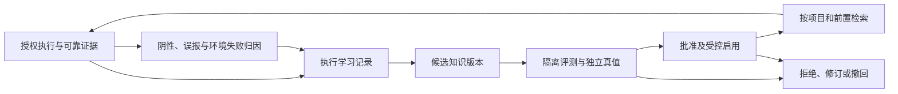

# SilkSecAgent v5 自学习与漏洞学习探测设计

> 日期：2026-09-12；状态：**方案待实施**。本文中的新增命令、表、评测和发布策略均未上线。
> 配套：[平台升级方案](2026-09-12-dsh-0.1.5-rc.2-plan.md) · [csai 实测基线](2026-09-12-dsh-0.1.5-rc.2-record.md) · [升级目录](README.md)
> 约束：沿用 v5 的 14 业务域、CommandGateway、actor、owns 和事件契约；实施前同步受影响的域文档与 manifest，本文不直接覆盖现行契约。

## 1. 要让系统学会什么

目标是让每次授权研究都能改善下一次的**方法选择、适用性判断、证据质量与复核效率**。学习产物是可追溯的事实、方法卡、探测规程与选择策略；本阶段不涉及模型权重训练。

| 学习对象 | 应形成的能力 | 存放与边界 |
|---|---|---|
| 项目事实 | 记住已验证的接口、角色、对象归属、组件版本与有期限的阴性结论 | fact；绑定 Program、证据、版本和失效条件 |
| 可复用方法 | 知道什么前置下选什么方法、出现什么现象应停止或换路 | know 的经验卡 / playbook；事实与方法分开 |
| 漏洞规程 | 从公开案例、补丁和实测偏差得到可执行、可证伪的检查卡 | know 的 vulncards；版本化前置、步骤、对照、证据要求 |
| 任务选择 | 优先处理适用、尚未覆盖、可验证且成本合理的工作 | task 消费 endpoint/ledger/know 查询；选择理由可回放 |
| 判定能力 | 区分漏洞成立、有效阴性、前置不满足、环境失败与证据不足 | eval 独立校验，不能用模型自报成功替代真值 |

现状已经有知识资产和执行回执，但还不能证明闭环有效：active 经验向量覆盖 6/35，负反馈接近空白；44 行活评测只对应 33 个 finding；契约报告 7/7 只验证网关，`llm_probe` 尚未真正调用模型。先修这些可度量缺口，再增加自动化。

所有探测仍按当前 Scope/RoE、测试身份、时间窗、QPS 与动作预算执行。学习不能自行扩权、改授权规则、解锁高风险工具，或把抓取的网页指令当成执行指令。模板或执行器代码的改动进入代码审查和发布流程；知识晋升不隐含部署代码。

## 2. 一条闭环与既有域的分工



| 域/组件 | 本次新增职责 | 保持的 owner 边界 |
|---|---|---|
| exec | 可信的 run 元数据、沙箱产物发布、执行前置和成本记录 | 写 results/flows；从凭据引用解析身份，不把凭据放进知识 |
| vuln | finding 证据包、判定与后续 SRC 裁决来源 | 写 findings/evidence；发布判定事件，不直接改知识分数 |
| ledger | 每次 attempt、卡片采用、偏差和覆盖的权威流水 | card_usage 仍归 ledger；know 通过事件与查询消费 |
| fact | 项目事实、有效阴性、环境阻塞与失效条件 | 不把某个项目的阴性泛化为全局方法结论 |
| fgs | 本次假设、反证、失败分支的任务内决策图 | 由查询导出 run 快照；不作为永久学习库 |
| know | 学习记录、候选与发布版本、检索归因、来源复验 | 沿用经验/文献/规则/漏洞卡子仓，新增表由 know 独占 |
| eval | 独立数据集、真值、候选对照评测、冻结报告 | 数据与答案由 eval 管理；被评 worker 只能读被分配的题面 |
| approval | 具体版本的知识发布决策；后续的有限自动发布授权 | 审批 effect 有幂等、重试和结果回执；模型不能裁决 |
| task | 有预算的学习/评测任务及派单；回收执行结果 | 一套任务/worker 状态机，暂不增加第二套 Teams 调度器 |
| memcore | 到期复验、降温、归档的治理触发 | 只调声明的 lifecycle 命令，不做评测裁判或自动改永久规则 |
| dashboard / report | 展示学到了什么、证据和评测如何、在哪生效、如何撤回 | 只经网关查询/命令；清理 legacy assetDb 直调后备路径 |

跨域联动继续走事件 + 接收域命令。允许查询关联事实，禁止学习脚本直写其他域的 SQLite、台账、rules 或 eval 目录。

## 3. 执行学习记录：先让每次结果可归因

### 3.1 最小数据模型（提议）

在现有 SQLite 库中增量建表，不改名、搬迁现有 exp_cards/kb_docs。只存脱敏摘要与引用，完整请求/响应由证据 owner 保管。

| 对象 / owner | 必需字段及约束 |
|---|---|
| `learning_episodes` / know | `episode_id`、`schema_version`、`source_event_id`、`program_id`、`task_id`、`task_run_id`、`exec_run_id`、`attempt_id`、`session_id`；宿主从真实调用上下文注入关联，不采信模型自填归属 |
| 同一 episode 的上下文 | `card_id/card_version`、`template_digest`、`model_id/model_config_digest`、`persona_version/prompt_digest`、`scope_revision`、endpoint 指纹、角色/测试租户标签、观察时间；标识缺失时显式标记不可用于哪类比较 |
| 同一 episode 的结果 | `outcome`、`reason_code`、证据引用/哈希、前置检查、对照结果、请求数、token、耗时、来源可信度、FGS 快照摘要/哈希；区分工具 run 和父 worker run |
| `knowledge_revisions` / know | `revision_id`、`artifact_kind`、`artifact_id`、`parent_revision_id`、正文摘要/内容哈希、来源 episode/文献版本、适用谓词、状态、评测引用；发布内容不可原地覆盖 |
| `knowledge_releases` / know | Program 或全局适用范围、revision、批准/effect/策略版本、评测版本、启停时间、前一版本、撤回原因；发布指针与内容版本分离 |
| 检索/反馈投影 / know | exposure_id、候选排序/得分解释、实际展示的版本、采用关联、反馈 revision/tombstone；投影可以重建，原始 ledger/Session 事件不重复改写 |
| 评测数据与报告 / eval | dataset/fixture 版本、题面/答案分离、label 来源与修订、baseline/candidate、执行产物摘要、判定/成本、预算与阈值版本 |

`task_runs` 存在数量保留上限，FGS 会在后续运行重置；学习引用不能只指向将被清理的行。由宿主在收尾前取 `fgs_export` 及执行快照，固定本次 run 的内容，再发完成事件。若只能在异步订阅时读取“当前图”，存在串到下一次运行的风险，应直接判为缺快照。

同一 episode 不覆写；判定修正形成带 `supersedes` 的新记录。唯一约束至少含 `(source_event_id, consumer_version)`，业务归因另按 `(program_id, exec_run_id, attempt_id, card_version)` 去重。事件重复投递、七天后回放均不得重复记功；去重标识保留期必须覆盖对应学习记录，不能只依赖总线七天幂等缓存。

### 3.2 结果分类与负知识

以下是**学习记录的新分类**，不直接替换 ledger 现有六态；建立有版本的映射并保留原值：

| outcome | 成立条件 | 后续作用 |
|---|---|---|
| `confirmed` | finding 有可复核证据；记录模型、独立复核或 SRC 裁决的来源级别 | 可作正例候选；未经独立核验不直接进入验收真值 |
| `valid_clean` | 前置满足、请求到达、正/负对照正常、目标行为断言未成立 | 对应有证据的 TESTED_CLEAN；生成有适用范围与期限的负知识 |
| `inapplicable` | 卡片的栈、版本、接口或业务前置不满足 | 对应 NOT_APPLICABLE；改进适用性选择，不扣方法有效性分 |
| `blocked_auth` | 缺 Scope、测试身份、角色或对象归属证明 | 对应 BLOCKED 的细分原因；补前置，不自动尝试绕过 |
| `infra_error` | DNS/代理/浏览器/限流/超时/服务异常，使实验无效 | 对应 BLOCKED 或失效后的重测需求；不能当漏洞阴性或方法失败 |
| `inconclusive` | 现象存在但证据/对照不足，或各出口结论矛盾 | 进入待复核；不纳入成功/阴性分母 |

`FALSE_POSITIVE` 是对某条发现的修正标签，应关联先前 episode 并撤销派生奖励；`STALE` 是旧结论失效，进入复验队列。两者不能粗暴转换为一次新的 `valid_clean`。

负知识的适用键至少包括 Program、endpoint/参数、组件及版本、身份/租户关系、卡片/模板版本和验证时间。接口变化、版本变化、Scope 修订或凭据角色变化触发失效；到期后只能作为历史提示。网络失败不生成“此处无漏洞”，一个 URL 的阴性不屏蔽整个 Program。

### 3.3 证据发布与保留

先修当前 worker 产物对服务端 `vuln_confirm` 不可见的问题：

1. worker 只写自己的 run staging；宿主 exec 校验真实 run 归属，复制到服务端可见 `results/<run_id>/`，生成清单与 SHA-256。
2. 发布前检查路径穿越、软链/硬链逃逸、类型、大小、属主和文件是否已写完；用安全文件句柄读取，避免“先检查路径、再被换掉”。上传或 DSH 交付文件同样必须经过此入口。
3. finding 证据通过 vuln 的挂载命令从可信 exec manifest 导入 `evidence/{finding_id}/`；阴性和环境证据仍由 exec 管理。数据副本各有 owner，通过哈希关联。
4. 验证包记载请求上下文、响应断言、对照、时间、出口及身份引用；仅有正文哈希不代表复现语义相同，动态响应须有稳定的行为断言。
5. 文件先落暂存并校验，再原子发布清单、发事件；崩溃留下的未登记文件可对账清理，不能把文件复制和 SQLite 事务宣称为天然原子。

仍被 finding、知识发布或评测引用的证据需 reference pin；清理与备份都尊重引用及项目保留策略。释放引用、撤回知识和清理证据分别记录。旧 inline 证据只能标为 legacy，不能自动补造 request/response。

## 4. 从资料和实战偏差学成漏洞规程

### 4.1 两条输入通道

**外部情报**：公开漏洞公告、官方修复说明、补丁差异、可信复现报告 → `harvest_ingest`/`kb_import` → 记录 URL、抓取时间、内容哈希和版本 → 结构化候选卡。优先引用原始公告/修复提交，转述文章作为旁证；重复转载按共同来源归并。

**实战反馈**：卡片执行偏差、误报、有效阴性、复验结果与人工纠错 → episode → 提出新前置、反证、证据条件或更短的验证步骤。生成的是候选 revision，不覆盖正在使用的卡片。

网页、案例、工具输出都作为数据处理；检索内容不能覆盖 Scope、角色或系统工具规则。外部提供的脚本只作为待审材料，不由收割任务直接安装执行。

### 4.2 一张可学习卡的最小结构

```yaml
# 结构示意；不是当前 vc_save 已接受的 schema
id: VC-example-authz
version: 2
parent_version: 1
sources: [{kb_revision: "kb-example-r1"}]
applies_to:
  surface: api
  prerequisites: [owned_test_accounts, known_object_owner]
  invalidated_by: [role_change, endpoint_contract_change]
hypothesis: "身份与对象归属之间应满足的访问约束"
minimal_probe: "对受控测试对象执行允许范围内的最少检查"
positive_control: "对象拥有者可执行预期操作"
negative_control: "无相应权限的测试身份应被拒绝"
evidence_required: [request_context, identity_ref, object_owner, behavior_assertion]
stop_conditions: [scope_changed, unexpected_sensitive_data, rate_limit]
fixtures: {vulnerable: "fixture-a", patched: "fixture-b", invalid_env: "fixture-c"}
budget: {max_requests: 6, max_seconds: 120}
```

卡片还需包含失败解释、适用性置信度、建议替代方法、变更说明和评测引用。示例预算只是该示例的拟定值；实际上限取卡片、任务与 Scope 规则的最严格值。

### 4.3 文献更新必须完成内容闭环

先补 `kb_docs.category/fetch_failures` 的幂等 schema 演进，并验证旧库、重复迁移、失败回滚。`kb_revalidate(changed)` 应保存新正文/内容哈希/差异摘要，生成新 revision，更新 FTS 与向量任务；不能只刷新 `validated_at`。

来源变更后标记依赖该版本的候选/已发布卡“需复验”；原始引用保留，评测通过前不静默替换发布内容。抓取失败增加失败原因和退避，不能更新“已验证”时间；curated 规则继续由受控规则发布更新，免定时抓取不代表免版本管理。

## 5. 首批漏洞学习与探测能力

优先做可形成高质量对照的类型。扩展覆盖以受控 fixture 验收为起点，之后才进入已授权项目的有限试运行；本次未执行探测。

| 优先级 | 能力 | 检测和学习重点 | 必备对照/证据 |
|---|---|---|---|
| P1 | API 对象/功能/租户授权 | 扩展现有 `vuln_authz_diff`：从响应相似度发展到角色×对象×动作约束；学习接口归属和访问前置 | 成对**测试账号与测试对象**、已知 owner/tenant、拥有者正例及无权身份负例；“低权 200”本身不够 |
| P1 | 业务流程与状态约束 | 从接口文档和流程轨迹提出状态不变量，学习缺少哪一步校验；操作限定在可恢复测试数据 | 正常流程、禁止状态转换、前后状态证据；涉及资金/消息/外部副作用时使用隔离环境或明确批准的测试流程 |
| P1 | XSS 误报消减 | 区分反射、编码、DOM sink 和实际执行，学习上下文与反证 | 隔离浏览器中的无害执行标记、编码/过滤对照、页面来源和完整轨迹；反射不能直接 confirmed |
| P1 | SSRF/带外验证 | 关联 run、请求、受控 OOB token 与回连，辨别扫描器/预览器自身访问 | 已部署且归属明确的自有回连端点、对照请求、相关时间窗；未打通 OOB 时记缺前置，不能声称已具备 |
| P2 | 组件/CVE 适用性 | 公告/补丁 → 版本与配置前置 → 非破坏的行为差异；降低仅版本匹配的误报 | 易受影响与已修复 fixture、版本/功能指纹、真实行为证据；扫描器命中先入候选 |
| P2 | 上传/路径/配置暴露 | 对受控文件、无害标记和允许路径验证规则差异；沉淀环境依赖 | 隔离或可恢复测试对象、访问边界、修复后对照、清理结果；不以读取无关敏感数据取证 |

当前仅确认有 1 条凭据引用，不能默认具备成对身份。OOB 先做基础设施可用性核查；已有文档记录 NS 委派阻塞，本次未验证已解除。能力就绪状态需显示“缺测试身份/缺对照/缺 OOB”，这些是任务前置，不计为检出失败。

## 6. 候选、评测、发布必须是一套状态机

### 6.1 新 revision 的状态（提议）

`draft → candidate → evaluating → eligible → published → retired`；失败走 `rejected`，变更内容创建新 revision。`published` 仍需区分 Program 灰度与全局生效。

该状态属于**新增 revision**，不重定义现有 exp_cards 的 active/candidate/cooling/deprecated。旧卡先生成 legacy 基线版本，保留现有使用行为与来源等级；不能因迁移而自动标为“已评测通过”。新门禁启用后，卡片的任何改动均走新版本。

### 6.2 所有写入口都要受控

| 现有入口 | 拟收口行为 |
|---|---|
| `exp_store`、`pb_save`、`vc_save`、`exp_update` | 模型/脚本只产生候选 revision；同名修改不覆盖 active 版本。语义相似只能提示合并，不能静默合并不同前置/相反结论 |
| `exp_promote`、`vc_activate`、`know_adopt` | 校验具体 revision、评测报告和发布授权；模型不能自我晋升；工具面与看板 RPC 同步收紧 |
| `rule_seed`、AGENTS 受管区块、vault 导入 | 部署的规则发布仍受版本与来源约束；导入材料走候选，不能借导出再导入“洗白”来源或绕过门禁 |
| `exp_feedback`、`pb_outcome`、usage 回执 | 接收观察/意见，不直接把模型自评计成已验证正例；可信结果从 ledger/exec/vuln/eval 关联推导 |
| alias、迁移脚本、dashboard legacy fallback | 全部映射到相同 handler；禁止残留可直接更新状态/正文的第二写路径 |

这是对 [07-know](../v5/07-know.md) 现有 model 许可和晋升语义的**明确变更提议**。实施时升级契约版本、错误 hint、调用示例与兼容投影，并测试每个入口；只新增一套 candidate 表而保留旧直升入口不能算完成。

首版沿用当前 **knowledge-adopt** 人工裁决与 approval_effects，但现有 payload 只覆盖外部经验卡，必须扩展为“artifact_kind + revision + eval_report + scope”。内部 episode 来源用可验证的本地引用，不能伪造 source_url。批准时绑定内容哈希；审批后内容变更则批准失效。

后续允许在**已预授权、带版本的策略**下，自动晋升某 Program 的低风险方法版本。策略须规定有效期、适用 Program/漏洞类型、最大调用成本、最低独立证据、评测门槛、灰度比例和自动撤回条件；未配置时不自动晋升。规则库、全局永久提示、授权与风险策略的变动继续经过对应人工/代码发布流程。不得让 system actor 冒充 `approval_decide`；自动发布调用专门的受限策略执行通道。

### 6.3 最小接口增量（均为提议）

沿用统一成功/错误信封、严格 schema、调用面注入身份与统一审计。表中“必需输入”是设计字段清单，实现前补齐类型/上限/默认值至相应域文档。

| 命令 / owner | actor 与可信输入 | 幂等依据 / 事件 |
|---|---|---|
| `exec_evidence_publish` / exec | system（明确登记的宿主收尾通道）；run 归属、staging 清单、文件摘要 | run + manifest digest；`exec.evidence.published` |
| `vuln_evidence_attach` / vuln | model/dashboard/reactor；finding_id + 已发布 exec evidence_ref，网关再核 Program/权限 | finding + evidence digest；`vuln.evidence.attached` |
| `know_episode_record` / know | reactor；源事件、执行/台账快照、证据 refs、上下文版本；不信任模型直接提交的奖励值 | source event + consumer version，另有业务唯一键；`know.episode.recorded` |
| `know_revision_propose` / know | model/script/dashboard；父版本、结构化改动、来源、适用条件 | artifact + parent + content digest；`know.revision.proposed` |
| `eval_run_candidate` / eval | dashboard/human/script；候选、基线、冻结数据集、模型/提示/工具版本、预算 | 评测规格摘要 + 显式 trial_id；`eval.report.built` 扩展 kind=candidate |
| `know_revision_assess` / know | reactor；独立 eval 报告引用，校验候选与内容哈希对应 | revision + report；`know.revision.assessed`，结果 eligible/rejected 由报告和发布规则决定 |
| `know_revision_publish` / know | approval/human；或显式注册的 system 策略执行通道；评测、内容哈希、批准/策略及目标范围 | revision + scope + authorization；`know.revision.published` |
| `know_release_revoke` / know | dashboard/human；或上述策略通道；release_id、结构化判据、回退版本 | release + correction event；`know.release.revoked` |
| `know_feedback_ingest` / know | system（DSH 本地反馈桥）；session/message/feedback id、revision、撤回标记及身份 | feedback id + revision；`know.feedback.ingested` |

补充只读投影 `know_learning_status` / `know_revision_history` / `know_retrieval_explain`，只暴露调用者有权查看的 Program。新 eval 隐藏集需收窄现有 `eval_cases/eval_reports` 的可见范围，不能继承“全量可见”默认。

失败使用既有 `E_EVIDENCE_REQUIRED/E_ACTOR_FORBIDDEN/E_IDEMPOTENT_CONFLICT` 等全局码；领域码提议 `E_KNOW_EVAL_REQUIRED`、`E_KNOW_POLICY_EXPIRED`、`E_KNOW_REVISION_CHANGED`、`E_EVAL_TRUTH_UNAVAILABLE`。hint 分别引导补独立评测、重新授权、重新评测变化后的版本、修复 fixture；不能提示直接改状态绕过。

订阅者必须检查 `ok:false` 和 `partial`，失败进入可见的 retry/dead-letter 或补偿任务。业务行已提交但索引失败时记录待修复投影，不重复业务落账；“outbox delivered”只说明投递结束，不能代替发布/effect/索引完成状态。

## 7. 独立评测：证明候选能改善结果

### 7.1 三种评测分开记分

| 类型 | 验证什么 | 必需改动 |
|---|---|---|
| 网关契约 | 非法 actor、无证据确认、越界调用是否被代码拒绝 | 继续现有 Mode A；新增知识发布绕过、证据伪造、事件重放、own 目录写入用例 |
| 模型行为 | 实际 LLM 是否选择正确工具、理解 hint、改正失败路径 | 修复 `llm_probe=true` 只 dispatchAttempt 的问题；真正启动受测 headless 会话，保存工具轨迹、轮次、拒绝/恢复结果 |
| 漏洞探测 | 在可验证真值的环境中能否发现漏洞并避免误报 | 将旧 eval-run.js 从 retired run_cli/grep_result 迁到 v5 bootstrap/exec；评测 owner 汇总标准 eval-range-report，不让 worker 直写 |

12 个 FP 种子、7 个契约种子和历史靶场报告可作为起点，不能合并成“检出准确率”。先在当前版本完成可复现基线，再固定模型、prompt、知识与工具版本比较候选；平台升级单独比较，防止收益归因混乱。

### 7.2 真值与防泄漏

- 活判定保留完整历史，计数以每个 finding 最新有效裁决去重；标注 `model-proposed / independently-verified / human-reviewed / vendor-confirmed` 等来源级别与纠正关系。模型触发的 confirmed 只是标签候选，不自动成为基准答案。
- 把训练/开发集与隐藏验收集按 Program、技术栈、同源案例家族和时间分组。近似转载、同一补丁衍生题不得跨两边泄漏；样本不足时显示限制，不能用随机行切分制造泛化表现。
- 被评 worker 无权查询隐藏答案、修改 fixture 断言或读其挂载目录；拥有 exec 工具也不得访问答案服务。现有 eval 的只读工具需要 profile/身份/数据集级裁剪。
- 答案由受控 fixture 的状态断言、独立复验或有来源的人工裁决产生。模型可整理证据，不能单独决定自己是否答对；隐藏集只返回足以验收的汇总，调试使用开发集。
- 每个类型至少包含易受影响、已修复/未受影响、环境异常三类 fixture。P1 的 4 类先形成不少于 12 个基本场景；**这是冒烟覆盖，不能替代足量独立样本的统计结论**。

### 7.3 对照与放行

每轮固定 baseline 和 candidate 的内容哈希、数据集、执行器、模型参数、预算与停止条件；同一 case 做配对运行，必要时多次重复估计模型波动。禁止只展示候选有利的运行。

| 维度 | 首轮建议验收线（实施前登记并冻结） |
|---|---|
| 边界正确性 | 越权/伪造/无证据确认的负向 fixture 全部被拒；一例失守即不发布 |
| 数据与归因 | 纳入评估的 episode 必需字段和证据关联完整；重复回放零重复奖励；无法归因样本单列 |
| 探测质量 | 严重误报无新增，关键修复对照不回归；报告 TP/FP/FN、有效样本数与区间，不只给总百分比 |
| 学习收益 | 预注册目标至少一项改善：适用性选择、有效检出、误报消减或等质量下成本；其余指标在预设容忍范围内 |
| 样本不足 | 结果标记 inconclusive，保留候选或仅批准限定试运行；不能宣布自动全局晋升 |
| 成本 | 请求/token/时长符合每轮冻结预算；成本提升若换取质量提升，必须在该次发布决策中明确接受 |

首个灰度可以限定一个 Program 和少量已授权任务，**默认建议不超过符合条件任务的 10%**；这是后续待授权的发布参数，不是本次对线上任务的操作指令。观察实际有效样本和至少一个完整任务周期，触发误报/边界/预算阈值即撤回发布指针。

回退知识时，未启动任务改用前版；在飞任务保留已绑定版本，紧急边界问题则取消。历史 episode 不回写，报告明确版本切点。知识回退不要求降级 DSH 或恢复整库。

## 8. 检索、选择与反馈计分

### 8.1 把曝光、采用和有效结果分开

现有 exp/kb usage 与 score 不适合直接作为效果奖励。查询本身仍纯读；宿主对实际注入上下文的结果补发曝光回执，再由执行台账证明采用，由独立证据证明效果。

`检索命中 → 实际展示 → 采用 → 有效实验 → 独立验证 → 后续修订` 分开计数。给一个查询重复刷新、模型称赞一张卡、重放一次事件，都不能累计“成功”。一个结果涉及多张卡时保存归因集合与说明，不能给每张卡都加一整次独立成功。

### 8.2 检索与选择顺序

1. 先过滤 Program/授权可见性、版本、身份前置、生命周期与失效时间；召回不得将其他项目凭据或私有证据带入当前上下文。
2. 在合格集合内做 FTS + 向量融合，用可复核的适用性、独立结果、来源质量与新鲜度排序；raw uses 只作使用统计，去掉“越曝光越加分”的循环。
3. 稳定纪律留在 persona prefix，检索只注入少量卡片摘要和证据引用，需要时展开；完整内部轨迹不塞进永久 prompt。
4. 每次记录入选/未入选原因、卡片版本和成本；先能回放固定策略，再考虑更复杂的选择优化。
5. 探索仅限满足 Scope/预算且已经过评测的允许集合；未发布候选的实验走独立评测或被批准的灰度，不能用探索奖励绕过门禁。

效果估计按漏洞类型/技术栈/身份前置分层，展示样本量与不确定性；小样本采用保守平滑，环境错误不扣方法分，误报与已证伪反馈及时降权/撤回。先建立计分的可重算流水，不立刻引入在线强化学习或多臂老虎机。

### 8.3 向量与索引可靠性

先补齐当前规模的向量覆盖和可见错误，再按性能数据决定是否引入 ANN。为索引记录 `content_hash + embedding_model + dimension + build_version`，混模型向量不可直接相似度排序；异步队列有失败原因、退避、重试和覆盖率。

生命周期/发布指针是查询时的最终过滤依据：即使旧 FTS/向量条目未及时清理，也不能召回已撤回版本。FTS-only 降级显式显示，缺索引不把主行删除；回填需限速并能断点恢复。

## 9. 使用 rc.2 的原生反馈与文件体验

rc.2 反馈确认/失败保留输入改善了采集体验，但反馈不会自行更新知识。新增本地桥同时处理实时 `session/event` 和冷启动 `feedback/committed`，按 Session/message/feedback id 与 revision 去重；只处理目标版本实际定义的事件形状。

冷通知给出的是借用的只读 canonical 快照：回调先复制必要字段到本地处理队列，不在回调中等待同一 Session 的另一项反馈/写操作，避免持锁互等。已提交反馈不能由观察者撤销；后续学习落账失败只记录可恢复重试，不伪称原反馈提交失败。

反馈关联该条回复采用的卡片版本、任务和 run。无法明确归因时进待整理队列，不能给整场会话所有卡片加分。修改覆盖旧反馈的有效投影，撤回产生 tombstone 并撤销派生分数；重复订阅或重启补扫不重复奖励。

人工“有用/错误”与漏洞真值分开：有用表示体验/方法价值，成立与否仍需证据。错误说明可以产生候选修订；是否进正式评测集由 eval 的标签通道决定。

反馈留在本地。按升级方案显式禁用 OTel 内容导出并独立核查其他上报插件；FEEDBACK_ONLY 会释放会话上下文，不能用来表达“只上传点赞”。文件上传/交付预览可以展示证据，但附件必须经 §3.3 的验证和归属登记。

## 10. 调度和用户可见的学习状态

学习与评测作为现有 task 的明确任务类型/目标调度，复用 exec worker 和预算收尾：

- 实时：执行结束可靠地记录证据、attempt 和 episode；失败进入可恢复队列，不能因学习订阅失败把研究结果静默丢掉。
- 日常：整理新资料/偏差、补索引、复验到期来源，限制并发与模型预算；只形成候选。
- 周期性：固定评测批次、候选对照、误报复盘与晋升审阅；避免每次小反馈都启动昂贵的全量评测。
- 变更触发：Scope/接口/版本/卡片撤回使相关负知识失效并产生有预算的重测需求；已暂停任务不自行恢复。

当前由 v4 scheduler 持锁。调度器替换放在独立切片：先验证 task.claim/finish/reap 的等价性、重启与幂等，再停止旧循环并切唯一持锁者。不能因升级原生子代理能力就开启并行的第二个派单循环。

看板入口使用普通业务语言：“最近学到的”“待复核的方法”“本项目已启用”“效果与成本”“已撤回”。每项回答五件事：**学到了什么、依据是什么、比旧版改善多少、在哪生效、如何恢复旧版**。技术字段放详情，不要求用户理解 episode/outbox 才能做决定。

当前看板先修旧 assetDb fallback 绕网关问题，再按 v5 域视图拆分；rc.2 的 main/panellist 与文件预览用于承载全局学习面和证据对照。体验改造不替代正确的权限与数据归属。

## 11. 实施切片和完成定义

| 包 | 交付 | 依赖 | 验收与回退 |
|---|---|---|---|
| **L0：正确性和测量** | kb 缺列/内容复验修复；task proof 异常显式失败；订阅 partial/索引失败可见；纠正 llm_probe 模式标签；标准评测入口恢复 | 可在旧 DSH 上先做；与 U1 按发布边界协调 | 真实缺陷可复现且回归通过；不再有伪成功报告；模型行为未实现前明确 unsupported |
| **L1：证据与执行学习记录** | exec 发布/挂证据；episode、FGS 快照、六类结果、长期去重、来源可信度 | L0 的错误/归因基础 | 正常、超时、取消、无身份、重启、晚到事件均正确归因；越权文件被拒；重复回放不重复记功 |
| **L2：候选规程与来源版本** | 外部资料及偏差转候选；revision；先交付 P1 中一种类型的完整卡片切片 | L1 | 前置/对照/停止/证据/来源齐全；内容变化不覆盖已发布版本；坏资料不触发执行 |
| **L3：独立评测** | 真实模型行为层、v5 fixture runner、分组开发/隐藏集、baseline 配对报告 | L0、L2；DSH 比较使用完成 U2 的产物 | 三类评测分别出报告；隐藏答案不可读；标签去重和来源可追溯；失败/中断不记成功 |
| **L4：受控晋升和撤回** | 收口所有旧写入口；扩展 knowledge-adopt；具体 revision 发布、有限灰度和回退 | L3 | 模型不能直升/原地改 active；批准绑定哈希；effect 重试不重复发布；灰度失败可恢复 |
| **L5：检索与计分** | 分层检索、曝光/采用/结果拆分、覆盖补建、反馈编辑/撤回重算 | L1、L4；原生反馈桥依赖 U3 | 旧版本/跨项目/失效负知识不误召回；计分可重算；能报告效果和成本而非 uses 榜单 |
| **L6：完整运营体验** | 学习面板、证据对照、逐域视图、调度器独立切换；补齐其余 P1，再按证据扩 P2 | L4、L5 | 人能追溯一次学习到实际结果并撤回；只有一个调度持锁者；Web/worker 行为验收通过 |

首个端到端里程碑：**一个漏洞类型、一个受控 fixture 家族、一张有版本的候选卡，从执行证据走完独立评测、批准发布、实际采用、纠错撤回**。完成这个切片后才复制到其他类型。

L0/L1 中会使授权、证据确认或 task 收尾产生伪成功的问题，应在相应 U-D/U-E/U-H 放行前修复或明确阻断相关功能；不能以“以后属于学习包”为由让升级验收虚报通过。其他学习增量可以独立于 DSH 切换发布。

关账必须有：基线和候选报告、固定版本清单、实际 Program 可见范围、发布/effect/回退记录、纠错/撤回验证、仍未覆盖的场景。当前计数器不能证明这些已完成，所有 L0–L6 状态继续记为未执行。

## 12. 契约与来源

- v5：[全局约定](../v5/00-conventions.md)、[task](../v5/05-task.md)、[fact](../v5/06-fact.md)、[know](../v5/07-know.md)、[approval](../v5/09-approval.md)、[exec](../v5/10-exec.md)、[ledger](../v5/11-ledger.md)、[FGS](../v5/14-fgs.md)、[eval](../v5/15-eval.md)、[dashboard](../v5/16-dashboard.md)。
- 本次运行态与代码证据：[csai 预检记录](2026-09-12-dsh-0.1.5-rc.2-record.md)。
- 上游 rc.2：[message-feedback](https://github.com/deepseek-ai/deepseek-harness/blob/dsh-v0.1.5-rc.2/packages/feedback/message-feedback/README.md)、[session-telemetry-otel](https://github.com/deepseek-ai/deepseek-harness/blob/dsh-v0.1.5-rc.2/packages/session/session-telemetry-otel/README.md)。
