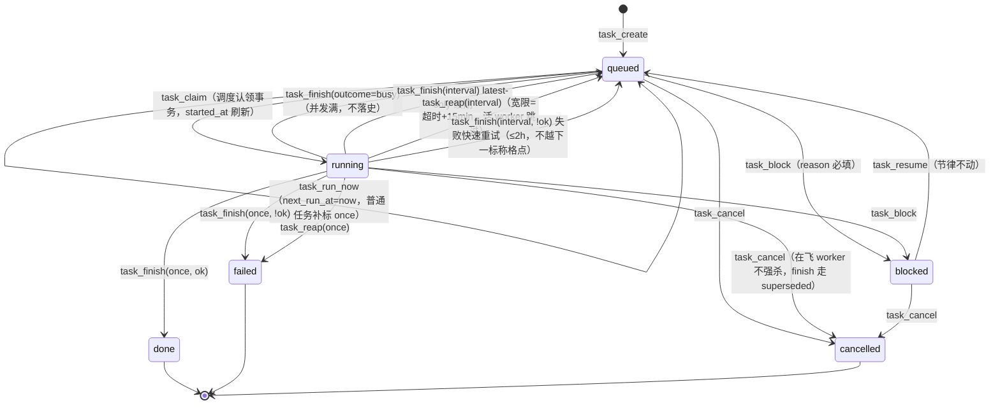

# 05 · task 域设计（任务 / 调度 / 执行史 / worker 注册表）

> 版本：v5.0 ｜ 状态：草案 ｜ 契约版本：task domain manifest v1
> 依赖：订阅 `approval.approved`（审批入队种子任务 + task-budget-extend 预算落列）、`exec.worker.spawned` / `exec.worker.finished`（worker 注册表记账，强联动）
> 被订阅：`task.created`（看板/memcore）、`task.claimed`（看板）、`task.finished`（**fgs 域沉淀触发、fact 域 FGS 转正、ledger 域 handoff 追加**）、`task.blocked` / `task.cancelled`（看板/memcore）
> 最高约定：[`00-conventions.md`](00-conventions.md)。本文与宪法冲突时以宪法为准。

---

## 一、对外暴露（External Surface）

### 1.1 服务标识与挂载

| 项 | 值 |
|---|---|
| 域名 | `task` |
| cordis 服务名 | `secDomain.task`（`ctx.provide('secDomain.task')`） |
| 插件包名 | `@silksec/sec-domain-task` |
| 后端插件包名 | `@silksec/sec-backend-task-sqlite` |
| owns（单写者声明） | 表：`tasks`、`task_runs`、`workers`；文件：`data/scheduler.lock`（调度器单例锁，本域独占读写）。**注意：`data/pipeline/{program}/` 下产物文件归 ledger 域 owns，本域只读（守卫校验经 ledger 域查询）** |
| 事件日志 | `data/events/task.jsonl` |

**profile 挂载矩阵**：

| profile | 挂载内容 | 说明 |
|---|---|---|
| `web`（宿主面） | 全部命令 + 全部查询 + RPC 投影 + **调度器循环（单例）** | 调度器只在 web profile 启动（文件锁兜底，headless 误载不认领） |
| `headless`（worker 面） | 模型可见命令 + 查询（不含 scheduler 专用动词） | worker 会话内 agent 需要建任务/记 note/查执行史 |

### 1.2 命令总表

| # | 动词 | 一句话语义 | actor | 幂等键 | 发布事件 | 模型可见 |
|---|---|---|---|---|---|---|
| C1 | `task_create` | 登记新任务（普通 / once / interval），含任务级模型覆盖与预算参数 | model, dashboard, script, approval, system | 自然键（interval）/ 自动指纹 | task.created | ✅ |
| C2 | `task_schedule` | 设置 / 修改 / 清除任务的调度（终态不可改） | model, dashboard | 显式 / 自动指纹 | — | ✅ |
| C3 | `task_run_now` | 立即触发一次（拨 next_run_at=now，不动节律） | model, dashboard | 自动指纹 | — | ✅ |
| C4 | `task_update_note` | 向 result 证据链追加一条带时间戳的记录（不改状态） | model, dashboard, scheduler, script | 自动指纹 | — | ✅ |
| C5 | `task_block` | HITL 暂停：非终态 → blocked（blocked_reason 必填） | model, dashboard | 自动指纹 | task.blocked | ✅ |
| C6 | `task_resume` | 恢复：blocked → queued（节律不动） | model, dashboard | 自动指纹 | — | ✅ |
| C7 | `task_cancel` | 取消：任意非终态 → cancelled | model, dashboard | 自动指纹 | task.cancelled | ✅ |
| C8 | `task_finish` | **调度器专用收尾**：落执行史 + latest-only 续期 + 流程守卫前置不变量 | scheduler | 自然键（task_id+run_id） | task.finished | ❌ |
| C9 | `task_chain` | 能力图 BFS + 反向剪枝 → 落 parent 串联 once 链 | model, dashboard | 自然键（链标记） | task.created ×N | ✅ |
| C10 | `task_budget_extend` | task-budget-extend 审批落列（budget_timeout_sec ≤7200） | approval | 自然键（task_id） | — | ❌ |
| C11 | `task_claim` | 调度认领：BEGIN IMMEDIATE 原子抢占 ≤4 条到期任务 | scheduler | 状态条件（queued） | task.claimed ×N | ❌ |
| C12 | `task_reap` | 僵尸回收：宽限=超时+15min，活 worker 跳过 | scheduler | 状态条件（running） | task.finished ×N | ❌ |
| C13 | `task_worker_register` | worker 注册表登记（exec.worker.spawned 订阅执行） | reactor | 自然键（run_id） | — | ❌ |
| C14 | `task_worker_finish` | worker 注册表收尾（exec.worker.finished 订阅执行） | reactor | 自然键（run_id） | — | ❌ |
| C15 | `task_worker_reap` | worker 注册表启动/周期对账（meta 回读 → pid 判活 → 孤儿执法） | scheduler | 状态条件（running） | — | ❌ |
| C16 | `task_submit_complete` | **自执行任务完成声明**（不改状态，提请 task-complete 审批） | model | 自然键（task_id+声明时刻） | — | ✅ |
| C17 | `task_complete` | **审批落成收尾**（approval.approved kind=task-complete 订阅执行，自执行任务唯一 done 入口） | approval | 自然键（task_id） | task.finished | ❌ |

> \* actor 为 `reactor`（宪法 §三 域事件订阅反应器）：C13/C14 由总线从 `exec.worker.*` 订阅回调注入 actor=reactor，审计 cause 链指向源事件及其原始 actor；approval 事件的订阅执行保留专用 `approval` actor（语义更具体的先例身份）。

**与 exec 域的边界（dedupe_key 幂等语义为界）**：

| 职责 | 归属 | 内容 |
|---|---|---|
| 执行动作 | **exec 域** | `exec_spawn_worker` 命令：dedupe_key 构造（sha1(task 全文)）、`force` 跳过语义、幂等预检（调本域查询 `task_worker_recent`）、进程 spawn/超时杀组、run_dir 文件（worker.log/meta.json）、RoE 块注入、真实性校验（worker.log 拒执标记扫描——它读的是 exec owned 文件） |
| 任务执行史 | **task 域（本域）** | workers 表行：注册（spawn 后）、收尾（退出后）、对账（重启后）。exec 域**不直接写 workers 表**——spawn 成功后发布 `exec.worker.spawned {run_id, dedupe_key, pid, task, cwd, timeout_sec, session_id, run_dir}`（**强联动 sync**），本域订阅后执行 C13；进程退出后发布 `exec.worker.finished {run_id, status, exit_code, truth}`，本域执行 C14。强联动失败 → exec_spawn_worker 整体报错回滚（exec 域负责 kill 刚 spawn 的进程组再返回）——**注册行丢失 = dedupe 语义失效 = 重复 spawn**，故必须强联动 |

### 1.3 命令逐个详述

#### C1 `task_create`

**语义**：登记一个任务（可管理的工作单元，编排器的派单对象）。普通任务（无 schedule）只进队列；`once` 到期跑一次；`interval` 周期跑（latest-only 续期）。

**参数表**（additionalProperties: false）：

| 参数 | 类型 | 必填 | 默认 | 校验 |
|---|---|---|---|---|
| `program_id` | string | 条件 | 会话工作区反查 | 须存在于 programs（scope 域镜像）；显式传入优先；反查无果 → `E_TASK_PROGRAM_UNRESOLVED` |
| `objective` | string | ✅ | — | 非空；≤4000 字符；interval 任务额外过 objective lint（故障词/陈旧日期，memcore 既有口径） |
| `phase` | string | ❌ | `''` | 建议枚举 recon/vuln/biz-logic/code-audit/intranet/review（不硬校验，PHASE_PRESET 未命中则不注入人格） |
| `priority` | integer | ❌ | `5` | 0 最高；0–9 |
| `parent_id` | integer | ❌ | null | 须存在且非本任务自身；父任务终态后子任务才可被认领（链式放行） |
| `budget_tokens` | integer | ❌ | null | ≥0 |
| `assignee` | string | ❌ | `''` | 自由文本 |
| `schedule` | object | ❌ | null | `{kind:'once', at}`：at 须未来毫秒时间戳，否则 `E_TASK_SCHEDULE_PAST`；`{kind:'interval', every_seconds}`：整数且 ≥300，否则 `E_TASK_INTERVAL_MIN`；kind 非法 → `E_SCHEMA` |
| `provider` | string | ❌ | null | 任务级模型覆盖（P18）；须 provider+model 成对出现，单传 → `E_SCHEMA` |
| `model` | string | ❌ | null | 同上 |
| `reasoning_effort` | string | ❌ | null | 枚举 low/medium/high |

（`session_id` 由网关从调用面注入，调用方不传。）

**不变量（网关前置）**：

| ID | 不变量 | 失败码 |
|---|---|---|
| INV-T1 | interval 任务 objective 不得命中 intrusive 关键词表（manifest 可配，默认 `intrusive/主动利用/getshell/写入/破坏性`）——保守启发式，完整口径靠 objective lint 兜底 | `E_TASK_INTRUSIVE_INTERVAL` |
| INV-T2 | **interval 固定实体幂等**：同 `(program_id, objective)` 已有活跃（非 done/failed/cancelled）interval 任务 → 不新建，返回已有 `task_id` + `deduped:true`（v4.x P12 防任务表增殖语义原样保留） | （不失败，幂等命中） |
| INV-T3 | once.at 未来；every_seconds ≥300 整数 | `E_TASK_SCHEDULE_PAST` / `E_TASK_INTERVAL_MIN` |

**返回信封（成功）**：

```json
{
  "ok": true, "domain": "task", "cmd": "create",
  "data": { "task_id": 128, "status": "queued",
            "schedule": { "kind": "interval", "next_run_at": 1789003000000 },
            "deduped": false },
  "event_ids": ["evt_01J..."], "idempotency_key": "task:create:interval:prog-a:每日03点资产巡检", "replay": false
}
```

**错误码**：

| code | 触发 | hint | retryable |
|---|---|---|---|
| `E_SCHEMA` | objective 缺失 / schedule.kind 非法 / provider+model 不成对 | 「objective 必填；schedule.kind 仅 once/interval；模型覆盖须 provider+model 成对」 | false |
| `E_TASK_PROGRAM_UNRESOLVED` | program_id 缺失且会话不在已绑定工作区 | 「传 program_id（见 program_list），或在绑定工作区的会话里调用」 | false |
| `E_TASK_SCHEDULE_PAST` | once.at ≤ now | 「once 调度需要未来的毫秒时间戳」 | false |
| `E_TASK_INTERVAL_MIN` | every_seconds <300 或非整数 | 「interval 调度需要 every_seconds ≥300 的整数（对齐 dsh-schedule 下限）」 | false |
| `E_TASK_INTRUSIVE_INTERVAL` | INV-T1 命中 | 「intrusive 级目标禁止 interval——改用 once 单次执行，或拆出被动采集部分做周期任务」 | false |

**幂等**：interval 分支走**自然键** `task:create:interval:{program_id}:{objective}`（活跃唯一约束）；once/普通分支走自动指纹（网关 sha1 核心字段）。重放同 key 同参 → 首次结果 + `replay:true`。

**actor**：model, dashboard, script, approval（审批种子任务订阅执行）, system。`approval` actor 的调用 cause 链带源审批 id。

**agent_note（模型面工具描述全文）**：

> 创建一个任务（可管理的工作单元，编排器的派单对象；看板任务视图立即可见）。program_id 见 program_list（不传则按当前会话所在工作区自动带出）；phase: recon/vuln/biz-logic/code-audit/intranet/review；priority 0 最高。依赖：传 parent_id 声明前置任务，前置未 done 时调度器/派单不放行（多级链用 task_chain 一次展开）。定时任务：用户说「定时/每隔/每天/每小时/定期跑」时必须传 schedule（{kind:"once",at:<未来毫秒时间戳>} 或 {kind:"interval",every_seconds:>=300}），不得只在会话里口头答应——带 schedule 的任务由调度循环自动执行，intrusive 级目标禁止 interval。provider/model/reasoning_effort 可选：任务级模型覆盖（不传走 agent-default-model）。

**side_effects**：`[rows_touched: tasks+1, events: task.created×1, caches: none]`

---

#### C2 `task_schedule`

**语义**：设置/修改/清除任务的调度。`schedule:null` 表示清除调度（变普通任务）。**终态任务不可改**。

**参数表**：

| 参数 | 类型 | 必填 | 默认 | 校验 |
|---|---|---|---|---|
| `task_id` | integer | ✅ | — | 存在，否则 `E_NOT_FOUND` |
| `schedule` | object\|null | ✅ | — | 同 task_create 的 schedule 校验；null=清除 |

**不变量**：INV-T4（终态不可改调度）→ `E_STATE`；interval 分支同样过 INV-T1/INV-T3。

**返回**：`data: {task_id, schedule: {kind, next_run_at}|null}`。

**错误码**：

| code | 触发 | hint | retryable |
|---|---|---|---|
| `E_NOT_FOUND` | 任务不存在 | 「核对 task_list 里的 id」 | false |
| `E_STATE` | 任务已 done/failed/cancelled | 「终态任务不能改调度；需要重跑请新建任务」 | false |
| `E_TASK_INTRUSIVE_INTERVAL` | 同 C1 | 同 C1 | false |

**幂等**：显式键（推荐）或自动指纹。**actor**：model, dashboard。**事件**：无（调度参数变更不是状态机流转，审计可见）。

**agent_note**：

> 设置/修改/清除任务的定时调度。schedule 结构同 task_create；schedule 传 null 清除调度变普通任务。终态任务不可改。修改 interval 的 every_seconds 后，续期锚点仍为原 run_at（节律相位不因改调度而重置，除非清除后重设）。

---

#### C3 `task_run_now`

**语义**：立即触发一次执行：把 `next_run_at` 拨到现在，调度循环下一 tick（≤60s）认领。**不动节律**——续期以 run_at 标称锚点计算，手动触发不会污染下次运行时间（2026-09-02 手动执行致每日任务从凌晨 3 点漂到 19 点的根因防护）。未设置 schedule_kind 的一次性任务自动标 `once`（否则调度循环永不认领）。

**参数表**：`task_id` integer ✅（存在性校验）。

**不变量**：仅 `queued` 可触发（`E_STATE`）。

**返回**：`data: {task_id, hint: "已排入调度队列，下一 tick（≤60s）认领执行"}`。

**错误码**：`E_NOT_FOUND`（hint「核对 task_list 里的 id」）；`E_STATE`（hint「仅 queued 可立即触发；running 用 task_worker_status 查进度，blocked 先 task_resume」）。

**幂等**：自动指纹。**actor**：model, dashboard。**事件**：无（状态未变，审计留痕）。

**agent_note**：

> 立即触发一次任务执行（不动调度节律）：排入调度队列，下一 tick（≤60s）由 worker 认领执行。手动提前跑 interval 任务不会跳过原定运行（未到期的标称格点仍保留）。

---

#### C4 `task_update_note`

**语义**：向任务 result 证据链追加一条 `[ISO 时间] note` 记录（v4.x taskUpdate 的 note 段独立成动词）。不改状态。

**参数表**：

| 参数 | 类型 | 必填 | 校验 |
|---|---|---|---|
| `task_id` | integer | ✅ | 存在 |
| `note` | string | ✅ | 非空；单条 ≤2000 字；result 总长截断保留尾部 8000 字 |

**返回**：`data: {task_id, result_tail: "…最近 200 字"}`。

**错误码**：`E_NOT_FOUND`；`E_SCHEMA`（note 空）。终态任务**允许**追加 note（证据链补录）。

**幂等**：自动指纹（防重放把同一条 note 叠两遍）。**actor**：model, dashboard, scheduler, script。**事件**：无。

**agent_note**：

> 向任务的 result 证据链追加一条带时间戳的记录（不改任务状态）。用于：执行中途记录关键结论、补录证据指针、说明阻塞背景。收尾摘要由调度器 task_finish 自动落，不要手动模拟。

---

#### C5 `task_block`

**语义**：HITL 暂停——非终态任务 → `blocked`（调度器只认领 queued，blocked 即冻结）。v4.x「看板手动改状态」的显式动词化。

**参数表**：

| 参数 | 类型 | 必填 | 校验 |
|---|---|---|---|
| `task_id` | integer | ✅ | 存在 |
| `blocked_reason` | string | ✅ | 非空；≤500 字 |
| `note` | string | ❌ | 同 C4 |

**不变量**：INV-T5（blocked_reason 必填；终态/已 blocked 不可再 block）→ `E_STATE`。

**返回**：`data: {task_id, status: "blocked"}`。

**错误码**：`E_NOT_FOUND`；`E_STATE`（hint「终态任务不可阻塞；已 blocked 用 task_resume 恢复」）；`E_SCHEMA`（blocked_reason 空，hint「阻塞必须写原因——这是解除阻塞时判断依据」）。

**幂等**：自动指纹。**actor**：model, dashboard。**事件**：`task.blocked`。

**agent_note**：

> 暂停一个任务（HITL 阻塞）：调度器不再认领，直到 task_resume。blocked_reason 必填（等授权/等审批/等人工确认…），恢复时人工据此判断。

---

#### C6 `task_resume`

**语义**：恢复——`blocked → queued`。next_run_at 不动（interval 节律保留；被阻塞错过的格点由 latest-only 续期自然跳过，不补跑）。

**参数表**：`task_id` integer ✅。

**不变量**：仅 blocked 可恢复（`E_STATE`）。

**返回**：`data: {task_id, status: "queued", next_run_at}`。

**错误码**：`E_NOT_FOUND`；`E_STATE`（hint「仅 blocked 状态可恢复；queued/running 无须恢复」）。

**幂等**：自动指纹。**actor**：model, dashboard。**事件**：无（恢复不是业务联动点；audit 可见，看板 30s 轮询自然刷新）。

**agent_note**：

> 恢复一个被阻塞（blocked）的任务回队列。节律不变：阻塞期间错过的周期不补跑。

---

#### C7 `task_cancel`

**语义**：取消——任意非终态 → `cancelled`。正在跑的 worker 不被杀（run 结果到达时 task_finish 走 superseded 路径，只补执行史不改状态）。

**参数表**：

| 参数 | 类型 | 必填 | 校验 |
|---|---|---|---|
| `task_id` | integer | ✅ | 存在 |
| `note` | string | ❌ | 取消原因（看板默认「看板手动取消」） |

**不变量**：INV-T9（终态不可再取消）→ `E_STATE`。

**返回**：`data: {task_id, status: "cancelled"}`。

**错误码**：`E_NOT_FOUND`；`E_STATE`（hint「任务已终态；重跑请新建」）。

**幂等**：自动指纹。**actor**：model, dashboard。**事件**：`task.cancelled`。

**agent_note**：

> 取消一个任务（任意非终态 → cancelled，不可逆）。在飞的 worker 不强杀——其结果仅补进执行史。误建的任务、目标失效的链、被更好方案取代的周期任务用它退出。

---

#### C8 `task_finish`（actor=scheduler 专用）

**语义**：调度器收尾一个 run：① 真实性判定（以 exec.worker.finished 事件的 `truth` 为准，拒执/API 错误即使 exit 0 也翻转为失败）；② **流程守卫前置不变量**（见下）；③ 落 task_runs 执行史；④ interval 任务 latest-only 续期回 queued / once 任务进终态；⑤ 写 last_run_at/last_run_id/session_id；⑥ 发布 `task.finished`。

**参数表**：

| 参数 | 类型 | 必填 | 默认 | 校验 |
|---|---|---|---|---|
| `task_id` | integer | ✅ | — | 存在 |
| `run_id` | string | 条件 | `''` | **证据即参数**（铁律 4）：outcome=done/failed 时必填（exception 路径允许空）；引用须存在于 exec 域 results，否则 `E_EVIDENCE_REQUIRED` |
| `outcome` | string | ✅ | — | 枚举 `done / failed / busy / crash`：busy=exec 并发满（回 queued 不落史）；crash=调度执行异常（视同 failed，run_id 可空） |
| `note` | string | ❌ | `''` | 摘要 ≤500 字（v4.x：worker 尾部去噪后 3 行） |
| `session_id` | string | ❌ | null | 会话反查回填值（findWorkerSessionId 结果） |
| `truth` | object | ❌ | `{checked:false,rejected:false,reason:''}` | 由 exec.worker.finished 事件透传；`truth.rejected=true` ⇒ outcome 强制翻转为 failed |

**流程守卫（前置不变量，从 v4.x taskUpdate 拆出，成为 finish 的私有不变量）**：

| ID | 校验 | 作用域 | 失败语义 |
|---|---|---|---|
| INV-T6a | ① attempts 台账近 24h（北京日切：今天/昨天）有增量行（六态皆可）——**经 ledger 域查询 `ledger_pipeline_guard`** | `schedule_kind='interval'` 且 `data/pipeline/{program}/` 目录存在的任务 | 守卫结果不拒绝 finish（见下），进 payload |
| INV-T6b | ② card_usage-*.jsonl 近 24h 有记录（文件名日期或 mtime 24h 内）——同上经 ledger 查询 | 同上 | 同上 |
| INV-T6c | ③ handoff-<北京日期>.md 存在（今天或昨天）——同上经 ledger 查询 | 同上 | 同上 |

**守卫失败的处理（设计决策，防死锁）**：v4.x 守卫拦的是 agent 手动标 done；v5 收尾权唯一归 task_finish，而 interval 任务本就不落 done——**守卫失败不拒绝事务**，而是：本次 run 的 task_runs 落 `ok=0`、note 前缀 `[流程守卫缺失]` + missing 清单；task.finished payload 带 `guard:{checked, missing[]}`；ops 健康度红条（看板）呈现缺失清单。理由：拒绝 finish 会让任务卡 running 直至被 reap 误回收——纪律信号用可观测性承载，不用状态死锁承载。缺失清单的补救动作仍是 agent 职责（attempts_log / card_usage_log / handoff 五段结构）。

**latest-only 续期锚点算法（interval 分支，逐行移植 v4.x，含全部防漂移注释）**：

```
step   = every_seconds × 1000
anchor = (run_at > 0) ? run_at : (next_run_at ?? finished)
         // ★ 锚点=标称相位 run_at（任务创建/改调度时的原始节律），绝不能用 next_run_at 当锚——
         //   task_run_now 会把它拨到"现在"，用它续期会把整个节律漂移到手动触发时刻。
         //   run_at 无效（epoch 0/NULL 老数据）时退回 next_run_at。
if finished <= anchor:
    next = anchor                      // 手动提前跑（task_run_now）：未到期的原定运行仍保留，不跳格
else:
    next = anchor + max(1, ceil((finished - anchor) / step)) × step
    if next <= finished: next += step  // finish 恰落在格点上时防立即重复认领
    if not ok:
        next = min(next, finished + 2h)  // 失败快速重试：2h 内重试一次（额度窗口/凭证类故障数十分钟内恢复），
                                         // 但不越过下一个标称格点——持续失败也只是每小时段重试，成功后自动回原节律
status = 'queued'
```

once 分支：`status = ok ? 'done' : 'failed'`，`finished_at=now`。

**superseded 路径**：任务已非 running（被 cancel/reap 抢先）→ 只补 task_runs 执行史，不改状态不续期，返回 `data:{task_id, superseded:true}`（不算错误）。

**返回信封（成功）**：

```json
{
  "ok": true, "domain": "task", "cmd": "finish",
  "data": { "task_id": 96, "status": "queued", "next_run_at": 1789086000000,
            "run_recorded": true, "guard": { "checked": true, "missing": [] } },
  "event_ids": ["evt_01J..."],
  "idempotency_key": "task:finish:96:run_wxyz12", "replay": false
}
```

**错误码**：

| code | 触发 | hint | retryable |
|---|---|---|---|
| `E_ACTOR_FORBIDDEN` | actor ≠ scheduler | 「task_finish 是调度器专用收尾动词；会话内记录结果用 task_update_note」 | false |
| `E_EVIDENCE_REQUIRED` | outcome=done/failed 且 run_id 缺失或不存在 | 「收尾必须携带真实 run_id（exec 域 results 引用）」 | false |
| `E_NOT_FOUND` | 任务不存在 | — | false |

**幂等**：自然键 `task:finish:{task_id}:{run_id}`——调度器重启重试同一 run 收尾时重放首次结果（`replay:true`），不重复落 task_runs。

**事件**：`task.finished`（payload 见 §1.5——**fgs 域沉淀与 ledger handoff 的触发器**）。busy 路径不发事件（无状态变更）。

**side_effects**：`[rows_touched: tasks+1, task_runs+1, events: task.finished×1, files: none]`

**agent_note**：无（不向模型注册）。

---

#### C9 `task_chain`

**归属论证（任务书要求）**：`task_chain` 归 **task 域**。理由：它的事务主体是写本域 owned 的 tasks 表 N 行（parent 串联的 once 链）——落点全在本域；它依赖的能力图（tools.d manifest 的 requires/produces）是 **exec 域 owned 数据**，经 exec 域查询 `exec_plan_chain`（纯读 BFS，归 exec 域）获取。跨域只读 + 本域写 = 合法形态；若归 exec 域则出现"exec 域事务写 tasks 表"，违反单写者律。

**语义**：一条 objective 自动展开为任务依赖链：① 调 exec_plan_chain BFS 验证可达（have→want 有序工具链）；② 反向剪枝——从 want 回溯，只保留 produces 命中所需能力的工具，其 requires 逐级并入所需集（去掉贪心旁支）；③ 幂等去重——同 program 已有未终结的同 `[链:want]` 标记链则不重复展开（`deduped:true`）；④ 建 parent 串联 once 任务（at 取小幅未来过校验，实际次序由认领的 parent gate 决定）。

**参数表**：

| 参数 | 类型 | 必填 | 默认 | 校验 |
|---|---|---|---|---|
| `program_id` | string | 条件 | 会话工作区反查 | 同 C1 |
| `objective` | string | ❌ | `''` | 整体目标描述，写入每级任务作上下文 |
| `want` | string | ❌ | `'findings'` | 目标能力（见 exec_plan_chain） |
| `have` | string[] | ❌ | `['domains']` | 起始已有能力 |
| `priority` | integer | ❌ | `3` | 链上任务统一优先级 |
| `parent_id` | integer | ❌ | null | 把链挂在某个已有任务之后 |

**返回**：`data: {program_id, want, have, chain: [工具名…], task_ids: […], deduped}`。

**错误码**：

| code | 触发 | hint | retryable |
|---|---|---|---|
| `E_TASK_CHAIN_UNREACHABLE` | BFS 凑不到 want | 「调整 have/want 或检查 manifest 的 requires/produces」 | false |
| `E_TASK_CHAIN_EMPTY` | 剪枝后链为空 | 「want 无产出工具，换一个能力目标」 | false |
| `E_TASK_PROGRAM_UNRESOLVED` | 同 C1 | 同 C1 | false |

**幂等**：自然键 `task:chain:{program_id}:链:{want}`（未终结链存在即命中，deduped 返回）。

**actor**：model, dashboard。**事件**：`task.created ×N`（批量命令事件数 ≤ 行数，合规）。

**agent_note**：

> 一条 objective 自动展开为任务依赖链：复用能力图（exec_plan_chain）按 manifest requires/produces 凑链，反向剪枝到达成 want 的最小链，落成 parent 串联的 once 调度任务——前置未完成不派单，parent 完成后调度器自动放行下一级（链式自动推进）。默认 have=["domains"]、want=findings（资产收集→存活→指纹→N-day）。链尾多为 active 扫描且会自动执行，仅对已授权 scope 使用。

---

#### C10 `task_budget_extend`

**语义**：`task-budget-extend` 审批批准后的落列动作（v4.5 异步审批协议的 task 侧终点）。写 `tasks.budget_timeout_sec`，下个调度周期 runWorker 取 `max(默认 3600, 该值)`。

**参数表**：

| 参数 | 类型 | 必填 | 校验 |
|---|---|---|---|
| `task_id` | integer | ✅ | 存在 |
| `budget_timeout_sec` | integer | ✅ | 1–7200（硬顶，防 2 小时外的失控 worker 占死调度槽），否则 `E_SCHEMA` |
| `approval_id` | integer | ✅ | 证据：源审批单 id（**证据即参数**），须为已批准的 task-budget-extend 单 |

**actor**：approval（approval.approved 订阅执行，弱联动 async——审批已裁决，落列失败仅 audit `subscriber_failed` + 事件可重放）。**幂等**：自然键 `task:budget:{task_id}`。**事件**：无。**模型不可见**。

#### C11 `task_claim`（内部）

调度认领：`BEGIN IMMEDIATE` 事务内取 `schedule_kind IS NOT NULL AND status='queued' AND next_run_at<=now` 且 **parent gate**（parent_id 为空，或 parent 状态=done）的 ≤4 条（`ORDER BY priority ASC, next_run_at ASC`），逐条 `UPDATE … SET status='running', started_at=now WHERE id=? AND status='queued'` **原子抢占**（changes=1 才算认领成功；started_at 每次认领刷新——P15 修复语义，防跨日复用首次认领时间被 reap 误杀）。每条发布 `task.claimed`。actor=scheduler；幂等=状态条件（重复认领自然落空）；模型不可见。

#### C12 `task_reap`（内部）

僵尸回收：候选=`status='running' AND schedule_kind IS NOT NULL AND started_at < now-宽限`。**活 worker 跳过**：last_run_id 对应 workers 行 status='running' 且 pid 活 → skip（P15 修复：旧逻辑按 started_at 判龄与 3600s 超时同量级，会误杀跑满预算的任务并双重派单）。回收动作：interval → queued、once → failed，`blocked_reason='宿主重启/超时回收'`，补落 task_runs（ok=0, note=回收原因），发布 `task.finished`（ok=false, cause=reap）。宽限默认 `(3600+900)s`；调度器启动时以 `max_age=0` 无条件跑一遍（新进程启动=旧进程已死，其 running 任务全是孤儿）。actor=scheduler；模型不可见。

#### C13–C15 `task_worker_register` / `task_worker_finish` / `task_worker_reap`（内部）

| 动词 | 触发面 | 语义 | 关键细节 |
|---|---|---|---|
| C13 `task_worker_register` | 订阅 `exec.worker.spawned`（强联动 sync） | workers 表 upsert（run_id 冲突时刷 pid/status） | 参数=事件 payload 原样：run_id（必填）、dedupe_key、task（含 RoE 的 fullTask，截 2000）、cwd、pid、timeout_sec、session_id、run_dir |
| C14 `task_worker_finish` | 订阅 `exec.worker.finished`（强联动 sync） | 写终态 status（done/failed/killed）+ exit_code + finished_at | 幂等：run_id 自然键 + status='running' 条件更新 |
| C15 `task_worker_reap` | 调度器启动 + 每 10 tick | 注册表对账：先读 run_dir/meta.json（有 exit_code → done/failed，**先读 meta 再判 pid，防把已完成误判 killed**）；pid 死 → killed；pid 活但超 `started_at+timeout_sec+60s` → 代行 SIGTERM→5s→SIGKILL（进程组）标 killed（P12-1 孤儿执法：父 worker 被杀后 killer 定时器随之消失，detached 孙 worker 会无限跑） | actor=scheduler |

三者均不向模型注册；C13/C14 不发事件（exec.worker.* 事件本身即是留痕）。

#### C16–C17 `task_submit_complete` / `task_complete`（自执行任务三段式收尾）

**背景**：v4.x 模型可 `task_update status=done` 手动完结——模型给自己当法官。v5 收尾权唯一归 task_finish(scheduler)，但 assignee=model 的**自执行型任务**（web 会话内直接执行、不经 worker 派生）需要一个不破坏状态机单一入口的收尾路径。采用 **声明完成 → 统一拦截 → 审批裁决** 三段式。

| 动词 | 触发面 | 语义 | 关键细节 |
|---|---|---|---|
| C16 `task_submit_complete` | 模型（会话内） | **完成声明，不改状态**：向 approval 域提请 kind=task-complete 审批 | 参数：task_id（必填）、summary（≥30 字，做了什么/结论）、evidence（产物指针：run_id / result note 引用，可多个）、follow_up（可选，≤500 字——希望人工顺带裁决的后续操作建议，进审批单 payload 供用户参考）。域内先校验：task 存在、assignee=model、非终态、task_active_by_session 确认无活动 worker；然后 dispatch approval_request（kind=task-complete，subject=task_id，payload={summary, evidence, follow_up, 三产物检查快照}）。返回审批 request_id + hint（"已提请人工确认（看板「审批」tab）。任务保持 in_progress，不要自行标记完成"） |
| C17 `task_complete` | 订阅 `approval.approved`（kind=task-complete，强联动 sync） | 落 done：status→done、finished_at、result 追加"人工确认 {request_id} + summary" | actor=approval（宪法 §三 先例身份），cause 链指向审批单与 C16 声明。三产物守卫在此**降为展示不拦截**：自执行任务无 worker 产物，守卫结果（含 missing 清单）已在审批单 payload 里呈现给用户——**人工裁决即守卫**（fail-open 的合法形态：放行决策权在人，且全程审计留痕） |

**统一拦截任务（防漏声明兜底）**：调度器每 tick 附带扫描——`assignee=model AND status=in_progress AND 会话已结束（session idle >30min）AND 无 pending 的 task-complete 审批单` → 自动以 actor=scheduler 补提审批（summary="拦截任务自动提请：会话结束未声明完成"，evidence=最后的 task_update_note 摘录）。保证任何自执行任务最终都会进入人工裁决闭环，不悬挂。

**驳回路径**：approval.approved 不发生（rejected）→ 任务保持 in_progress，note 追加驳回理由——用户可在看板 task_block / task_cancel 收尾，或让模型补证后重新 C16。

三者段式对状态机的影响：done 的写入口仍然唯一收敛（worker 型=task_finish[scheduler]；自执行型=task_complete[approval]——都是"调度/人工裁决"，模型在两种形态下都没有直接落 done 的接口）。

### 1.4 查询逐个详述

统一分页信封 `{rows, total, limit, offset}`；limit 默认 50、上限 500；sort 白名单 + dir。**行数=total 同 where 构造器**（契约测试必备断言）。

**本域可见域谓词**（查询参数，默认值如下）：

| 谓词 | 语义 | 默认 |
|---|---|---|
| `program` | 项目归属过滤 | 全部 |
| `bucket` | `active`（queued/running/blocked）/ `history`（done/failed/cancelled） | 全部 |
| `scheduled` | `only` / `exclude`（定时行与普通行分区） | 全部 |

| 查询 | 参数 | 返回 | 说明 |
|---|---|---|---|
| `task_list` | program_id / status / phase / q（objective LIKE）/ bucket / scheduled / limit / offset / sort（priority\|created_at，默认 priority asc,created_at asc）/ dir | `{rows, total}` | 看板任务视图数据源；bucket=active 且未显式传 scheduled 时默认 `scheduled=exclude`（定时任务由独立卡片区展示，避免重复——v4.x P12 口径保留） |
| `task_get` | task_id | 单行或 `E_NOT_FOUND` | 全列（含调度/预算/模型覆盖/最近 run） |
| `task_next` | program_id | 单个任务或 null | 编排器认领：最高优先级 queued 且 **parent gate** 放行（parent 须 done）的第一条 |
| `task_stats` | program_id | `{total, by_phase_status[]}` | 聚合独立命名（宪法 §七.5） |
| `task_runs` | task_id / program_id / limit / offset | `{rows, total}` | join tasks 带 objective/program/phase；order id DESC；**每任务只保留最近 200 行**（写入侧 LRU 剪枝） |
| `task_scheduled` | —（无分页，固定清单） | rows | 固定定时任务卡片区：`schedule_kind IS NOT NULL AND status NOT IN (done,failed,cancelled)` + 聚合 run_count/fail_count/last_ok/last_note；order next_run_at ASC |
| `task_worker_list` | status（running/done/failed/killed）/ limit（默认 20 上限 200） | rows | 注册表总览（在飞/历史 worker） |
| `task_worker_status` | run_id | 单行或 `E_NOT_FOUND` | 注册行 + 恢复 hint；尾部日志经 exec 域查询（grep_result/page_result）——**工具投影层可组合两域查询呈现 v4.x 的 tail 体验** |
| `task_worker_recent` | dedupe_key / window_ms（默认 30min） | 单行或 null | **exec 域幂等预检专用**（跨域只读）：窗口内该 dedupe_key 最近一条（started_at 倒序） |
| `task_active_by_session` | session_id / max_age_ms（默认 6h） | `{task_id, program_id, phase, objective, run_id, started_at}` 或 null | 会话→运行中任务反查（vuln 域 finding 归属、fgs 域上下文提示用；v4.x activeTaskBySession 原样） |

### 1.5 事件

事件信封与留痕遵守宪法 §八；jsonl 落 `data/events/task.jsonl`。payload 只含 ID 与判据快照。

| 事件 | 发布者命令 | payload schema |
|---|---|---|
| `task.created` | task_create / task_chain | `{task_id, program_id, phase, objective_head(≤80字), schedule_kind, parent_id, priority, source: "model"|"dashboard"|"approval"|"chain"}` |
| `task.claimed` | task_claim | `{task_id, program_id, phase, priority, claimed_at, worker_slot: 1..4}` |
| `task.finished` | task_finish / task_reap | `{task_id, program_id, run_id, ok, outcome, schedule_kind, next_run_at, session_id, guard: {checked, missing[]}, truth: {checked, rejected, reason}, cause: "run"|"reap"}` |
| `task.blocked` | task_block | `{task_id, program_id, from_status, blocked_reason}` |
| `task.cancelled` | task_cancel | `{task_id, program_id, from_status, note}` |

**task.finished 是下游触发器**（本域只发事件，不做跨域写）：

| 订阅方 | 模式 | 动作 |
|---|---|---|
| **fgs 域** | sync | ok=false 时补记 failed step/finding 节点（原 taskFinishScheduledRun 的 P17 内嵌逻辑事件化）；图生命周期收口 |
| **fact 域** | async | ok=true 时把该任务 FGS 图中带证据的 done fact 节点转正 durable facts（原 persistFgsFacts 直写归零；fact 域再结合订阅 fgs.node.done 形成待沉淀清单，详见 14-fgs.md §1.5） |
| **ledger 域** | async | 调 fgs 域查询 fgs_export(markdown) → 追加 handoff-{北京日期}.md（原 appendFgsToHandoff 直写归零——handoff 文件归 ledger 域 owns） |
| memcore / 看板 | async | 生命周期治理、红条刷新 |

**本域订阅**：

| 事件 | 模式 | 处理器 |
|---|---|---|
| `approval.approved {kind:'scope-domain'\|'scope-wildcard'}` | async（best-effort，入队失败不影响批准） | 种子任务入队：`task_create{program_id, phase:'recon', priority:1, objective:'[审批入队] 新授权域名 {host} 首轮资产面收集：radar_read 读入 scope-approved 事件 → subfinder → dnsx → httpx 存活+指纹入图谱。只做资产收集，禁止主动漏洞探测。完成后 attempts_log 落台账…', schedule:{kind:'once', at:now+5min}}`；幂等=同 program 活跃 `[审批入队]`+host 任务存在即跳过（**原 onApprove 直调 taskCreate 改事件**，v4.x enqueueScopeSeedTask 移植） |
| `approval.approved {kind:'task-budget-extend'}` | async | `task_budget_extend`（C10） |
| `exec.worker.spawned` | **sync（强联动）** | `task_worker_register`（C13） |
| `exec.worker.finished` | **sync（强联动）** | `task_worker_finish`（C14） |

### 1.6 模型工具面投影（工具名 + 描述全文）

工具名=命令/查询名，零改名；按 profile × actor 白名单挂载（headless+web 均挂）。模型**看不见**：task_finish / task_claim / task_reap / task_worker_register / task_worker_finish / task_worker_reap / task_budget_extend / task_complete（approval 专用）/ task_worker_recent（exec 内部用）/ task_active_by_session（域内部用）。模型**可见** task_submit_complete（自执行任务完成声明的唯一入口——描述里写明"声明后等人工确认，不要自行标记完成"）。

| 工具 | 描述全文（manifest agent_note） |
|---|---|
| `task_create` | 见 C1 agent_note |
| `task_schedule` | 见 C2 agent_note |
| `task_run_now` | 见 C3 agent_note |
| `task_update_note` | 见 C4 agent_note |
| `task_submit_complete` | 见 C16 agent_note（自执行任务完成声明：summary ≥30 字 + evidence 产物指针 + 可选 follow_up；声明后任务保持 in_progress 等人工审批确认，绝不自行标记完成） |
| `task_block` | 见 C5 agent_note |
| `task_resume` | 见 C6 agent_note |
| `task_cancel` | 见 C7 agent_note |
| `task_chain` | 见 C9 agent_note |
| `task_list` | 列出任务（看板数据源）。按 program/status/phase/bucket(active|history)/scheduled(only|exclude) 过滤，priority 升序 + created_at 升序；q 对 objective 模糊匹配。 |
| `task_get` | 取单个任务全列（调度/预算/模型覆盖/最近 run/证据链尾部）。 |
| `task_next` | 编排器认领：返回指定 program 下最高优先级、无未完成父任务的 queued 任务。无则返回 null。 |
| `task_stats` | 任务进度总览：按 phase×status 计数 + 总数。 |
| `task_runs` | 任务执行历史（每任务保留最近 200 行）：run_id/ok/note/时长/会话，可按 task 或 program 过滤。 |
| `task_scheduled` | 固定定时任务清单（卡片数据源）：未终态+带调度，附运行统计（run 数/失败数/最近一次结局）。 |
| `task_worker_list` | 列出最近的 spawn_worker run（可按 status 过滤：running/done/failed/killed），总览在飞/历史 worker。 |
| `task_worker_status` | 查询某个 spawn_worker run 的结局（running/done/failed/killed）+ 恢复指引。重启后 spawn_worker 报 interrupted/outcome unknown 时，用它确认真实结果（已落盘）；尾部日志用 grep_result/page_result 取。 |

**兼容别名**（观察期一个调度周期 7 天，audit 记 deprecated_use）：`task_update`（分派见 §3.2）、`worker_list` → task_worker_list、`worker_status` → task_worker_status、`scheduled_tasks` → task_scheduled、RPC case 名（taskCreate/taskRunNow/taskCancel/taskSetStatus/taskScheduleUpdate）→ 点分新名。

### 1.7 看板 RPC 投影

RPC 通道 `/silksec-dashboard`（authority=loopback），RpcProjector 自动投影 + 少量 UI 聚合 case。写操作审计带 operator。

| RPC 名（v5 点分） | 投影到 | v4.x case 名 | operator 审计 |
|---|---|---|---|
| `task.list` | 查询 task_list | `tasks` | — |
| `task.runs` | 查询 task_runs | `taskRuns` | — |
| `task.scheduled` | 查询 task_scheduled | `scheduledTasks` | — |
| `task.create` | 命令 task_create | `taskCreate` | ✅ |
| `task.runNow` | 命令 task_run_now | `taskRunNow` | ✅ |
| `task.cancel` | 命令 task_cancel | `taskCancel` | ✅ |
| `task.block` | 命令 task_block（status='blocked'） | `taskSetStatus(blocked)` | ✅ |
| `task.resume` | 命令 task_resume（status='queued'） | `taskSetStatus(queued)` | ✅ |
| `task.schedule` | 命令 task_schedule | `taskScheduleUpdate` | ✅ |
| `task.chain` | 命令 task_chain | —（新增） | ✅ |
| `task.note` | 命令 task_update_note | —（新增） | ✅ |
| `task.workerList` / `task.workerStatus` | 查询同门 | —（新增，工作区区块旁） | — |

任务视图三分区（定时任务卡片 / 一次性队列 / 执行历史）与工作区区块（program 徽章 + 会话跳链 `ctx.sessions.open`）由 16-dashboard.md 的域视图插件渲染，数据全部来自上表。

### 1.8 外部调用示例

**模型调用（worker 会话内）**：

```json
{ "tool": "task_create",
  "args": {
    "program_id": "prog-a", "phase": "recon",
    "objective": "每日 03:00 资产面巡检：subfinder 增量子域 → httpx 存活比对 → 新增资产自动分级",
    "priority": 4,
    "schedule": { "kind": "interval", "every_seconds": 86400 },
    "provider": "deepseek", "model": "deepseek-v4-flash"
  } }
```

**代码调用（总线 dispatch）**：

```js
const bus = await container.inject('secDomainBus')
const r = await bus.dispatch('task', 'create', {
  program_id: 'prog-a', objective: '…', schedule: { kind: 'once', at: Date.now() + 300000 },
}, { actor: 'script', run_id: 'r123' })          // actor 由调用面注入，不可由参数伪造
if (!r.ok) console.error(r.error.code, r.error.hint)
```

**脚本调用（run_cli 治理脚本 → 经 exec 域落 bus RPC）**：

```bash
# 脚本产物只出建议 JSON，落库走域命令（机器直灌分流铁律）
curl -s http://127.0.0.1:3000/silksec-dashboard -H 'content-type: application/json' -d '{
  "method": "task.runNow", "params": { "task_id": 96 }, "operator": "singll"
}'
```

---

## 二、内部实现（Internal）

### 2.1 数据模型（sqlite-local，接管现表，不改名不迁库）

**tasks 表（逐列）**：

| 列 | 类型 | 约束/默认 | 语义 |
|---|---|---|---|
| `id` | INTEGER | PK AUTOINCREMENT | 任务 id |
| `program_id` | TEXT | NOT NULL | 所属项目（scope 域 programs 镜像的外键语义） |
| `parent_id` | INTEGER | nullable | 前置任务（链式放行 gate） |
| `phase` | TEXT | nullable | recon/vuln/biz-logic/code-audit/intranet/review（PHASE_PRESET 注入键） |
| `objective` | TEXT | NOT NULL | 任务目标（**禁止承载事实**——memcore objective lint 兜底） |
| `status` | TEXT | NOT NULL DEFAULT 'queued' | queued/running/blocked/done/failed/cancelled |
| `priority` | INTEGER | NOT NULL DEFAULT 5 | 0 最高 |
| `assignee` | TEXT | nullable | 指派（自由文本） |
| `budget_tokens` | INTEGER | nullable | token 预算 |
| `spent_tokens` | INTEGER | DEFAULT 0 | 已耗（预留） |
| `session_id` | TEXT | nullable | 最近一次调度 run 的 worker 会话（跳链；收尾时 COALESCE 回填） |
| `blocked_reason` | TEXT | nullable | HITL 阻塞原因（block 必填 / reap 写回收原因） |
| `result` | TEXT | nullable | 证据链（note 追加式，尾部 8000 字截断） |
| `created_at` / `updated_at` | INTEGER | | UTC epoch ms |
| `started_at` | INTEGER | nullable | **每次认领刷新**（P15 修复语义，reap 判龄依据） |
| `finished_at` | INTEGER | nullable | 终态时间 |
| `schedule_kind` | TEXT | nullable | NULL=普通 / once / interval |
| `run_at` | INTEGER | nullable | once：到期时间戳；**interval：标称节律锚点（latest-only 续期的相位基准，绝不漂移）** |
| `every_seconds` | INTEGER | nullable | interval 间隔（≥300） |
| `next_run_at` | INTEGER | nullable | 调度循环扫描键（task_run_now 会临时拨动，续期不以其为锚） |
| `last_run_at` | INTEGER | nullable | 最近 run 开始时间 |
| `last_run_id` | TEXT | nullable | 最近 run 的 exec run_id（reap 活性检查关联键） |
| `provider` | TEXT | nullable | 任务级模型覆盖（P18；NULL=走 agent-default-model） |
| `model` | TEXT | nullable | 同上 |
| `reasoning_effort` | TEXT | nullable | low/medium/high |
| `budget_timeout_sec` | INTEGER | nullable | 任务预算上限（task-budget-extend 审批落点；≤7200 硬顶） |

索引：`idx_tasks_queue(program_id, status, priority)`、`idx_tasks_due(schedule_kind, next_run_at)`。

**task_runs 表（执行史，每任务保留 200 行）**：

| 列 | 类型 | 语义 |
|---|---|---|
| `id` | INTEGER PK AUTOINCREMENT | |
| `task_id` | INTEGER NOT NULL | 归属任务 |
| `run_id` | TEXT | exec 域 run 引用（reap 回收行可为空串） |
| `ok` | INTEGER NOT NULL DEFAULT 0 | 结局（守卫缺失/真实性拒绝也落 0） |
| `note` | TEXT | 摘要（≤500；P15：失败 stderr 可见；守卫缺失时前缀清单） |
| `started_at` / `finished_at` | INTEGER | run 时间窗 |
| `duration_ms` | INTEGER | 派生 |
| `session_id` | TEXT | worker 会话（收尾反查回填——跳链） |

索引：`idx_task_runs_task(task_id, id DESC)`、`idx_task_runs_finished(finished_at DESC)`。写入侧 LRU：`DELETE … WHERE task_id=? AND id NOT IN (SELECT id … ORDER BY id DESC LIMIT 200)`。

**workers 表（spawn_worker 注册表：任务执行史账本）**：

| 列 | 类型 | 语义 |
|---|---|---|
| `run_id` | TEXT PK | exec 域 run id（注册/收尾幂等键） |
| `dedupe_key` | TEXT | **幂等语义边界键**（exec 域构造：sha1(task 全文)）；重启重试确定性恢复的依据 |
| `task` | TEXT | 含 RoE 的实际 prompt（截 2000 字；审计快照过 redact） |
| `cwd` | TEXT | 执行工作目录（工作区路径或 runDir） |
| `pid` | INTEGER | worker 进程 pid（对账判活/孤儿执法） |
| `status` | TEXT NOT NULL DEFAULT 'running' | running / done / failed / killed |
| `exit_code` | INTEGER | 退出码（null=被信号杀） |
| `started_at` / `finished_at` | INTEGER | |
| `timeout_sec` | INTEGER | 该 run 的超时预算（孤儿执法依据） |
| `session_id` | TEXT | 派生 worker 的源会话 |
| `run_dir` | TEXT | exec 域 run 目录（对账时回读 meta.json） |

索引：`idx_workers_key(dedupe_key, started_at)`（幂等预检查询路径）。

**owner 声明**：三表唯 task 域可写（网关构造 service 实例，别域只能经命令/查询）；`data/scheduler.lock` 本域独占；`data/pipeline/{program}/`（ledger 域）与 `data/results/{run_id}/`（exec 域）本域只读。

### 2.2 状态机与不变量

**完整流转图**：



**网关前置校验清单（不变量全集）**：

| ID | 不变量 | 失败码 |
|---|---|---|
| INV-T1 | intrusive 禁 interval（关键词表启发式 + objective lint 兜底） | `E_TASK_INTRUSIVE_INTERVAL` |
| INV-T2 | interval 固定实体：同 (program_id, objective) 活跃 interval 唯一 | （幂等命中，deduped） |
| INV-T3 | once.at 未来；every_seconds ≥300 整数 | `E_TASK_SCHEDULE_PAST` / `E_TASK_INTERVAL_MIN` |
| INV-T4 | 终态不可 task_schedule / task_run_now | `E_STATE` |
| INV-T5 | task_block 必填 blocked_reason；task_resume 仅 blocked | `E_SCHEMA` / `E_STATE` |
| INV-T6 | **守卫三产物**（台账 24h 增量 / card_usage 24h / handoff 当日或昨日），作用域=`schedule_kind='interval'` 且 `data/pipeline/{program}/` 存在；经 ledger 域查询 `ledger_pipeline_guard` 执行；失败不拒事务、进 task.finished payload 与 run ok=0 | （可观测承载） |
| INV-T7 | task_finish / task_claim / task_reap 仅 actor=scheduler；认领仅 queued→running 原子 | `E_ACTOR_FORBIDDEN` |
| INV-T8 | 认领 parent gate：parent_id 空或 parent=done 才放行 | （查询条件，不单独报错） |
| INV-T9 | 终态不可再流转（cancel/block/resume/finish 主体变更） | `E_STATE` / superseded |
| INV-T10 | budget_timeout_sec ≤7200 | `E_SCHEMA` |
| INV-T11 | 续期锚点=run_at（标称相位），非 next_run_at | （算法内建，非校验） |
| INV-T12 | run_cli 沙箱对本域 owned 表/文件不可写（manifest owns × 沙箱白名单，setup.sh 冒烟交叉断言） | （部署期断言） |

### 2.3 事务与联动实现

**事务边界**：每个命令一个 BEGIN IMMEDIATE（含联动列）；跨域效果一律事件（见 §1.5 订阅表）。强联动仅两处：worker 注册表记账（exec.worker.spawned/finished sync）——注册行丢失即 dedupe 失效。

**调度器（scheduler）实现**——域内部组件，仅 web profile 启动：

| 机制 | 实现（v4.x 移植 + 命令化改造） |
|---|---|
| **文件锁单例** | `data/scheduler.lock`（JSON `{pid, ts}`）。抢锁条件：无锁文件 / 持有者 pid 已死 / 心跳超 180s（容 3 tick 未刷新）。每 tick 心跳续写 + 持有校验（丢锁尝试重夺，仍被活持则本 tick 跳过不认领）。`process.once('exit')` 持锁者删锁。**根因注释保留**：插件被宿主面与每个 worker 子进程分别加载，模块级/globalThis 单例都挡不住多进程各起循环（实测 10+ PID 各跑 tick + database is locked） |
| **tick** | 60s（`SCHEDULER_TICK_MS`）；认领 ≤4 条/ tick；到期任务相互独立并行启动（`Promise.allSettled`，修复串行 await 导致第 N 个任务晚 (N-1)×上限） |
| **认领** | `task_claim`（C11）——原 taskClaimDue 的 BEGIN IMMEDIATE 原子抢占原样，唯一改动是改走命令管线（audit/事件） |
| **执行** | 每任务：workspace 路径解析（scope 域查询 program 镜像的 workspace_path）→ prompt 组装（见下）→ 预算 `timeout = max(3600, min(budget_timeout_sec, 7200))` → 经总线 `dispatch('exec','spawn_worker', …, actor=scheduler)` 派 worker（跨域命令调用，接口详见 10-exec.md） |
| **prompt 注入（来源域）** | 拼接顺序：① **角色人格**（PHASE_PRESET：recon→recon / vuln→vuln-hunt / biz-logic / code-audit / intranet / review；读 `data/.agent-presets/<preset>/agent.cordis.yml` 的 text 块，`{{model}}/{{cwd}}` 替换——**文件属 llm-surface 域（17 文档）管理的 DSH preset 层，本域只读**）② 任务头 `[定时任务 #N / phase] objective`（本域）③ **FGS 使用说明**（fgs 域 manifest `prompt_hint` 字段——fgs 域 owns 该模板）④ **kb_search 三步检索指令**（know 域 manifest `prompt_hint`——fact_search → exp_search → kb_search 顺序、curated 优先、tainted 警示）⑤ RoE 块（exec 域 spawn 时注入，非本域职责） |
| **会话反查回填** | `findWorkerSessionId(cwd, startedAt)`：从 DSH sessionPersistence（平台面只读）按 header.cwd=工作区路径 + createdAt∈运行窗口（±60s）取最新会话 id；查不到返回 null **不造假链**。结果作为 task_finish 的 session_id（落 task_runs + tasks 跳链列），并经 exec 域 run 标注接口回填 meta.json（exec owned 文件，跨域写走 exec 命令） |
| **busy 处理** | exec 返回 busy → `task_finish(outcome=busy)`：回 queued、不落 run 史、下 tick 再认领 |
| **超时审批** | 超时被杀且尾部有实质产出（非空 tail 去噪后）→ 经 approval 域命令 `approval_request{kind:'task-budget-extend', subject:'task:{id}', payload:{task_id, timed_out_at_sec, budget_timeout_sec:7200, run_id, tail}}`（actor=scheduler；幂等靠 approval 同 (kind,subject) pending 查重）。纯空跑不提（不配延预算） |
| **真实性校验** | 移入 exec 域（拒执标记扫描读的是 exec owned worker.log）；exec.worker.finished 事件 payload 带 `truth{checked,rejected,reason}`，task_finish 据此翻转 outcome。标记表：`I won't produce / refuse to continue / 拒绝执行 / INVALID_REQUEST / reasoning_content must be passed back` 等（manifest 版本受控） |
| **回收** | 每 10 tick（≈10min）：`task_reap`（宽限=超时+15min，传 pidAlive 跳过活 worker）+ `task_worker_reap`（孤儿执法）。启动时：`task_reap(0)` 无条件回收 + `task_worker_reap` 对账 |
| **vault 回流** | 每日 05 时后首个 tick 触发 know 域 kb 同步（经 know 域命令，弱联动）——细节归 07-know.md，本域只保留触发器 |
| **FGS 初始化** | 认领后、派 worker 前：经总线 `dispatch('fgs','clear', {task_id})` + `dispatch('fgs','add', {task_id, type:'goal', content:{summary:objective}})`（actor=scheduler；详见 14-fgs.md 生命周期绑定） |

**失败语义**：单任务执行异常全段 try/catch + stderr 落日志（任何单任务异常可见可查），兜底 `task_finish(outcome=crash)`。task_runs 落库失败不丢任务状态但必须可见（v4.x 教训：静默丢行导致断链无人发觉）。

### 2.4 后端适配器

**repository 接口**（`backend/repository.js`，JSDoc；方法名=原语，不含 SQL 语义、不含业务校验）：

```js
insertTask(row) → id                      // create 链路（含调度/预算/模型覆盖列）
getTask(id) → row|null
findActiveInterval(programId, objective) → row|null   // INV-T2 幂等
transitionTask(id, patch, expectStatus) → changes    // 状态机原子迁移（expectStatus 条件）
listTasksWhere(filters, limit, offset, sort) → rows  // taskWhere 单一构造器（行数=total 同口径）
countTasksWhere(filters) → n
claimDueTasks(nowTs, limit) → rows        // 认领原语（BEGIN IMMEDIATE 内）
nextTaskForProgram(programId) → row|null  // parent gate
pruneTaskRuns(taskId, keep) → n
insertTaskRun(row) → id
listTaskRunsWhere(filters, limit, offset) → rows / countTaskRunsWhere(filters) → n
scheduledTasksAgg() → rows                // 卡片聚合
upsertWorker(row) / finishWorker(runId, patch, expectRunning) → changes
getWorker(runId) / findWorkerRecentByKey(key, sinceMs) → row|null
listWorkersWhere(status, limit) → rows / runningWorkers() → rows
```

**三后端能力矩阵**：

| 后端 | 支持度 | 论证 |
|---|---|---|
| `sqlite-local`（默认） | **full（全部命令/查询）** | 接管现表（tasks/task_runs/workers），DDL/ensureCol 幂等迁移沿用；node:sqlite WAL + busy_timeout 5s，跨进程（调度器与宿主面/worker 面共库）正是现状运行形态 |
| `http-remote` | **unsupported（整域）** | ① 认领需要跨进程**原子抢占**（BEGIN IMMEDIATE + status='queued' 条件更新），HTTP 无事务语义，双调度器场景必然双重派单；② 调度器与 exec 域 worker 派生有**同机亲和**（pid 判活/进程组执法/bwrap 沙箱）；③ PHASE_PRESET/sessionPersistence 锁定本地文件系统；④ 文件锁单例本身就是本地资源。远端任务系统对接（如外部编排器下发任务）应走**事件入站**（webhook→task_create 命令），而非本域换后端——Phase 4 复评 |
| `file` | **unsupported（整域）** | 任务是关系型状态机：parent gate 递归、认领原子性、执行史 LRU 剪枝、卡片聚合都依赖事务与索引；TSV/JSONL 无事务无索引，认领竞态不可消除 |

混布：不适用（无 overlay 需求）。切换：`sec_domain_task_backend: sqlite-local`（唯一合法值，配置占位防误配）。

### 2.5 缓存与失效

| 缓存 | 位置 | 失效策略 |
|---|---|---|
| personaCache（角色人格） | 调度器进程内 Map，key=`preset|cwd`（**必须按 cwd 区分**——角色文本内联 cwd，跨 workspace 复用会张冠李戴） | 条目带 preset 文件 mtime，每次取用时校验（v4.x 进程内永不失效 → v5 改 mtime 校验，preset 热更新即时生效） |
| scheduler.lock | 文件系统 | 心跳续写/tick 持有校验/180s 过期可抢 |
| 幂等表 | 总线（`idempotency` 表） | LRU 7 天 / 10,000 条（宪法 §六） |
| 查询 | **无缓存** | 全部直查 SQLite（数据量小，WAL 读不阻塞写）；看板 30s 轮询自然新鲜 |
| lastVaultSyncDay | 调度器进程内 | 北京日切自然翻转 |

### 2.6 性能与容量

| 维度 | 现状（v4.7） | 增长预期 | 保障 |
|---|---|---|---|
| tasks 行数 | 数十（interval 固定任务 ~10 + once 链/种子任务累积） | 缓增；once 终态行长期累积 | idx_tasks_queue / idx_tasks_due；终态行只读不扫（认领查询天然过滤 status='queued'） |
| task_runs | 每任务 ≤200 行（写入侧 LRU 剪枝） | 有界 | idx_task_runs_task / idx_task_runs_finished |
| workers | 随 spawn 累积（v4.x 无清理） | 每日数十行 | **v5 新增保留策略（开放问题 2）：终态行保留 30 天后由 task_worker_reap 顺带清理，dedupe 窗口仅 30min 不受影响** |
| 认领查询 | tick 60s × idx_tasks_due | — | BEGIN IMMEDIATE 短事务，busy_timeout 5s |
| 并发 | 认领 ≤4/ tick，MAX_WORKERS=4（调度与交互 spawn 共享） | — | busy → 回 queued 下 tick 重试 |
| dedupe 窗口 | 30min（done/failed 回读） | — | idx_workers_key 覆盖查询 |

---

## 三、迁移与兼容

### 3.1 现状代码映射（行级）

| v4.x 文件 : 行 | 函数/段 | v5 落点 |
|---|---|---|
| `dsh-plugin-sec-suite.asset-db.js` L79-95 | tasks 基础 DDL | `sec-backend-task-sqlite/schema.js` |
| 同上 L110-121,122 | schedule/预算/模型覆盖 ensureCol + idx_tasks_due | 同上（幂等迁移原样） |
| 同上 L124-137 | task_runs DDL + 索引 | 同上 |
| 同上 L187-199 | workers DDL + idx_workers_key | 同上 |
| 同上 L622-642 | TASK_STATUS / MIN_INTERVAL_SECONDS / normalizeSchedule | `commands/task_create.js`（校验进网关不变量） |
| 同上 L644-666 | taskCreate（含 P12 interval 幂等去重） | `commands/task_create.js`（INV-T2） |
| 同上 L672-701 | pipelineGuardStatus（三产物校验） | **移出本域** → ledger 域查询 `ledger_pipeline_guard`（11-ledger.md）；task_finish 网关不变量 INV-T6 调用 |
| 同上 L703-736 | taskUpdate（守卫+状态+note） | **拆分**：守卫→task_finish INV-T6；状态→task_block/resume/cancel；note→task_update_note |
| 同上 L738-793 | taskList/taskGet/countTasks/taskWhere/taskNext/taskStats | `queries/`（taskWhere 单一构造器保留） |
| 同上 L798-822 | taskSchedule / taskRunNow | `commands/task_schedule.js` / `task_run_now.js` |
| 同上 L825-852 | taskClaimDue（BEGIN IMMEDIATE 原子抢占） | `commands/task_claim.js`（C11） |
| 同上 L857-942 | taskFinishScheduledRun（真实性校验+FGS 失败节点+续期+run 史+handoff） | **拆四路**：续期+run 史+superseded→`commands/task_finish.js`；真实性校验→exec 域（exec.worker.finished payload）；FGS 失败节点→fgs 域订阅 task.finished；handoff 追加→ledger 域订阅 task.finished |
| 同上 L945-1068 | fgsAddNode…appendFgsToHandoff | **整体移出** → fgs 域（14-fgs.md §3.1） |
| 同上 L1071-1079 | taskRunRecord（200 行 LRU） | `commands/task_finish.js` 内（repository insertTaskRun+prune） |
| 同上 L1082-1092 | activeTaskBySession | `queries/task_active_by_session.js` |
| 同上 L1095-1128 | taskRunsList/countTaskRuns/taskScheduledList | `queries/` |
| 同上 L1132-1158 | taskReapStale（宽限+活 worker 跳过） | `commands/task_reap.js`（C12） |
| 同上 L1160-1243 | workerRegister/workerFinish/workerFindRecentByKey/workerGet/workerList/workerReapStale | `commands/task_worker_*.js`（C13-C15）+ `queries/` |
| `dsh-plugin-sec-suite.scheduler.js` 全文（280 行） | 调度循环 | 域内部 `scheduler/`：文件锁/心跳/tick/并行执行/reconcileWorkspaceSessions 原样；对 tasks 表全部触达改走命令（task_claim/task_finish/task_reap）；对 fgs/facts 的直调改经总线（fgs 命令 / fact 域订阅链）；persistFgsFacts → fact 域订阅；kbVaultSync → know 域命令 |
| `dsh-plugin-sec-suite.js` L1597-1740 | runWorker/spawnWorker（dedupe/RoE/模型覆盖/进程组执法） | **移出** → exec 域（10-exec.md）；本域只留 task_worker_recent 查询与 C13/C14 订阅 |
| 同上 L466-492 | enqueueScopeSeedTask（审批种子任务+radar 双通道） | 本域 `subscribers/approval_approved.js`（task_create 部分）；radar 追加部分归 ledger 域订阅 |
| 同上 L1927-1978 | spawn_worker / worker_status / worker_list 工具注册 | spawn_worker→exec 域投影；worker_status/worker_list→本域 ToolProjector |
| 同上 L2002-2039 + `dashboard-rpc.js` L39-135 | planChain/taskChain（BFS+剪枝+建链） | planChain→exec 域查询 exec_plan_chain；taskChain→本域 `commands/task_chain.js`（C9，跨域调 exec_plan_chain） |
| `dashboard-rpc.js` L226-237,320-369 | taskRunNow/taskCancel/tasks/scheduledTasks/taskRuns/taskScheduleUpdate/taskSetStatus/taskCreate | RpcProjector 自动投影（§1.7 映射表） |
| `asset-graph.js` L322-455 | task_* 工具 schema | ToolProjector（描述=manifest agent_note，§1.6） |

### 3.2 兼容别名与观察期

| 旧名 | 分派目标 | 备注 |
|---|---|---|
| `task_update{status:'blocked'}` | `task_block` | blocked_reason 从 note 推导或报 E_SCHEMA 引导 |
| `task_update{status:'queued'}` | `task_resume`（仅 blocked 合法） | 其余原状 → `E_STATE` |
| `task_update{status:'cancelled'}` | `task_cancel` | |
| `task_update{status:'done'\|'failed'\|'running'}` | **拒绝** `E_ACTOR_FORBIDDEN` | hint：「任务终态由调度器收尾（task_finish）；会话内记录结果用 task_update_note」——v4.x 模型手动标 done 的通道关闭，守卫语义随收尾权统一 |
| `task_update{note}`（无 status） | `task_update_note` | |
| `task_create` / `task_schedule` / `task_run_now` / `task_list` / `task_next` / `task_stats` / `task_chain` | 同名（本就合规） | 仅信封格式升级 |
| `worker_list` / `worker_status` / `scheduled_tasks` | `task_worker_list` / `task_worker_status` / `task_scheduled` | 域前缀归位 |
| RPC case：taskCreate/taskRunNow/taskCancel/taskSetStatus/taskScheduleUpdate | `task.create` 等点分名 | 客户端 16-dashboard.md 同批切换 |

别名同样过网关全管线（不绕校验）；观察期一个调度周期（7 天，audit 零使用验收）后删除；prompt/objective 里的旧工具引用由脚本化改写（p14-1-tool-refs.py 模式）+ discipline-audit 悬空引用断言。

### 3.3 数据迁移脚本要点

1. **表不迁**：tasks/task_runs/workers 留在 asset-graph.db，sqlite-local 后端直接接管（宪法 §六 总设计取舍）。
2. ensureCol 幂等链原样保留（新装自动建全列；存量库无 ALTER）。
3. `data/scheduler.lock` 路径不变——切换窗口双版本调度器互斥由锁保证。
4. 无数据修复项：v4.7 已修 started_at 认领刷新 / reap 活 worker 跳过 / 续期锚点漂移；僵尸终态行无存量问题。
5. 幂等表冷启动：无预填（首次写入即建）。
6. 回滚：v4.x 插件整目录回滚（bundle 模板版本受控），表结构向后兼容（v4 代码忽略 v5 新增列）。

---

## 四、开放问题

1. **守卫失败是否应 blocked**：本稿选择「不拒事务、run ok=0 + 红条可观测」防状态死锁；替代方案是连续 N 次守卫缺失自动 task_block（人工介入）。倾向后者作为 v5.1 增强。
2. **workers 表保留策略**：v4.x 终态行无限累积；本稿提议 30 天清理（dedupe 窗口 30min 不受影响）。需与「重启恢复窗口」复核。
3. **task_runs 200 行上限可配性**：排障时可能需要更长历史；是否升为 manifest 配置（默认 200）。
4. **http-remote 入站形态**：远端任务系统若要下发任务，走 webhook→task_create（actor=webhook）即可；是否需要专用的 `task_import_bulk` 批量动词（≤500 行）待需求实证。
