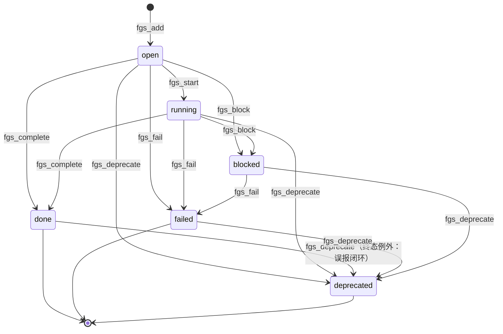

# 14 · fgs 域设计（任务内决策图 Fact-Goal-Step Graph）

> 版本：v5.0 ｜ 状态：定稿 ｜ 契约版本：fgs domain manifest v1
> 依赖：订阅 `task.finished`（图生命周期收口：失败节点补记）；被 task 域调度器调用（`fgs_clear` + 顶层 goal 种子，actor=scheduler）
> 被订阅：`fgs.node.done`（fact 域沉淀候选清单）；`fgs_export` 查询被 ledger 域（handoff 追加）、fact 域（沉淀取数）跨域只读调用
> 最高约定：[`00-conventions.md`](00-conventions.md)。本文与宪法冲突时以宪法为准。

---

## 一、对外暴露（External Surface）

### 1.1 服务标识与挂载

| 项 | 值 |
|---|---|
| 域名 | `fgs` |
| cordis 服务名 | `secDomain.fgs`（`ctx.provide('secDomain.fgs')`） |
| 插件包名 | `@silksec/sec-domain-fgs` |
| 后端插件包名 | `@silksec/sec-backend-fgs-sqlite` |
| owns（单写者声明） | 表：`fgs_nodes`。**不 owns 任何文件**——handoff 追加（appendFgsToHandoff）归 ledger 域、fact 沉淀（persistFgsFacts）归 fact 域，本域对二者只提供查询/事件（见 §1.5、§2.3） |
| 事件日志 | `data/events/fgs.jsonl` |
| prompt_hint | manifest 字段：注入调度任务 prompt 的 FGS 使用说明模板（task 域调度器消费，见 05-task.md §2.3） |

**profile 挂载矩阵**：

| profile | 挂载内容 | 说明 |
|---|---|---|
| `web`（宿主面） | 全部命令 + 全部查询 + RPC 投影 | 调度器经总线以 actor=scheduler 调 fgs_clear/fgs_add（启动序列） |
| `headless`（worker 面） | 模型可见命令（fgs_clear 除外）+ 全部查询 | **worker 会话是 FGS 图的主写方**——Decide/Execute 循环在每个 worker 内进行，headless 必挂 |

### 1.2 命令总表

> **命名说明**：种子设计（归档 §4.13）与任务书的「fgs_update 单动词（status 参数内聚状态机）」与宪法 §二禁用词（新动词不得叫 `update`）及 §四.1（**调用方永远不传 status 参数——目标状态是动词名的一部分**）冲突，故状态机拆为语义动词族（fgs_start / fgs_complete / fgs_fail / fgs_block / fgs_deprecate），content/score 增量合并独立为 `fgs_annotate`；`fgs_update` 降级为**兼容别名**（按 status 参数分派到语义动词，观察期后删除）——与 vuln 域 `updateFinding(status=xxx) → vuln_confirm/vuln_reject/...` 的分派先例完全同型。非法流转在 schema 层拒绝。

| # | 动词 | 一句话语义 | actor | 幂等键 | 发布事件 | 模型可见 |
|---|---|---|---|---|---|---|
| F1 | `fgs_add` | 登记节点（fact/goal/step/finding，status 起 open） | model, scheduler, system | 自动指纹 | fgs.node.added | ✅ |
| F2 | `fgs_start` | open → running（step 开工） | model | 自动指纹 | fgs.node.updated | ✅ |
| F3 | `fgs_complete` | open/running → done（可同时补结果 content/score） | model | 自动指纹 | **fgs.node.done** | ✅ |
| F4 | `fgs_fail` | 任意活跃态 → failed（reason 必填） | model, reactor* | 自动指纹 | fgs.node.updated | ✅ |
| F5 | `fgs_block` | 任意活跃态 → blocked（reason 必填） | model | 自动指纹 | fgs.node.updated | ✅ |
| F6 | `fgs_deprecate` | 任意态（含终态任务图）→ deprecated（误报/重复闭环落点） | model, dashboard, script | 自动指纹 | fgs.node.updated | ✅ |
| F7 | `fgs_annotate` | content 增量合并 + score 调整（**不动状态**） | model | 自动指纹 | fgs.node.updated | ✅ |
| F8 | `fgs_clear` | 清空某任务旧图（任务启动序列，调度器专用） | scheduler | 状态条件 | fgs.task.cleared | ❌ |

> \* F4 含 reactor：本域订阅 `task.finished(ok=false)` 后补记 failed 节点走域内 service（cause 链带源事件，宪法 §三）。

### 1.3 命令逐个详述

#### F1 `fgs_add`

**语义**：在任务 FGS 图中新增一个节点。节点是任务执行过程的外化记忆——把 fact（事实）/ goal（目标）/ step（待执行步骤）/ finding（中间发现）实时结构化，形成 Decide/Execute 循环。

**参数表**（additionalProperties: false）：

| 参数 | 类型 | 必填 | 默认 | 校验 |
|---|---|---|---|---|
| `task_id` | integer | ✅ | — | 任务存在（task 域），否则 `E_NOT_FOUND` |
| `type` | string | ✅ | — | 枚举 `fact / goal / step / finding`（DB CHECK 同约束），否则 `E_SCHEMA` |
| `content` | object | ✅ | — | JSON 对象；约定字段 `summary`（一行索引）/ `detail` / `evidence` / `run_id` / `host`——**fact 节点要被沉淀必须带 detail/evidence**（§1.5 时序） |
| `run_id` | string | ❌ | 会话注入 | 关联 exec run（归属与导出用） |
| `score` | number | ❌ | `0` | 排序权重（fgs_next 取最优 step） |
| `parent_id` | integer | ❌ | null | 同任务内节点引用（须存在），否则 `E_FGS_PARENT_INVALID` |
| `status` | — | **不接受** | `open` | 状态机私有（铁律 1）；v4.x 的 status 参数废除 |

**不变量（网关前置）**：

| ID | 不变量 | 失败码 |
|---|---|---|
| INV-F1 | **节点归属一致性（跨任务写拒绝）**：目标 task 须处于 `running`（图开）——写一个 queued/blocked/终态任务的图 = 跨任务/跨周期污染，拒绝。例外：F6 fgs_deprecate 放宽到任意状态（误报修正不因任务结束而失效） | `E_FGS_TASK_NOT_RUNNING` |
| INV-F2 | type 枚举（fact/goal/step/finding）；depends_on 引用的节点须存在且**同 task_id** | `E_SCHEMA` / `E_FGS_DEP_INVALID` |
| INV-F3 | content 须为合法 JSON 对象（序列化落库） | `E_SCHEMA` |

**返回信封（成功）**：

```json
{
  "ok": true, "domain": "fgs", "cmd": "add",
  "data": { "node_id": 412, "task_id": 96, "type": "step", "status": "open" },
  "event_ids": ["evt_01J..."], "idempotency_key": "fgs:add:a3f8…", "replay": false
}
```

**错误码**：

| code | 触发 | hint | retryable |
|---|---|---|---|
| `E_SCHEMA` | type 非枚举 / content 非对象 | 「type 仅 fact/goal/step/finding；content 须 JSON 对象（summary 一行索引 + detail/evidence 证据）」 | false |
| `E_NOT_FOUND` | task_id 不存在 | 「核对 task_get；FGS 节点必须挂在真实任务上」 | false |
| `E_FGS_TASK_NOT_RUNNING` | INV-F1 | 「该任务不在运行中——FGS 图与任务生命周期绑定，只写当前运行任务的图；历史图用 fgs_list 只读」 | false |
| `E_FGS_DEP_INVALID` | depends_on 引用不存在或跨任务 | 「depends_on 只能引用同任务内已存在的节点 id」 | false |

**幂等**：自动指纹（网关 sha1 核心字段）。**actor**：model, scheduler（启动 goal 种子）, system。**side_effects**：`[rows_touched: fgs_nodes+1, events: fgs.node.added×1]`

**agent_note（模型面工具描述全文）**：

> 在任务 FGS 图（Fact-Goal-Step Graph）中新增一个节点。type: fact（事实）/goal（目标）/step（待执行步骤）/finding（中间发现）；content 为 JSON 对象（summary 一行索引、detail/evidence 证据、run_id、host 等）；depends_on 为依赖节点 id 数组（依赖全 done 的 step 才会在 fgs_next 出现）。新节点初始 open——开工用 fgs_start、完成用 fgs_complete（可同时补结果），不要在新增时传状态。

#### F2 `fgs_start`

**语义**：step 开工——`open → running`。Decide（fgs_next 取 ready step）之后、Execute 之前的显式占位，使图中可见"正在做什么"。

**参数表**：`node_id` integer ✅（存在）；无其他可变参数。

**不变量**：INV-F1（任务 running）；状态机前置=当前 `open`（`running`/终态再 start → `E_STATE`）。

**返回**：`data: {node_id, task_id, status: "running"}`。**错误码**：`E_NOT_FOUND`；`E_STATE`（hint「open 才能开工；已 running 无须重复 start，已完成用 fgs_annotate 补内容」）；`E_FGS_TASK_NOT_RUNNING`。

**幂等**：自动指纹。**actor**：model。**事件**：`fgs.node.updated`。

**agent_note**：

> 把一个 open 的 step 节点标记为开工（open → running）。从 fgs_next 拿到 ready step 后、开始执行前调用——图上可见当前正在做什么；执行结果出来后用 fgs_complete 收口。

#### F3 `fgs_complete`

**语义**：完成——`open/running → done`。可同时补结果 content（增量合并）与 score。**这是 fact 沉淀链的入口**：done 且 content 带证据（detail/evidence 非空）的 fact 节点，将在任务收尾时被 fact 域转正为 durable facts（见 §1.5 时序图）。

**参数表**：

| 参数 | 类型 | 必填 | 校验 |
|---|---|---|---|
| `node_id` | integer | ✅ | 存在 |
| `content` | object | ❌ | 增量合并进既有 content（**不覆盖原有字段**——v4.x P17 语义）；fact 节点建议必带 detail/evidence（沉淀判据） |
| `score` | number | ❌ | — |

**不变量**：INV-F1；前置=当前 `open` 或 `running`（done/failed/blocked/deprecated 再 complete → `E_STATE`）。

**返回**：`data: {node_id, task_id, type, status: "done", persist_eligible: bool}`——`persist_eligible` 提示该 fact 节点是否满足沉淀判据（type=fact 且 content.detail/evidence 非空），是给模型的正向引导（不构成沉淀承诺，沉淀由 fact 域在 task.finished 后执行）。

**错误码**：`E_NOT_FOUND`；`E_STATE`（hint「节点已终态；补内容用 fgs_annotate」）；`E_FGS_TASK_NOT_RUNNING`。

**幂等**：自动指纹。**actor**：model。**事件**：**`fgs.node.done`**（payload 见 §1.5）。

**agent_note**：

> 完成一个节点（open/running → done），可同时补结果 content（增量合并不覆盖）与 score。fact 类节点完成时 content 务必带 detail/evidence——带证据的结论性事实会在任务收尾时自动沉淀进跨任务事实库（fact_search 可检索）；空泛的感想不会被沉淀。CONFIRMED 的发现同时用 finding_add 登记（vuln 域），会自动关联 FGS 节点。

#### F4 `fgs_fail`

**语义**：失败——任意活跃态（open/running/blocked）→ `failed`。reason 必填（**证据即参数的精神：失败必须可归因**）。

**参数表**：

| 参数 | 类型 | 必填 | 校验 |
|---|---|---|---|
| `node_id` | integer | ✅ | 存在 |
| `reason` | string | ✅ | 非空；≤500 字 |
| `content` | object | ❌ | 增量合并（补错误上下文） |

**不变量**：INV-F1（reactor actor 的 task.finished 补记路径豁免——见 §2.3）；前置=非终态。终态再 fail → `E_STATE`。

**返回**：`data: {node_id, task_id, status: "failed"}`。**错误码**：`E_NOT_FOUND`；`E_STATE`；`E_SCHEMA`（reason 空，hint「失败必须写 reason——复盘依赖归因」）。

**幂等**：自动指纹。**actor**：model, reactor（reactor 供订阅 `task.finished` 补记失败节点，宪法 §三）。**事件**：`fgs.node.updated`。

**agent_note**：

> 把节点标记为失败（→ failed）。reason 必填：工具报错/目标不存在/权限不足/超时…。失败的 step 不再出现在 fgs_next；如属暂时性故障可新建 step 重试（勿复活失败节点）。

#### F5 `fgs_block`

**语义**：受阻——任意活跃态 → `blocked`。等待外部条件（授权/审批/凭证/上游产物）时挂起，与 task 域 task_block 语义对齐但作用域是节点。

**参数表**：`node_id` ✅；`reason` string ✅（非空，等待什么）；`content` ❌。

**不变量**：INV-F1；前置=非终态。**返回**：`data: {node_id, status: "blocked"}`。**错误码**：`E_NOT_FOUND`；`E_STATE`；`E_SCHEMA`（reason 空）。

**幂等**：自动指纹。**actor**：model。**事件**：`fgs.node.updated`。

**agent_note**：

> 把节点标记为受阻（→ blocked）。reason 必填：在等什么（授权/审批/凭证/上游产物）。阻塞的 step 不会出现在 fgs_next；条件解除后新建后续 step 或用 fgs_annotate 补说明——blocked 节点不自动复活。

#### F6 `fgs_deprecate`

**语义**：废弃——**任意态 → deprecated**。finding 节点的误报/重复/忽略闭环落点（vuln 域 `vuln_reject` 联动）；也用于目标变更后作废旧 goal/step。

**参数表**：`node_id` ✅；`reason` string ✅（非空）；`content` ❌。

**不变量**：**INV-F1 例外条款**——本动词允许作用于**已终态任务**的节点（任务结束后的误报修正不失效）；已 deprecated 再 deprecate → `E_STATE`。

**返回**：`data: {node_id, status: "deprecated"}`。**错误码**：`E_NOT_FOUND`；`E_STATE`；`E_SCHEMA`。

**幂等**：自动指纹。**actor**：model, dashboard（看板误报打标联动）, script。**事件**：`fgs.node.updated`（payload 带 cause=deprecate + reason）。

**agent_note**：

> 把节点标记为废弃（→ deprecated）。finding 打 false_positive/dup/ignored 时 vuln 域会联动调用本动词；手动废弃过时的 goal/step 也用它。deprecated 节点保留在图中（决策链留痕）但不参与 fgs_next 与沉淀。

#### F7 `fgs_annotate`

**语义**：注记——content 增量合并 + score 调整，**不动状态**（v4.x fgsUpdateNode 的 content/score 段独立成动词；铁律 1 的「这不是状态机流转」诚实命名）。

**参数表**：

| 参数 | 类型 | 必填 | 校验 |
|---|---|---|---|
| `node_id` | integer | ✅ | 存在 |
| `content` | object | 条件 | 与 score 至少其一；增量合并（浅合并，同键覆盖） |
| `score` | number | 条件 | 与 content 至少其一 |

**不变量**：INV-F1；content 须 JSON 对象。**返回**：`data: {node_id, merged_keys: [...]}`。**错误码**：`E_NOT_FOUND`；`E_SCHEMA`（两者皆空，hint「annotate 至少传 content 或 score 之一；改状态请用 fgs_start/complete/fail/block/deprecate」）。

**幂等**：自动指纹（防重放叠加同一注记）。**actor**：model。**事件**：`fgs.node.updated`。

**agent_note**：

> 向节点增量合并 content 字段 / 调整 score（不动状态，不覆盖已有字段）。用于执行中途补充证据指针、中间观察、修正优先级。状态流转请用对应语义动词。

#### F8 `fgs_clear`（调度器专用）

**语义**：清空某任务的旧图——任务启动序列第一步（图生命周期与任务绑定：每个调度周期开始时清旧图，防止上一轮残留节点污染本轮 Decide）。同时是防跨周期泄漏的硬边界。

**参数表**：`task_id` integer ✅（存在）。**不变量**：actor=scheduler；**仅在认领后（task 已 running）执行**——由 task 域调度器在启动序列中保证（fgs_clear → fgs_add goal → spawn worker），本命令不重复校验时序（幂等：清空后再清空无副作用）。

**返回**：`data: {task_id, removed: N}`。**错误码**：`E_NOT_FOUND`；`E_ACTOR_FORBIDDEN`（hint「fgs_clear 是调度器启动序列专用；模型不要清图——新周期由调度器自动清」）。

**幂等**：状态条件（无残留即 removed:0）。**actor**：scheduler。**事件**：`fgs.task.cleared`（payload `{task_id, removed}`——铁律 6 命令必发事件；无订阅方，仅 jsonl 留痕）。**模型不可见**。

### 1.4 查询逐个详述

统一分页信封；**本域无跨对象可见域谓词**（图的可见性由 INV-F1 生命周期不变量承载：运行中任务的图可写、终态任务的图只读）。

| 查询 | 参数 | 返回 | 算法/说明 |
|---|---|---|---|
| `fgs_list` | task_id ✅ / type / status / run_id / limit（默认 200 上限 500）/ offset | `{rows, total}` | 按 task 过滤（+可选 type/status/run_id）；order `score DESC, updated_at DESC`；返回行 content/depends_on 已 JSON 反序列化。**行数=total 同 where 构造器**（契约测试断言） |
| `fgs_next` | task_id ✅ | `{steps: [≤10]}` | **依赖满足算法**（逐行移植 v4.x fgsNextStep）：① 取 `type='step' AND status='open'` 的候选（order score DESC, updated_at DESC，LIMIT 50）；② 构造 done 集 = 同任务 `type='step' AND status='done'` 的节点 id 集合；③ 逐候选解析 depends_on（JSON 数组，解析失败视为空=无依赖），**全部元素 ∈ done 集**（或依赖为空）才算 ready；④ 取前 10 返回（含已解析 content）。注意：依赖判定只认 **step 类 done 节点**——依赖一个 fact 节点不会使 step ready（fact 用 fgs_complete 表达"已知"，step 依赖链表达"先做什么"） |
| `fgs_export` | task_id ✅ / format（`markdown`\|`json`，默认 markdown） | `{task_id, markdown}` 或 `{task_id, nodes}` | 聚合导出：按 type 四分组（goal/fact/step/finding），markdown 模板=「FGS 决策链摘要」章节（任务号、节点总数、四类计数、每类 `[status] summary`，finding 额外带 host/score）。**ledger 域订阅 task.finished 后调本查询（format=markdown）追加进 handoff——原 appendFgsToHandoff 的文件写入归 ledger，本域只出内容** |

### 1.5 事件

| 事件 | 发布者命令 | payload schema |
|---|---|---|
| `fgs.node.added` | fgs_add | `{node_id, task_id, run_id, type, score}` |
| `fgs.node.updated` | fgs_start / fgs_fail / fgs_block / fgs_deprecate / fgs_annotate | `{node_id, task_id, type, from: {status, score}, to: {status, score}, cause: "start"\|"fail"\|"block"\|"deprecate"\|"annotate", reason?}` |
| `fgs.node.done` | fgs_complete | `{node_id, task_id, run_id, type, from: {status}, persist_eligible, content_head: {summary}}` |
| `fgs.task.cleared` | fgs_clear | `{task_id, removed}` |

payload 只含 ID 与判据快照（宪法 §八.1），不含行全量——订阅方需要详情自己 fgs_list。

**订阅**：`task.finished`（async，actor=reactor，cause 链带源事件）——ok=false 时为该任务补记失败节点：先 `fgs_add` 创建 step/finding 节点，再 `fgs_fail` 写入失败原因；truth.rejected=true 时补记 finding 类节点。2026-09-12 审查后改为弱联动：补记失败不回滚任务事实，失败进入 outbox 重试/死信，避免“名义 sync、实际 best-effort”的语义漂移。

**事件协作时序（任务全生命周期，fact 沉淀链全景）**：

```
┌─ 调度器（task 域）────────────────────────────────────────────────────────┐
│ task_claim → status=running，发布 task.claimed                            │
│   ├─ dispatch('fgs','clear',{task_id})      → fgs.task.cleared            │
│   ├─ dispatch('fgs','add',{type:'goal',…})  → fgs.node.added（顶层目标）  │
│   └─ dispatch('exec','spawn_worker', prompt=人格+任务头+FGS说明+检索指令) │
└───────────────────────────────────────────────────────────────────────────┘
┌─ worker 内模型循环（Decide/Execute）─────────────────────────────────────┐
│ fgs_add(step, depends_on=[…])        → fgs.node.added                    │
│ fgs_next(task_id)                    → ready steps（依赖全 done）        │
│ fgs_start(step)                      → fgs.node.updated(open→running)    │
│   …执行（run_cli 等，经 exec 域）…                                        │
│ fgs_complete(step, content=结果)     → fgs.node.done                     │
│ fgs_add(fact, content={summary,detail,evidence,run_id})                  │
│ fgs_complete(fact)                   → fgs.node.done                     │
│   ├─ fact 域订阅 fgs.node.done（async）：type=fact 且 persist_eligible   │
│   │   → 记入「待沉淀清单」（弱联动，失败可重放）                          │
│   └─ finding 类：另走 vuln 域 finding 登记（fgs_node_id 自动关联）        │
└───────────────────────────────────────────────────────────────────────────┘
┌─ 收尾（task 域）─────────────────────────────────────────────────────────┐
│ exec.worker.finished{run_id, status, exit_code, truth}                    │
│   → task_worker_finish（强联动）                                          │
│ task_finish{task_id, run_id, outcome, truth} → 发布 task.finished         │
│   ├─ fgs 域（sync，ok=false）：补记 failed step/finding 节点              │
│   ├─ fact 域（async，ok=true）：fgs_list(type=fact,status=done) →          │
│   │   对 persist_eligible 节点逐条 fact_upsert{                           │
│   │     program_id, fact_key='fgs/{task_id}/{node_id}', category='fgs',  │
│   │     summary(≤200), body=detail(≤2000), confidence='confirmed',      │
│   │     source='fgs-persist', intent={mem_class:'durable',              │
│   │     revalidate_days:30, justification:'FGS 任务 #N 结论性事实沉淀…'}}│
│   │   —— factUpsert 幂等（冲突刷新 last_validated_at），单节点失败不影响 │
│   │   其余；**原 persistFgsFacts 直写 facts 归零**                        │
│   └─ ledger 域（async）：fgs_export(markdown) → 追加 handoff-{北京日期}.md│
│       —— **原 appendFgsToHandoff 直写 handoff 文件归零**                  │
└───────────────────────────────────────────────────────────────────────────┘
下个周期：fgs_clear 清旧图（沉淀是 FGS 唯一的跨任务出口——没有这层，
每晚任务产出的结论性事实随图一起蒸发，cairn-y §5.8 断链）
```

> 沉淀判据（fact 域执行，源自 v4.x persistFgsFacts 的防灌水闸门）：type=fact、status=done、`content.summary` 非空、`content.detail|evidence` 非空——只沉淀结论性事实，空泛 step 感想不进 facts。线上现状（2026-09-06 实测）：FGS 59 节点、`fgs/%` facts 已有 1 条沉淀（历史基线，非零）——v5 事件化后 `persist_eligible` 即时反馈 + fgs.node.done 留痕，断链可观测。待沉淀清单的持久性由总线 `event_outbox` 承担（fgs.node.done 事件随事务落库，宿主重启不丢，dispatcher 续扫派发），不再依赖进程内内存清单。

### 1.6 模型工具面投影（工具名 + 描述全文）

工具名=命令/查询名，零改名；headless+web 均挂。模型**看不见**：fgs_clear（scheduler 专用）。

| 工具 | 描述全文（manifest agent_note） |
|---|---|
| `fgs_add` | 见 F1 agent_note |
| `fgs_start` | 见 F2 agent_note |
| `fgs_complete` | 见 F3 agent_note |
| `fgs_fail` | 见 F4 agent_note |
| `fgs_block` | 见 F5 agent_note |
| `fgs_deprecate` | 见 F6 agent_note |
| `fgs_annotate` | 见 F7 agent_note |
| `fgs_list` | 列出某任务的 FGS 图节点，可按 type/status/run_id 过滤，score 降序。复盘决策链、检查图完整性用。 |
| `fgs_next` | 返回任务 FGS 图中当前可执行的 Step 列表（依赖已满足、状态 open），按 score 降序。Decide 循环用此工具决定下一步动作。 |
| `fgs_export` | 导出某任务 FGS 图摘要（按 type/status 聚合，markdown 可直接嵌入 handoff；json 返回全节点）。 |

**兼容别名**（观察期 7 天）：`fgs_update` → 按 status 参数分派（`running`→fgs_start、`done`→fgs_complete、`failed`→fgs_fail、`blocked`→fgs_block、`deprecated`→fgs_deprecate；仅 content/score 无 status → fgs_annotate；带 status 参数本身在别名层吸收，不进新契约）；`fgs_add` / `fgs_list` / `fgs_next` / `fgs_export` 名称本就合规，仅 schema 变化（status 参数移除）。

### 1.7 看板 RPC 投影

| RPC 名（v5 点分） | 投影到 | 说明 |
|---|---|---|
| `fgs.list` | 查询 fgs_list | 知识 tab「任务内」位（六类型知识全景图之一）+ 任务视图执行历史钻取（决策链 Modal） |
| `fgs.export` | 查询 fgs_export | 决策链 markdown 预览/复制（供人工贴入交接材料） |

无写 RPC（fgs_deprecate 的看板入口走 vuln 域误报打标联动，不单独暴露）。

### 1.8 外部调用示例

**模型调用（worker 会话内，Decide/Execute 循环）**：

```json
{ "tool": "fgs_add",
  "args": { "task_id": 96, "type": "step",
            "content": { "summary": "对 api.example.com 跑 nuclei N-day 模板集",
                         "detail": "指纹命中 Spring Boot 2.6，关联 CVE-2022-22965 候选" },
            "score": 8, "depends_on": [409, 410] } }
```

**代码调用（总线 dispatch）**：

```js
const bus = await container.inject('secDomainBus')
const r = await bus.dispatch('fgs', 'complete', {
  node_id: 412, content: { evidence: 'results/run_wxyz/stdout.log:L120' },
}, { actor: 'model', session_id: 'sess-worker-96' })
```

**脚本调用（复盘脚本只读导出）**：

```bash
curl -s http://127.0.0.1:3000/silksec-dashboard -H 'content-type: application/json' \
  -d '{"method":"fgs.export","params":{"task_id":96,"format":"markdown"}}'
```

---

## 二、内部实现（Internal）

### 2.1 数据模型（sqlite-local，接管现表）

**fgs_nodes 表（逐列）**：

| 列 | 类型 | 约束/默认 | 语义 |
|---|---|---|---|
| `id` | INTEGER | PK AUTOINCREMENT | 节点 id（depends_on/parent_id/findings.fgs_node_id 的引用键） |
| `task_id` | INTEGER | NOT NULL | 归属任务（**生命周期绑定键**：fgs_clear 按此清理；task 域 tasks.id 弱外键） |
| `run_id` | TEXT | nullable | 产生该节点的 exec run（归属/导出过滤；fgs_add 未传时由网关注入会话关联值） |
| `type` | TEXT | NOT NULL CHECK IN ('fact','goal','step','finding') | 节点四类（枚举 DB 硬约束） |
| `status` | TEXT | NOT NULL DEFAULT 'open' CHECK IN ('open','running','done','failed','blocked','deprecated') | 节点状态机（枚举 DB 硬约束） |
| `content` | TEXT | NOT NULL DEFAULT '{}' | JSON 序列化：summary/detail/evidence/run_id/host 等；**fgs_annotate/complete 增量合并不覆盖** |
| `score` | REAL | DEFAULT 0 | 排序权重（fgs_next / fgs_list 排序） |
| `parent_id` | INTEGER | REFERENCES fgs_nodes(id) | 树形归属（goal→step 层级） |
| `depends_on` | TEXT | nullable | JSON 数组：依赖节点 id 列表（**fgs_next ready 判定依据**；只认同任务 step 类 done 节点） |
| `created_at` / `updated_at` | INTEGER | NOT NULL | UTC epoch ms |

索引：`idx_fgs_task(task_id, type, status)`（fgs_list/fgs_next 主路径）、`idx_fgs_run(run_id)`。

**owner 声明**：fgs_nodes 唯 fgs 域可写；findings.fgs_node_id 列由 vuln 域写（引用本域 id，弱外键）；本域不 owns 任何文件。

### 2.2 状态机与不变量

**节点状态机**：



要点：done/failed 是吸收态（不可再流转，**唯 deprecated 例外**——误报修正可废弃已 done 的 finding 节点）；blocked 不自动复活（新 step 重试）；running 不能回 open。

**网关前置校验清单（不变量全集）**：

| ID | 不变量 | 失败码 |
|---|---|---|
| INV-F1 | **节点归属 task 一致（跨任务写拒绝）**：除 fgs_deprecate 外，全部写命令要求目标 task 处于 `running`（图开）；任务结束图封为只读 | `E_FGS_TASK_NOT_RUNNING` |
| INV-F2 | type/status 枚举（DB CHECK 双保险）；depends_on/parent_id 引用存在且同 task_id | `E_SCHEMA` / `E_FGS_DEP_INVALID` / `E_FGS_PARENT_INVALID` |
| INV-F3 | content 合法 JSON 对象；增量合并不覆盖（域实现保证） | `E_SCHEMA` |
| INV-F4 | fgs_next 的 ready 判定 = 依赖数组非空时**全部元素** ∈ 同任务 step 类 done 集 | （算法内建） |
| INV-F5 | fgs_fail / fgs_block / fgs_deprecate 的 reason 必填（归因/等待语义不可缺） | `E_SCHEMA` |
| INV-F6 | fgs_clear 仅 actor=scheduler、仅任务启动序列 | `E_ACTOR_FORBIDDEN` |
| INV-F7 | run_cli 沙箱对 fgs_nodes 不可写（manifest owns × 沙箱白名单交叉断言） | （部署期断言） |

### 2.3 事务与联动实现

| 场景 | 实现 |
|---|---|
| 单命令事务 | fgs_add/complete/… 各一个 BEGIN IMMEDIATE：单行 INSERT 或 UPDATE（status+updated_at+content 合并+score）；跨域效果（fact 沉淀、handoff、vuln 联动）一律事件，最终一致 |
| **生命周期绑定** | 任务启动：task 域调度器经总线 `fgs_clear` + `fgs_add(goal)`（actor=scheduler；goal content.summary=objective 截 200，detail=全文）。任务收尾：图随 task.finished 封存（INV-F1 转只读）。**清图与沉淀是图的一体两面**——先沉淀（fact 域 async 订阅者）后清图（下周期 scheduler），事件序天然保证（task.finished 先于下一 claim） |
| **失败节点补记** | 本域订阅 task.finished（async）：ok=false → 经 `fgs_add` + `fgs_fail` 补记 failed 节点（cause 链带源事件；补记的是历史事实）。truth.rejected → finding 类 failed 节点；订阅失败走 outbox 重试，不回滚任务收尾 |
| **fact 沉淀（协作而非直写）** | fact 域订阅 fgs.node.done（async，维护待沉淀清单）+ task.finished（async，ok=true 触发批量转正，判据与时序见 §1.5 图）。**本域零 fact 写入**——persistFgsFacts 从 scheduler.js 整体迁出 |
| **handoff 追加（归属裁决，任务书要求论证）** | **handoff 归 ledger 域**。理由：handoff-{date}.md 与 attempts-{program}.tsv、card_usage-{date}.jsonl 同目录（`data/pipeline/{program}/`）、同生命周期（北京日切滚动）、同消费方（vault 同步/次日任务交接阅读）——五段结构（状态快照/今日动作/明日队列/阻塞与求助/数据指针）本身就是纪律台账体系的一环；若归 fgs 域则 pipeline 目录出现第二个写者，且 fgs 域被迫 owns 一个与决策图无关的文件形态。**原 appendFgsToHandoff 的直写归零**：ledger 域订阅 task.finished → 调本域查询 fgs_export(format=markdown) → 追加进当日 handoff（跨域只读 + 本域写，合法形态）。本域只保证 fgs_export 输出与 v4.x 追加段落逐字兼容 |
| 失败语义 | 同步订阅者异常被网关捕获 → audit `subscriber_failed`，不回滚命令；async 可经 `sec bus replay --since` 重放 |

### 2.4 后端适配器

**repository 接口**（`backend/repository.js`，JSDoc）：

```js
insertNode(row) → id
getNode(id) → row|null
updateNodeFields(id, fields, expectStatuses) → changes   // 状态机原子迁移（open/running 等前置条件）
mergeNodeContent(id, incoming) → merged_keys              // content 增量合并（读-合-写同事务）
listNodesWhere(filters, limit, offset) → rows             // fgsWhere 单一构造器（行数=total 同口径）
countNodesWhere(filters) → n
nextStepCandidates(taskId, limit) → rows                  // open step 候选（score DESC）
doneStepIds(taskId) → Set<number>                          // ready 判定输入
deleteNodesByTask(taskId) → n                              // fgs_clear
```

**三后端能力矩阵**：

| 后端 | 支持度 | 论证 |
|---|---|---|
| `sqlite-local`（默认） | **full（全部命令/查询）** | 接管现表 fgs_nodes（不改名不迁库）；DDL/索引幂等沿用；与 task 域同库，fgs_clear→fgs_add(goal) 启动序列与认领事务时序紧邻 |
| `http-remote` | **unsupported（整域）** | ① FGS 是**任务内工作记忆**：Decide 循环每次 fgs_next 都在关键路径上，HTTP 往返延迟不可接受；② 图生命周期与 task 域绑定（同库同时序域），拆远端即拆散任务事务时序；③ 依赖判定（done 集合）需要低延迟聚合 |
| `file` | **unsupported（整域）** | 依赖计算（depends_on ⊆ done 集）与图遍历需要索引与事务；markdown/jsonl 无查询能力，fgs_next 无法实现 |

混布：不适用。切换：`sec_domain_fgs_backend: sqlite-local`（唯一合法值）。

### 2.5 缓存与失效

| 缓存 | 说明 |
|---|---|
| **无查询缓存** | 图在任务运行期间高频变更（每个 step 流转都改 status），任何缓存都会造成 fgs_next 取到陈旧 ready 集——直查 SQLite（WAL 读不阻塞写，单任务节点量级下 <1ms） |
| prompt_hint 模板 | manifest 静态字段，域加载时读入，版本随 bundle 受控 |
| fgs_export markdown | 不缓存（消费方 ledger 每任务收尾调一次，频率低） |

### 2.6 性能与容量

| 维度 | 现状（v4.7） | 增长预期 | 保障 |
|---|---|---|---|
| fgs_nodes 行数 | 59（2026-09-06 实测） | 每任务每周期数十节点；fgs_clear 每周期清旧图，**活跃图 ≤ 单任务体量**；历史终态任务图累积（只读） | idx_fgs_task 主路径；终态图永不进入写路径 |
| fgs_next | 候选 ≤50 扫描 + done 集一次查询 | — | O(候选数)；依赖数组通常 ≤5 |
| fgs_list/fgs_export | ≤500 行/任务 | — | 分页 + idx_fgs_task |
| 事件量 | fgs.node.* 每任务每周期 ~节点数 ×2 | payload 均 <2KB | jsonl 追加写，无风暴风险 |

---

## 三、迁移与兼容

### 3.1 现状代码映射（行级）

| v4.x 文件 : 行 | 函数/段 | v5 落点 |
|---|---|---|
| `dsh-plugin-sec-suite.asset-db.js` L233-249 | fgs_nodes DDL + 索引 | `sec-backend-fgs-sqlite/schema.js` |
| 同上 L945-954 | fgsAddNode | `commands/fgs_add.js`（status 参数移除） |
| 同上 L956-984 | fgsUpdateNode（status/content/score 自由更新） | **拆分**：status→`commands/fgs_{start,complete,fail,block,deprecate}.js`；content 合并+score→`commands/fgs_annotate.js`；兼容分派→`aliases/fgs_update.js` |
| 同上 L986-1001 | fgsListNodes | `queries/fgs_list.js`（补 total 信封） |
| 同上 L1003-1025 | fgsNextStep（依赖满足算法） | `queries/fgs_next.js`（算法逐行移植，见 §1.4） |
| 同上 L1027-1030 | fgsClearTask | `commands/fgs_clear.js`（actor=scheduler 化） |
| 同上 L1033-1068 | appendFgsToHandoff（读图+拼 markdown+写文件） | **拆两半**：markdown 拼装→本域 `queries/fgs_export.js`（模板逐字兼容）；文件追加→ledger 域 task.finished 订阅者（11-ledger.md） |
| `dsh-plugin-sec-suite.scheduler.js` L96-129 | persistFgsFacts（done fact → factUpsert 转正） | **整体移出** → fact 域订阅链（06-fact.md：fgs.node.done 待沉淀清单 + task.finished 批量转正） |
| 同上 L146-157 | 任务启动 FGS 初始化（fgsClearTask + goal 节点） | task 域调度器经总线 dispatch（本域 fgs_clear/fgs_add，actor=scheduler） |
| 同上 L158-163 | 调度 prompt 的 FGS 使用说明注入 | 本域 manifest `prompt_hint`（task 域调度器消费；**v4.x 硬编码在 scheduler.js 的文本改为本域版本受控**） |
| `dsh-plugin-sec-suite.asset-db.js` L884-892, 916-922 | taskFinishScheduledRun 内嵌的 FGS 失败/拒执节点补记 | 本域 `subscribers/task_finished.js`（订阅 task.finished，ok=false） |
| `dsh-plugin-sec-suite.asset-graph.js` L649-748 | fgs_add/fgs_update/fgs_list/fgs_next/fgs_export 工具注册 | ToolProjector（§1.6；fgs_update 走别名层） |
| `dsh-plugin-sec-suite.asset-graph.js` L177-196 | finding_add 前的 activeTaskBySession 反查 + running step 关联 | vuln 域消费 task 域查询 `task_active_by_session` + 本域 fgs_list（跨域只读） |

### 3.2 兼容别名与观察期

| 旧名 | 分派目标 | 备注 |
|---|---|---|
| `fgs_update{status:'running'}` | `fgs_start` | |
| `fgs_update{status:'done'}` | `fgs_complete`（content/score 透传） | |
| `fgs_update{status:'failed'}` | `fgs_fail`（reason 缺失时从 content.reason 推导，无则 E_SCHEMA 引导） | |
| `fgs_update{status:'blocked'}` | `fgs_block`（同上） | |
| `fgs_update{status:'deprecated'}` | `fgs_deprecate`（同上） | |
| `fgs_update`（无 status，仅 content/score） | `fgs_annotate` | |
| `fgs_add{status:…}` | `fgs_add`（status 参数被别名层丢弃并 warning） | 新契约 status 起恒 open |
| `fgs_list` / `fgs_next` / `fgs_export` | 同名 | 仅信封/schema 升级 |
| `fgsClearTask`（内部函数名） | `fgs_clear` | 无外部调用方，无观察期 |

别名过网关全管线；观察期 7 天（audit 零使用验收）后删除；prompt（调度 prompt_hint、objective 模板）中的 `fgs_update` 引用由脚本化改写 + discipline-audit 悬空引用断言。

### 3.3 数据迁移脚本要点

1. **表不迁**：fgs_nodes 留在 asset-graph.db，sqlite-local 后端直接接管；DDL/索引幂等（新装自动建表）。
2. **无列变更**：v4.x 表结构（含 CHECK 约束）与新契约完全兼容——状态机拆分是动词层变化，落库仍是同一 status 枚举。
3. **历史节点保留**：终态任务的旧图原样保留（只读决策链档案，fgs_list 可查）；不回填、不清理。
4. **known-issue 交接**：FGS 沉淀链历史基线 59 节点/`fgs/%` 1 条沉淀（2026-09-06 实测）——v5 事件化后以 `persist_eligible` 即时反馈 + fgs.node.done jsonl 留痕定位断链点，属于迁移后的首批验收用例（契约测试：fgs_complete(fact, 带证据) → fgs.node.done(payload.persist_eligible=true) → fact 域订阅者落 fact_upsert）。
5. 回滚：v4.x 插件整目录回滚；表结构向后兼容。

---

## 四、开放问题

1. **goal 节点唯一性**：调度器每周期种一个顶层 goal，但契约未禁止模型追加 goal。是否将「每任务 goal ≤1（scheduler 种子专属）」升级为 INV（当前为纪律约定）。
2. **depends_on 跨类型依赖**：当前 ready 判定只认 step 类 done 节点（依赖 fact 节点不使 step ready）。是否需要显式 fact 依赖语义（如 `depends_kind`），或维持「fact 依赖用 content 表达」的极简口径。
3. **历史图保留策略**：终态任务图累积（只读）。节点量级小（每任务数十），暂不清理；若长期膨胀再议「导出后归档」。
4. **fgs.node.done 是否足以独立驱动沉淀**：当前设计 fact 域双订阅（fgs.node.done 记清单 + task.finished 触发转正），沉淀被任务收尾门控（与图生命周期一致）。若未来出现「任务中途即沉淀」的实时性需求，需评估 mid-task 沉淀对复验周期（30d）锚点的影响。
5. **blocked 节点复活**：当前 blocked 不自动复活（新 step 重试）。是否需要 `fgs_unblock`（blocked→open）动词——倾向不加（避免状态机膨胀，重试新建节点语义更清晰），待实证。

## 五、2026-09-12 深度审查结论

| 维度 | 结论 |
|---|---|
| 逻辑/功能 | 19/19 契约通过；goal/fact/step/finding 依赖与状态语义清晰。 |
| 逻辑修正 | `task.finished` 已改为 async 弱联动：补记失败不回滚任务事实，失败走 outbox 重试。 |
| 性能 | `fgs_next` 候选 LIMIT 50 + done set；当前图规模可用，超大图需任务级索引。 |
| 静默错误 | 补记链的 fgs_add/fgs_fail 失败会记录日志并保留事件重试；无主流程吞错。 |
| hook 判定 | 无直写；fact/ledger 均通过查询/命令协作。 |
| 独立升级 | 支持单域替换；须与 task、fact、ledger 联测。 |
